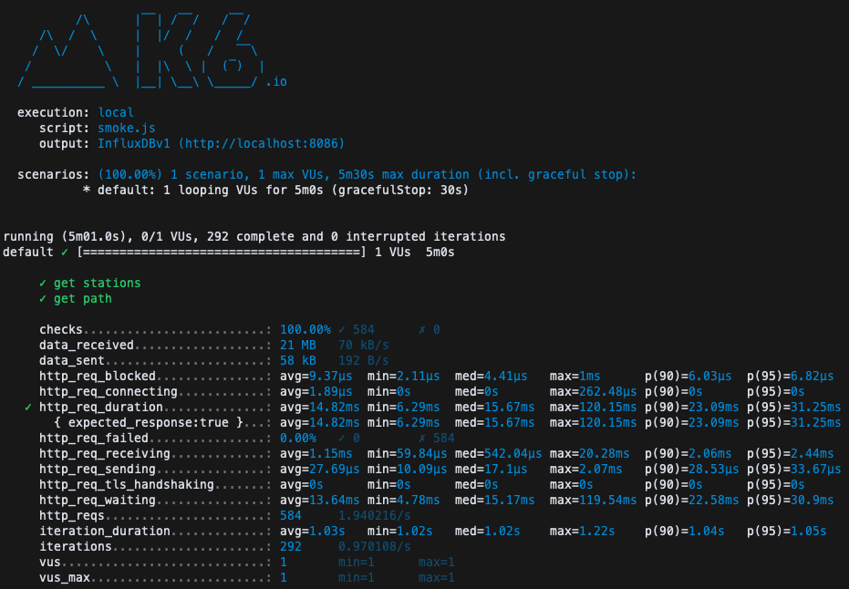
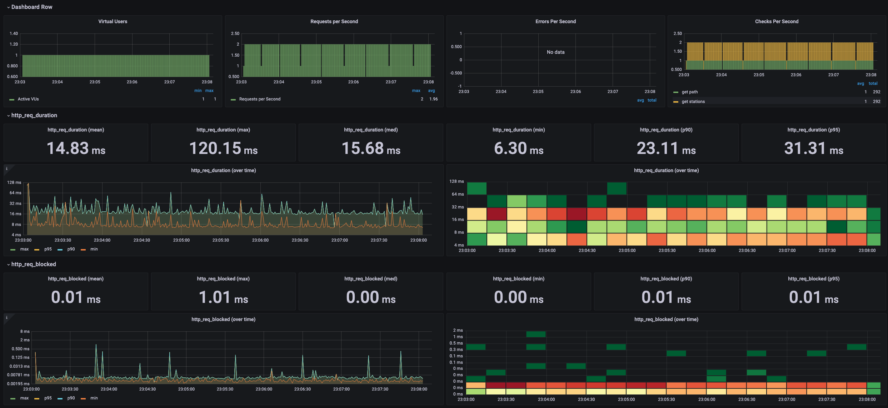
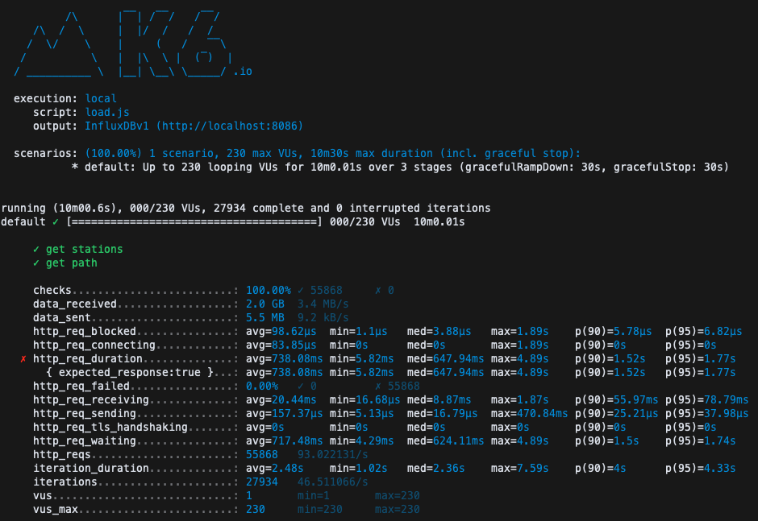
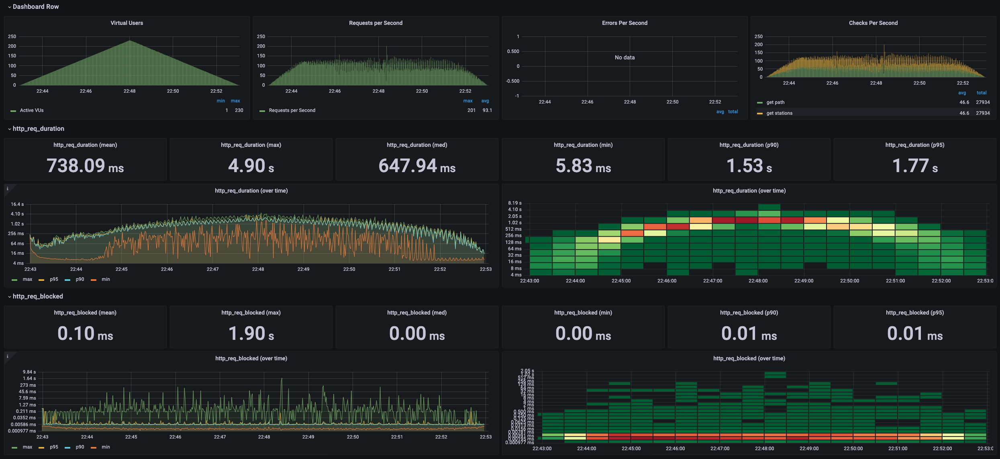
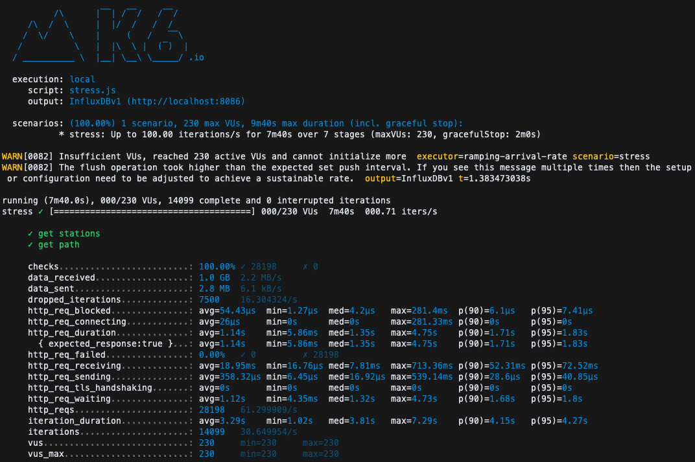
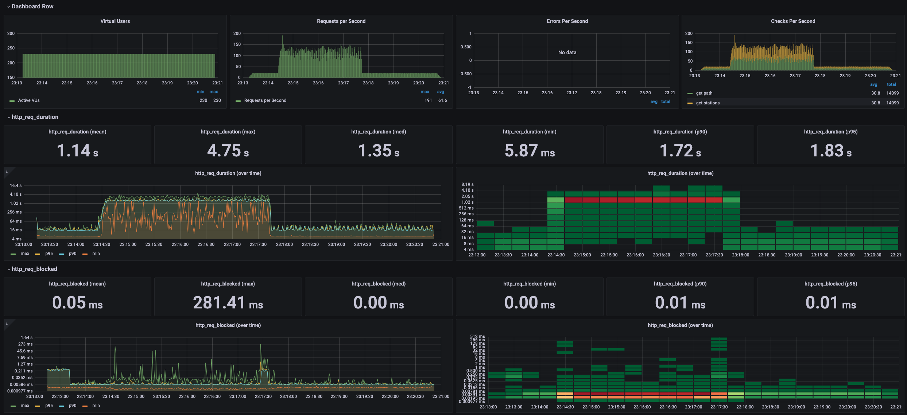

<p align="center">
    
</p>
<p align="center">
  
  
  <a href="https://edu.nextstep.camp/c/R89PYi5H" alt="nextstep atdd">
    
  </a>
  
</p>

<br>

# 인프라공방 샘플 서비스 - 지하철 노선도

<br>

## 🚀 Getting Started

### Install
#### npm 설치
```
cd frontend
npm install
```
> `frontend` 디렉토리에서 수행해야 합니다.

### Usage
#### webpack server 구동
```
npm run dev
```
#### application 구동
```
./gradlew clean build
```
<br>


### 1단계 - 웹 성능 테스트
1. 웹 성능예산은 어느정도가 적당하다고 생각하시나요
- 카카오맵
  - FCP 0.5s
  - TTI 0.7s
  - SI 2.3s
  - TBT 0ms
  - LCP 1.2s
  - CLS 0.006


- 네이버 지도
  - FCP 0.5s
  - TTI 0.7s
  - Si 2.1s
  - TBT 0ms
  - LCP 1.1s
  - CLS 0.006


- RUNNINGMAP
  - FCP 2.7s
  - TTI 2.8s
  - SI 2.7s
  - TBT 10ms
  - LCP 2.8s
  - CLS 0.004


- 목표
  - FCP 0.5s
  - TTI 0.7s
  - SI 2.1s
  - TBT 10ms
  - LCP 1.1s
  - CLS 0.004

2. 웹 성능예산을 바탕으로 현재 지하철 노선도 서비스는 어떤 부분을 개선하면 좋을까요

경로 검색 페이지 성능을 개선하는 것이 제일 효과가 좋을 것 같음.

   1. /path 현재 50ms -> 40ms
   2. /stations 현재 300ms -> 150ms
   3. /paths 현재 580ms -> 200ms


---

### 2단계 - 부하 테스트 
1. 부하테스트 전제조건은 어느정도로 설정하셨나요

- 목표 rps 구하기
  - DAU: 1,000,000
  - 피크 시간대 집중률: 10
  - 1명당 1일 평균 접속수: 2
  - 1일 평균 rps: 1,000,000 * 2 / 86,400 = 23.148
  - 1일 최대 rps: 231.48
  - Throughput: 23.148 ~ 231.48

- api 응답 시간
  - /stations -> 60ms
  - /paths -> 105ms
  - 1단계에서 측정했던 것보다 훨씬 적게 나와서 기준을 새로 잡아봐야할 것 같습니다. (스토리지가 부족해서 늘려줬는데 이부분 때문인지 모르겠습니다..)  

- VUser
  - 2 * (231.48 * (1 + 0.165)) / 2 = 269.9

2. Smoke, Load, Stress 테스트 스크립트와 결과를 공유해주세요

- Smoke testing

[smoke.js](result/smoke.js)



- Load testing

[load.js](result/load.js)



- Stress testing

[stress.js](result/stress.js)



---

### 3단계 - 로깅, 모니터링
1. 각 서버내 로깅 경로를 알려주세요

2. Cloudwatch 대시보드 URL을 알려주세요
