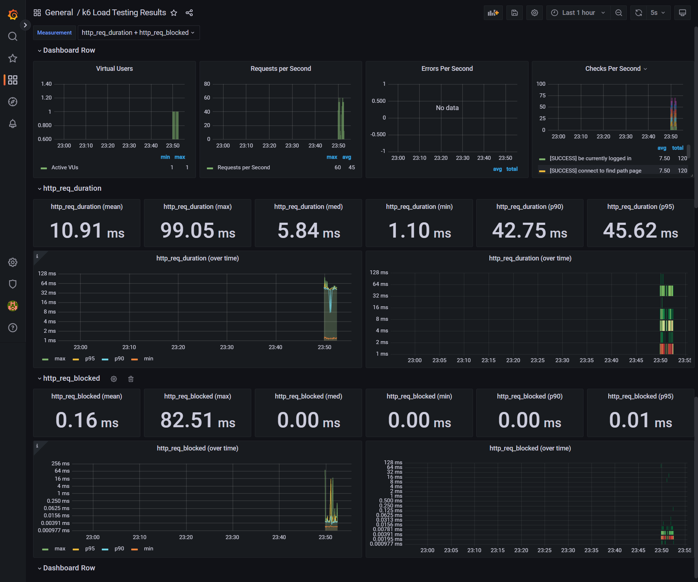
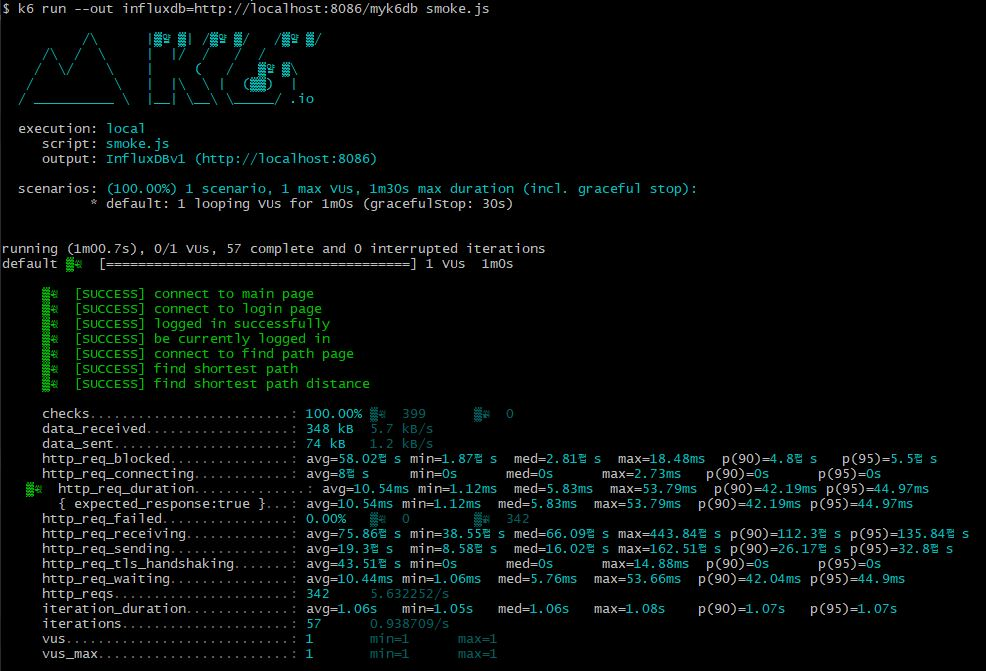
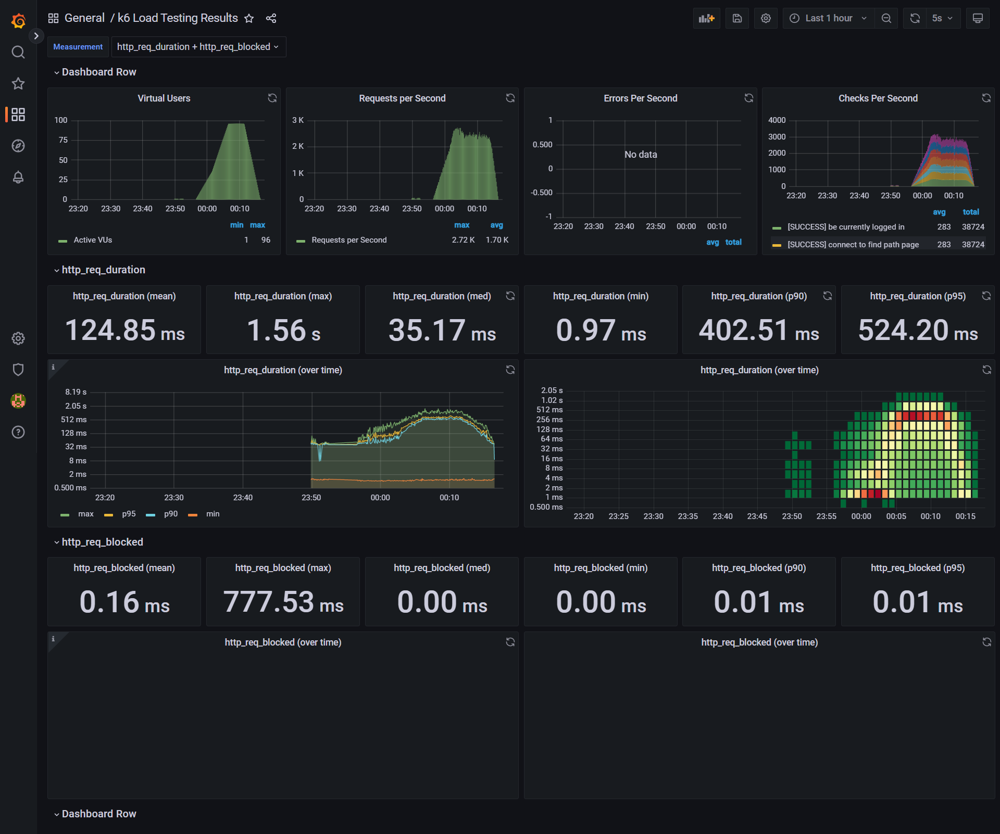
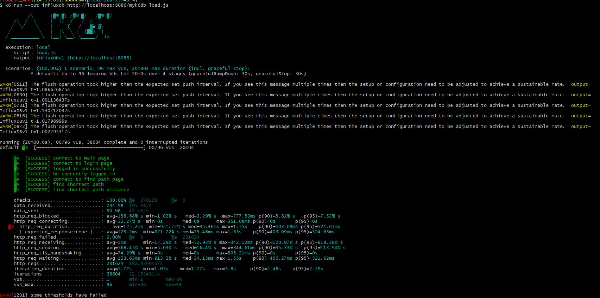
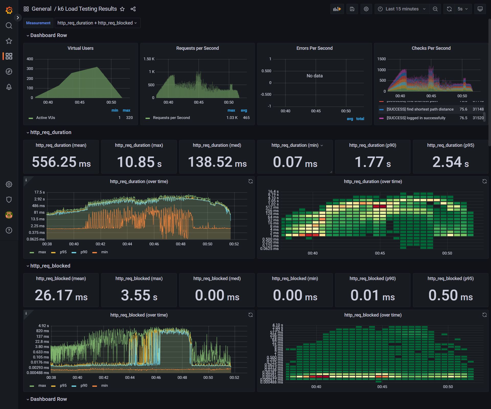
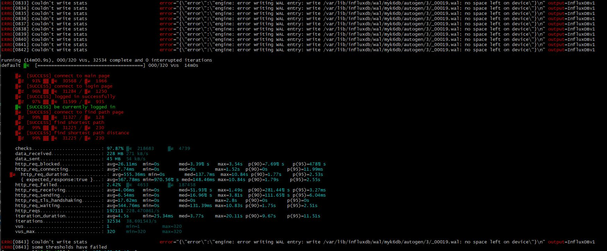

<p align="center">
    
</p>
<p align="center">
  
  
  <a href="https://edu.nextstep.camp/c/R89PYi5H" alt="nextstep atdd">
    
  </a>
  
</p>

<br>

# 인프라공방 샘플 서비스 - 지하철 노선도

<br>

## 🚀 Getting Started

### Install
#### npm 설치
```
cd frontend
npm install
```
> `frontend` 디렉토리에서 수행해야 합니다.

### Usage
#### webpack server 구동
```
npm run dev
```
#### application 구동
```
./gradlew clean build
```
<br>


### 1단계 - 웹 성능 테스트
- 용어 정리  
  FCP: 페이지 로드가 시작된 후 뷰포트내의 의미있는 콘텐츠 일부가 처음 화면에 렌더링 될 때까지의 시간을 측정  
  Speed Index: 뷰포트내의 콘텐츠가 눈에 띄게 채워지는 속도를 보여주는 페이지 로드 성능을 측정합니다.  
  LCP: 뷰포트의 컨텐츠 중 가장 큰(넓은) 영역을 차지하는 이미지나 텍스트 요소가 처음 로딩되는 시점  
  TTI: 페이지가 완전히 사용자와 상호 작용할 수 있는 상태가 되는데 걸리는 시간을 의미합니다.  
  TBT: TTI와 비슷한 측정 기준을 갖고 있는데요. 페이지가 클릭, 키보드 입력 같은 사용자와 상호작용하지 못했던 시간의 총 합을 측정  
  CLS: 사용자가 예상하지 못한 레이아웃을 경험하는 빈도를 정량화해서 시각적인 안정성을 판단


- 자사  
  First Byte |　Start Render　|　FCP　|　Speed Index　|　　LCP　　|　 CLS　 |　	　TBT　	　|　Total Bytes  
  1.772S　　　　8.700S　　　8.701S　　　8.729S　　　8.881S　　　　.058　　　≥ .000S　　　2,462KB


- 경쟁사(서울교통공사, 네이버맴, 카카오맵 순서)  
  First Byte |　Start Render　|　FCP　|　Speed Index　|　　LCP　　|　 CLS　 |　	　TBT　	　|　Total Bytes  
  2.641S　　　　 7.000S　　　6.976S	　　10.327S　　	　6.976S　　　　0　　　≥ 7.938S	　　　 1,066KB  
  3.933S　　　　	5.800S　　　5.632S　　　5.972S　　　  6.037S　　　　 0　　　≥ .000S　　　　1,686KB  
  1.835S　　　 　3.100S　　　3.095S　　　7.130S　　　 9.367S　　　.004　　　 .600S　　　　 1,456KB

1. 웹 성능예산은 어느정도가 적당하다고 생각하시나요  
   FCL(2s), LCP(2.5s) CLS(0.1s), Speed Index(4.3s)가 각각 괄호에 표시된 시간 안에 들었을 때 가장 성능이 놓다고 평가된다고 합니다.  
   실무에서 최적화를 위해 노력을 지속적인 노력을 하겠지만 항상 가장 좋은 상태를 유지하긴 어려운 것 같습니다.  
   유저가 느끼기에 불편하다고 느껴 경쟁사로 이탈 되지 않도록 경쟁사의 지표의 20%정도 안밖으로 예산을 내는 것이 좋다고 생각합니다.


2. 웹 성능예산을 바탕으로 현재 지하철 노선도 서비스의 서버 목표 응답시간 가설을 세워보세요.

First Byte |　Start Render　|　FCP　|　Speed Index　|　　LCP　　|　 CLS　 |　	　TBT　	　|　Total Bytes  
1.772S　　　　6.000S　　　6.701S　　　8.729S　　　6.881S　　　　.058　　　≥ .000S　　　1,562KB


### 2단계 - 부하 테스트
용어정리 
-  Smoke 테스트   
VUser: 1 ~ 2  
최소의 부하로 시나리오를 검증해봅니다.
- Load 테스트  
평소 트래픽과 최대 트래픽일 때 VUser를 계산 후 시나리오를 검증해봅니다.  
결과에 따라 개선해보면서 테스트를   
- Stress 테스트  
최대 사용자 혹은 최대 처리량인 경우의 한계점을 확인하는 테스트입니다.
점진적으로 부하를 증가시켜봅니다.
테스트 이후 시스템이 수동 개입 없이 자동 복구되는지 확인해봅니다.  

1. 부하테스트 전제조건은 어느정도로 설정하셨나요  
   
    - 예상 1일 사용자 수 (DAU)    
   카카오맵 DAU 약 600K라고 가정했을 때 자사 DAU 300K 예상

    -   피크시간대 집중률 (최대 트래픽 / 평소 트래픽)  
    출퇴근 시간에 평소보다  3배정도 트래픽이 몰릴 것 으로 예상

    -  1명당 1일 평균 요청 수  
   14 (출퇴근 2회 접속 예상, 1회 접속당 7번 요청 예상)


DAU * 1명당 1일 평균 접속수 = 1일 총 접속수  
→ 300,000* 14 = 4,200,000  
1일 총 접속수 / 86400(초 / 일) = 1일 평균 rps  
→  = 약 48.6  
1일 평균 rps * (최대 트래픽 / 평소 트래픽) = 1일 최대 rps  
→ 48.6 * 3 = 약 145.8  

T = (6 * 0.5) + 1  
-> 4  
평균VUser = 48.6 * 4 / 6  
-> 약 32  
최대VUser = 145.8 * 4 / 6  
-> 약 96  


2. Smoke, Load, Stress 테스트 스크립트와 결과를 공유해주세요  
   결과를 캡쳐하여 보여드리는 것이 좋을듯 하여
   ./step2 폴더 생성후 캡쳐한 결과 이미지 파일 넣어 두었습니다.  
### smoke
- 
- 


### load
- 
-   


### stress
- 
- 

---

### 3단계 - 로깅, 모니터링
1. 각 서버내 로깅 경로를 알려주세요  


    /home/ubuntu/logs/subway/_file.log  
    /home/ubuntu/logs/subway/_json.log  

2. Cloudwatch 대시보드 URL을 알려주세요  
   https://ap-northeast-2.console.aws.amazon.com/cloudwatch/home?region=ap-northeast-2#dashboards:name=sonyoon7
