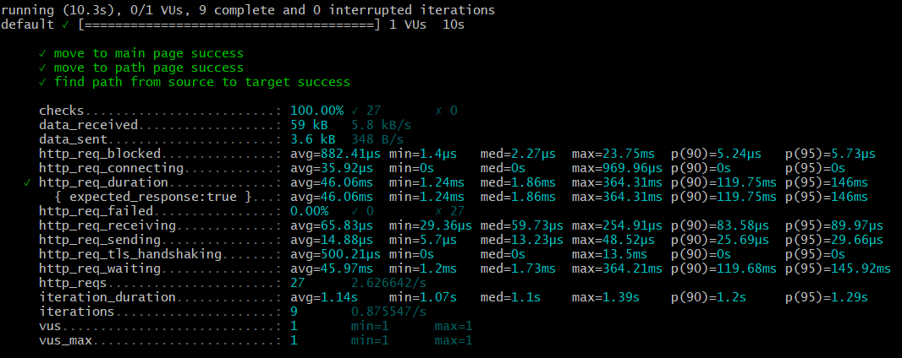
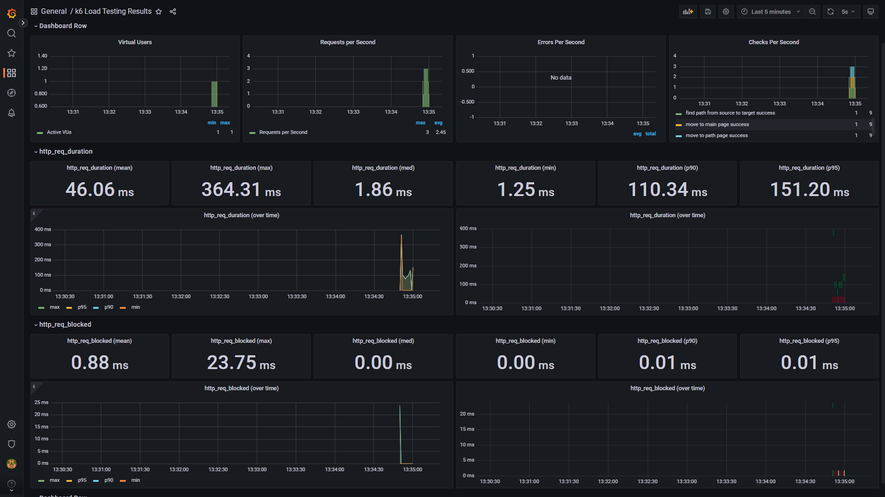
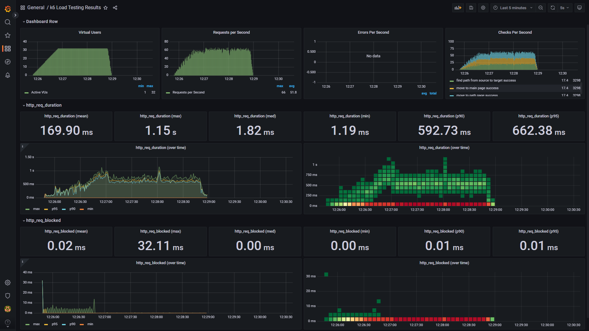
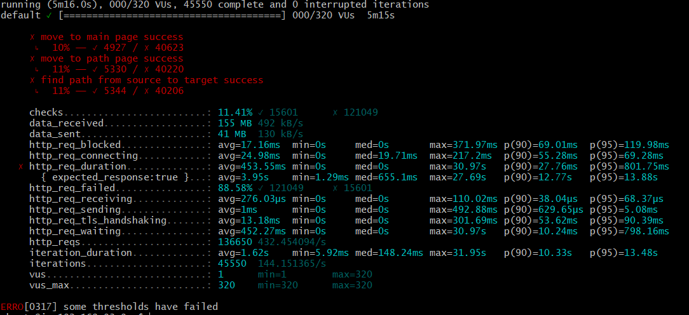
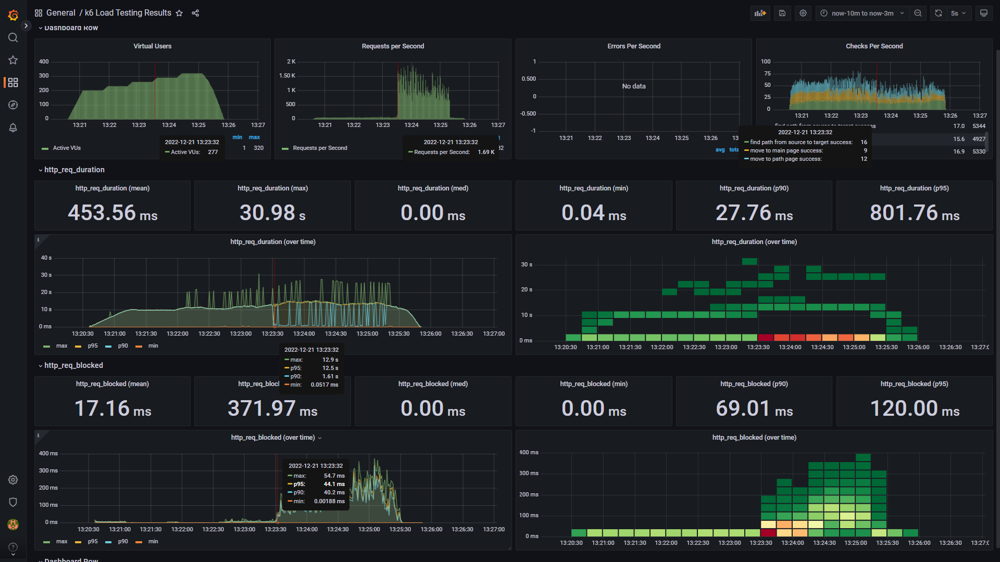

<p align="center">
    
</p>
<p align="center">
  
  
  <a href="https://edu.nextstep.camp/c/R89PYi5H" alt="nextstep atdd">
    
  </a>
  
</p>

<br>

# 인프라공방 샘플 서비스 - 지하철 노선도

<br>

## 🚀 Getting Started

### Install
#### npm 설치
```
cd frontend
npm install
```
> `frontend` 디렉토리에서 수행해야 합니다.

### Usage
#### webpack server 구동
```
npm run dev
```
#### application 구동
```
./gradlew clean build
```
<br>


### 1단계 - 웹 성능 테스트
1. 웹 성능예산은 어느정도가 적당하다고 생각하시나요 

개인적으로 2초 안에 화면이 나오면 빠르다고 느끼고, 4 ~ 5초가 넘어가면 왜 이렇게 느리지 하고 느꼈던 것 같습니다.

아래는 https://developer.chrome.com/docs/lighthouse/performance/ 의 빠름의 마지노선입니다.
- FCP 1.8s
- SI 3.4s
- LCP 2.5s
- TBT 0.2s 

2. 웹 성능예산을 바탕으로 현재 지하철 노선도 서비스의 서버 목표 응답시간 가설을 세워보세요.

|        | 서울교통공사 | 네이버지도 | 카카오맵 | Running Map |
|--------|----------|----------|----------|--------|
| FCP    | 2.162s   | 0.977s   | 1.329s   | 4.643s |
| SI     | 2.910s   | 2.406s   | 8.574s   | 4.620s |
| LCP    | 4.082s   | 2.887s   | 5.379s   | 4.683s |
| TBT    | 1.103s   | 0.014s   | 0.608s   | 0s     |
| TB     | 1377KB   | 772KB    | 4478KB   | 2493KB |

제일 성능이 좋은 네이버 지도를 기준으로 응답시간이 20% 차이일 때 인식하므로 + 18% 정도까지 허용하도록 했습니다. (18%의 기준은 아무 이유 없습니다. 20% 보다 적당하게 빠르고 싶었습니다.)

이렇게 경쟁사들과의 웹 성능에서 차이가 느껴지지 않아야 서비스의 품질로 경쟁할 수 있다고 생각했습니다.

LCP 의 경우는 위의 lighthouse performance 의 빠름을 기준을 초과했기에 lighthouse performance 의 빠름 기준으로 선정했습니다. 

- FCP: 1.153s
- SI: 2.839s
- LCP: 2.5s
- TBT: 0.017s
- TB: 910.96KB


- 서울교통공사 http://www.seoulmetro.co.kr/kr/cyberStation.do
- 네이버지도 https://m.map.naver.com/subway/subwayLine.naver?region=1000
- 카카오맵 https://map.kakao.com/?REGION=01&target=subway
- Running Map https://enfunha.kro.kr/

목표 응답시간 : 700ms => (202ms + 406ms) * 1.2 = 729.6ms  
네이버 기준: (메인페이지 요청 + 지하철 경로 검색 요청) * 20% (성능차이 못 느낌)

---

### 2단계 - 부하 테스트 
1. 부하테스트 전제조건은 어느정도로 설정하셨나요

```text
하루 평균 지하철 이용 고객 약 450 만명 (https://www.bigdata-map.kr/datastory/traffic/seoul)
피크 시간대 이용 고객 (8-9시) 약 100 만명
평소 시간대 이용 고객 40 만명
최대 트래픽 : 300 만 (출퇴근 시간 열차 시간 확인을 위해 3번은 요청할 것으로 예상. 100만 * 3번)
평소 트래픽 : 80 만 (환승 고려. 40만 * 2번)

이 중 30 % 의 고객들이 우리 서비스를 이용한다고 가정한다.

피크 고객 33만
평소 고객 13만
최대 트래픽 100만
평소 트래픽 26만

DAU 450만 / 3 = 150만
1 일 총 접속 수 = 150만 * 2번(출퇴근) = 300만
1 일 평균 rps = 300만 / 86400 = 34.722
1 일 최대 rps = 34.722 * 100만 / 26만 = 133.54

T = 0.7s

VUser = 32 => 133.54 * 0.7s / 3 = 31.159
(0.7s 은 총 목표 시간)
(Running Map 에서는 메인페이지, 경로 검색페이지, 경로 검색 총 3번의 요청)

```

2. Smoke, Load, Stress 테스트 스크립트와 결과를 공유해주세요
---
smoke test


```javascript
import scenario from './scenario.js';

export let options = {
  vus: 1,
  duration: '10s',

  thresholds: {
    http_req_duration: ['p(99)<700'],
  },
};

export default function ()  {
  scenario();
};

```
---
load test

```javascript
import scenario from './scenario.js';

export let options = {
  stages: [
    { duration: '1m', target: 32 },
    { duration: '2m', target: 32 },
    { duration: '10s', target: 0 },
  ],
  thresholds: {
    http_req_duration: ['p(99)<700'],
  },
};

export default function ()  {
  scenario();
};

```
---
stress test


```javascript
import scenario from './scenario.js';

export let options = {
  stages: [
    { duration: '30s', target: 200 },
    { duration: '40s', target: 200 },
    { duration: '10s', target: 230 },
    { duration: '40s', target: 230 },
    { duration: '10s', target: 260 },
    { duration: '40s', target: 260 },
    { duration: '10s', target: 290 },
    { duration: '40s', target: 290 },
    { duration: '10s', target: 320 },
    { duration: '40s', target: 320 },
    { duration: '45s', target: 0 },
  ],
  thresholds: {
    http_req_duration: ['p(99)<700'],
  },
};

export default function ()  {
  scenario();
};

```
---
scenario.js
```javascript
import http from 'k6/http';
import { check, group, sleep, fail } from 'k6';

const BASE_URL = 'https://enfunha.kro.kr/';

export default function ()  {
  let main = http.get(BASE_URL);
  check(main, {
    'move to main page success': (res) => res.status === 200,
  });

  let path = http.get(`${BASE_URL}/path`);
  check(path, {
    'move to path page success': (res) => res.status === 200,
  });

  let findStations = http.get(`${BASE_URL}/stations`);
  check(findStations, {
    'find stations success': (res) => res.status === 200 && res.json().length !== 0,
  });
  const stations = findStations.json();

  const source = getRandomStationId(stations);
  const target = getRandomStationId(stations);
  let findPath = http.get(`${BASE_URL}/paths?source=${source}&target=${target}`);
  check(findPath, {
    'find path from source to target success': (res) => res.status === 200 && res.json().stations.size !== 0,
  });

  sleep(1);
};

function getRandomStationId(stations) {
  return stations[getRandomIntExclusive(16)].id;
  //return stations[getRandomIntExclusive(stations.length)].id;
}

function getRandomIntExclusive(maxNumber) {
  return Math.floor(Math.random() * maxNumber);
}

```
---

### 3단계 - 로깅, 모니터링
1. 각 서버내 로깅 경로를 알려주세요
- soosue-public-web
  - /home/ubuntu/nextstep/infra-subway-monitoring/log/file.log 
  - /home/ubuntu/nextstep/infra-subway-monitoring/log/json.log
  - /var/log/nginx/access.log
  - /var/log/nginx/error.log

2. Cloudwatch 대시보드 URL을 알려주세요
- https://ap-northeast-2.console.aws.amazon.com/cloudwatch/home?region=ap-northeast-2#dashboards:name=soosue-dashboard

