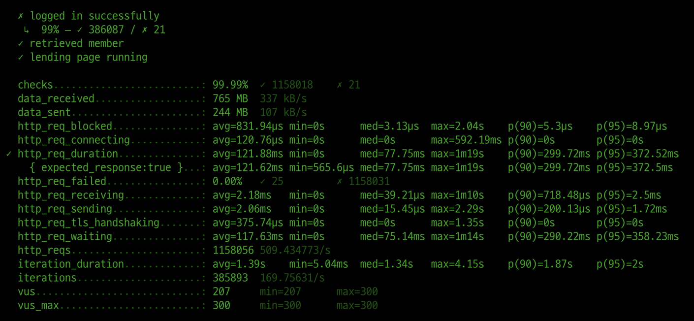
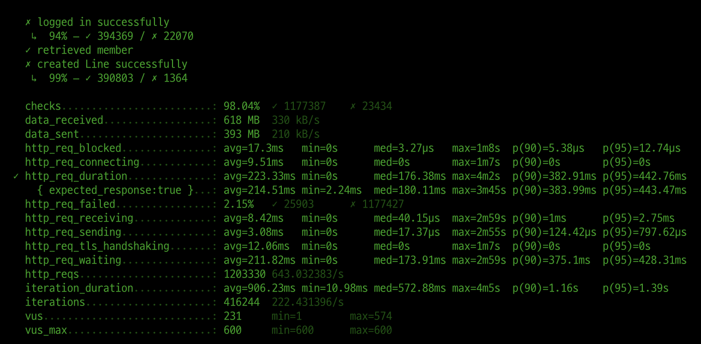
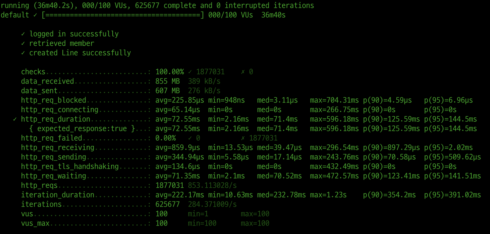

<p align="center">
    
</p>
<p align="center">
  
  
  <a href="https://edu.nextstep.camp/c/R89PYi5H" alt="nextstep atdd">
    
  </a>
  
</p>

<br>

# 인프라공방 샘플 서비스 - 지하철 노선도

<br>

## 🚀 Getting Started

### Install
#### npm 설치
```
cd frontend
npm install
```
> `frontend` 디렉토리에서 수행해야 합니다.

### Usage
#### webpack server 구동
```
npm run dev
```
#### application 구동
```
./gradlew clean build
```
<br>


### 1단계 - 웹 성능 테스트
1. 웹 성능예산은 어느정도가 적당하다고 생각하시나요

#### 예비 분석

|                        | PC      | Mobile |
|------------------------|---------|--------|
| First Contentful Paint | 2.7 s   | 14.8 s |
| Time to Interactive    | 2.8 s   | 15.3 s |
| Speed Index            | 2.7 s   | 14.8 s |
| Total Blocking Time    | 50 ms   | 490 ms |
| Largest Contentful Paint    | 2.8 s   | 15.3 s |
| Cumulative Layout Shift    | 0.004 s | 0.042 s |


#### 경쟁사 분석
- 네이버 지도

|                          | PC      | Mobile  |
|--------------------------|---------|---------|
| First Contentful Paint   | 0.3 s   | 2.3 s   |
| Time to Interactive      | 3.4 s   | 6.9 s   |
| Speed Index            | 3.0 s   | 3.5 s   |
| Total Blocking Time    | 550 ms  | 10 ms   |
| Largest Contentful Paint    | 2.7 s   | 3.6 s   |
| Cumulative Layout Shift    | 0.032 s | 0 s |

- 카카오 지도

|                          | PC      | Mobile  |
|--------------------------|---------|---------|
| First Contentful Paint   | 0.6 s   | 1.7 s   |
| Time to Interactive      | 3.0 s   | 6.2 s   |
| Speed Index            | 2.5 s   | 7.0 s   |
| Total Blocking Time    | 650 ms  | 120 ms  |
| Largest Contentful Paint    | 0.9 s   | 7.0 s   |
| Cumulative Layout Shift    | 0.018 s | 0.005 s |


#### 성능 기준 설정
- FCP 3s 미만
- TTI 5s 미만


2. 웹 성능예산을 바탕으로 현재 지하철 노선도 서비스의 서버 목표 응답시간 가설을 세워보세요.
- 텍스트 기반 리소스를 압축(gzip, deflate, brotli)
  - /js/vendors.js
  - /js/main.js
- 사용하지 않는 자바스크립트 줄이기
  - /js/vendors.js
  - /js/main.js
---

### 2단계 - 부하 테스트 
1. 부하테스트 전제조건은 어느정도로 설정하셨나요

a. 1일 이용자 수(DAU) : 30만    
b. 피크 시간대 집중률
  - 최대 : 약 200만명
  - 평균 : 약 30만

c. 1일 실행 횟수 1700만 회    
d. Throughput 계산
  - 1 일 총 접속자 수 : 5100만 회
  - 1일 평균 rps : 590
  - 1일 최대 rps : 3900

VU : (600 * 2) / 2 = 600

테스트 시간 : 30분

최대 사용자 수 : https://economist.co.kr/2022/11/08/it/general/20221108181600888.html   
평균 사용자 수 : https://mobile.newsis.com/view.html?ar_id=NISX20220927_0002028167   
일일 앱 실행 수 : https://m.segye.com/view/20221031511705 

2. Smoke, Load, Stress 테스트 스크립트와 결과를 공유해주세요

#### smoke.js
```javascript
import http from 'k6/http';
import { check, group, sleep, fail } from 'k6';

export let options = {
  vus: 300, // 1 user looping for 1 minute
  duration: '1800s',

  thresholds: {
    http_req_duration: ['p(99)<1500'], // 99% of requests must complete below 1.5s
  },
};

const BASE_URL = 'https://seogineer.o-r.kr';
const USERNAME = 'dgseo8981@gmail.com';
const PASSWORD = '1234';

export default function ()  {
  // login
  var payload = JSON.stringify({
    email: USERNAME,
    password: PASSWORD,
  });

  var params = {
    headers: {
      'Content-Type': 'application/json',
    },
  };

  let loginRes = http.post(`${BASE_URL}/login/token`, payload, params);

  check(loginRes, {
    'logged in successfully': (resp) => resp.json('accessToken') !== '',
  });

  let authHeaders = {
    headers: {
      Authorization: `Bearer ${loginRes.json('accessToken')}`,
    },
  };
  let myObjects = http.get(`${BASE_URL}/members/me`, authHeaders).json();
  check(myObjects, { 'retrieved member': (obj) => obj.id != 0 });
  sleep(1);

  // lending page
  let homeUrl = `${BASE_URL}`;
  let lendingPageResponse = http.get(homeUrl);
  check(lendingPageResponse, {
      'lending page running': (response) => response.status === 200
  });
};
```
#### smoke 테스트 결과


#### load.js
```javascript
import http from 'k6/http';
import { check, group, sleep, fail } from 'k6';

export let options = {
    stages: [
      { duration: '600s', target: 100 },
      { duration: '600s', target: 300 },
      { duration: '600s', target: 600 },
    ],

    thresholds: {
        http_req_duration: ['p(99)<1500'],
    },
};

const BASE_URL = 'https://seogineer.o-r.kr';
const USERNAME = 'dgseo8981@gmail.com';
const PASSWORD = '1234';

export default function () {
  // login
  var payload = JSON.stringify({
    email: USERNAME,
    password: PASSWORD,
  });

  var params = {
    headers: {
      'Content-Type': 'application/json',
    },
  };

  let loginRes = http.post(`${BASE_URL}/login/token`, payload, params);

  check(loginRes, {
    'logged in successfully': (resp) => resp.json('accessToken') !== '',
  });

  // myinfo
  let authHeaders = {
    headers: {
      Authorization: `Bearer ${loginRes.json('accessToken')}`,
    },
  };
  let myObjects = http.get(`${BASE_URL}/members/me`, authHeaders).json();
  check(myObjects, {'retrieved member': (obj) => obj.id != 0});

  // create line
  let createLineUrl = `${BASE_URL}/lines`;
  let lineRandomNumber = Math.random().toString().split('.')[1];
  let createLinePayload = JSON.stringify({
    name: `testLine-${lineRandomNumber}`,
    color: "grey darken-4",
    upStationId: 1,
    downStationId: 2,
    distance: 10,
  });
  let createLineParams = {
    headers: {
      'Authorization': `Bearer ${loginRes.json('accessToken')}`,
      'Content-Type': 'application/json',
    },
  };
  let createLinesResponse = http.post(createLineUrl, createLinePayload, createLineParams);
  check(createLinesResponse, {
    'created Line successfully': (response) => response.status === 201,
  });
}
```
#### load.js 테스트 결과


#### stress.js
```javascript
import http from 'k6/http';
import { check, group, sleep, fail } from 'k6';

export let options = {
    stages: [
      { duration: '200s', target: 10 },
      { duration: '200s', target: 10 },
      { duration: '300s', target: 60 },
      { duration: '300s', target: 60 },
      { duration: '600s', target: 100 },
      { duration: '600s', target: 100 },
    ],
    thresholds: {
        http_req_duration: ['p(99)<1500'],
    },
};

const BASE_URL = 'https://seogineer.o-r.kr';
const USERNAME = 'dgseo8981@gmail.com';
const PASSWORD = '1234';

export default function ()  {
  // login
  var payload = JSON.stringify({
    email: USERNAME,
    password: PASSWORD,
  });

  var params = {
    headers: {
      'Content-Type': 'application/json',
    },
  };

  let loginRes = http.post(`${BASE_URL}/login/token`, payload, params);

  check(loginRes, {
    'logged in successfully': (resp) => resp.json('accessToken') !== '',
  });

  // myinfo
  let authHeaders = {
    headers: {
      Authorization: `Bearer ${loginRes.json('accessToken')}`,
    },
  };
  let myObjects = http.get(`${BASE_URL}/members/me`, authHeaders).json();
  check(myObjects, { 'retrieved member': (obj) => obj.id != 0 });
  
  // create line
  let createLineUrl = `${BASE_URL}/lines`;
  let lineRandomNumber = Math.random().toString().split('.')[1];
  let createLinePayload = JSON.stringify({
      name: `testLine-${lineRandomNumber}`,
      color: "grey darken-4",
      upStationId: 1,
      downStationId: 2,
      distance: 10,
  });
  let createLineParams = {
      headers: {
          'Authorization': `Bearer ${loginRes.json('accessToken')}`,
          'Content-Type': 'application/json',
      },
  };
  let createLinesResponse = http.post(createLineUrl, createLinePayload, createLineParams);
  check(createLinesResponse, {
      'created Line successfully': (response) => response.status === 201,
  });
}
```
#### stress.js 테스트 결과


---

### 3단계 - 로깅, 모니터링
1. 각 서버내 로깅 경로를 알려주세요

2. Cloudwatch 대시보드 URL을 알려주세요
