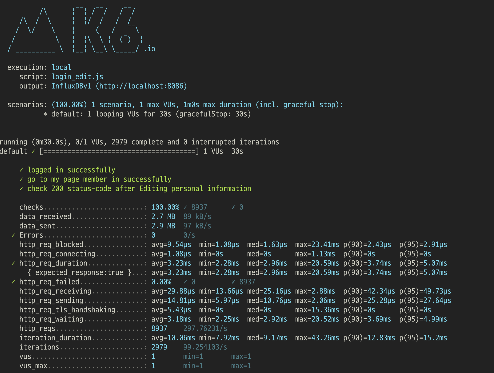
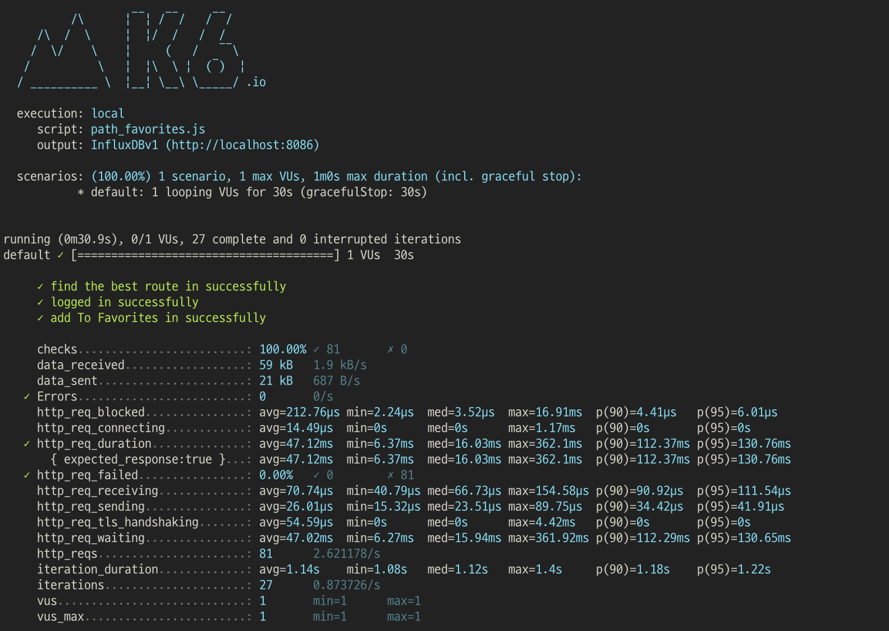
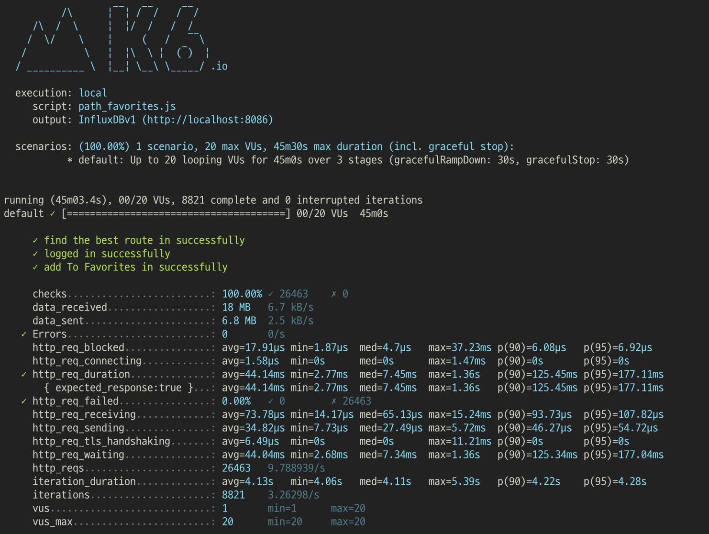
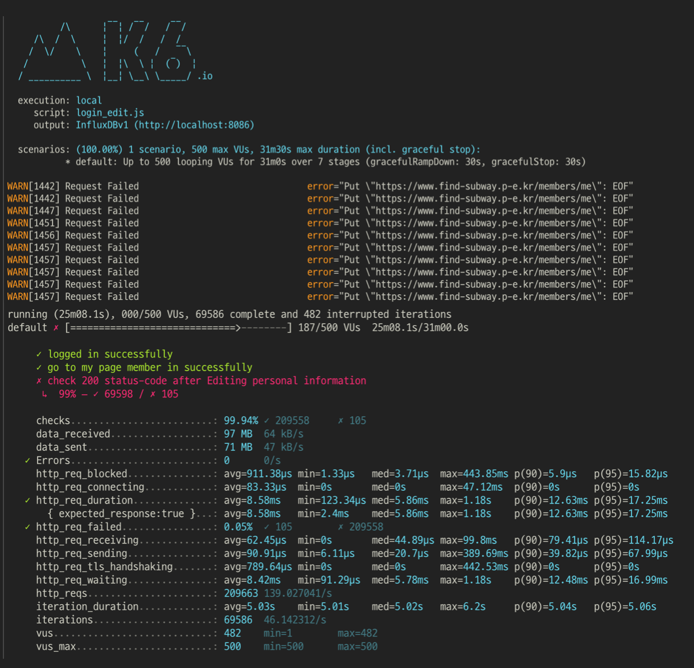
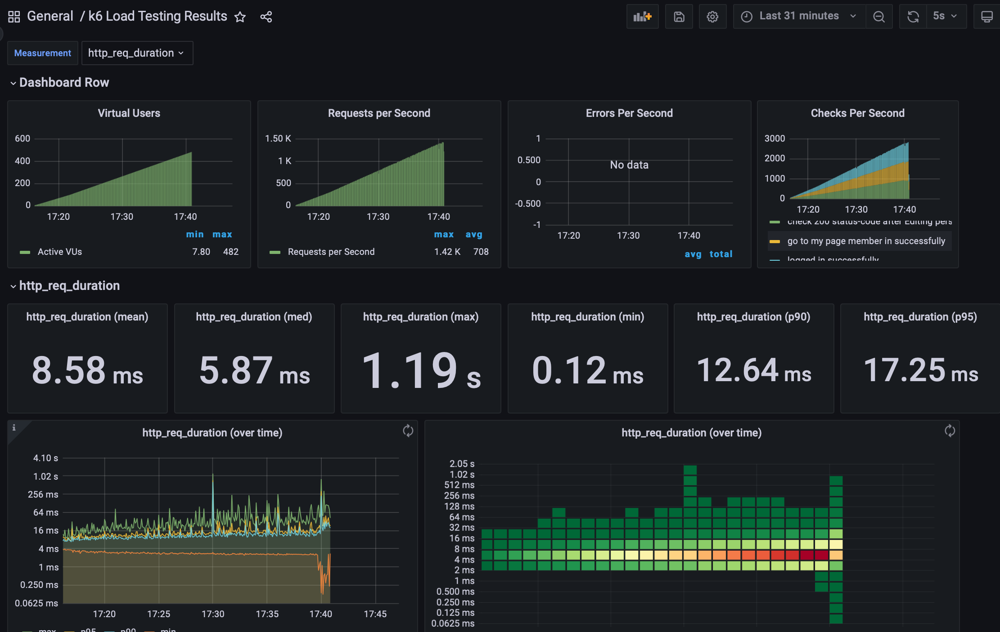
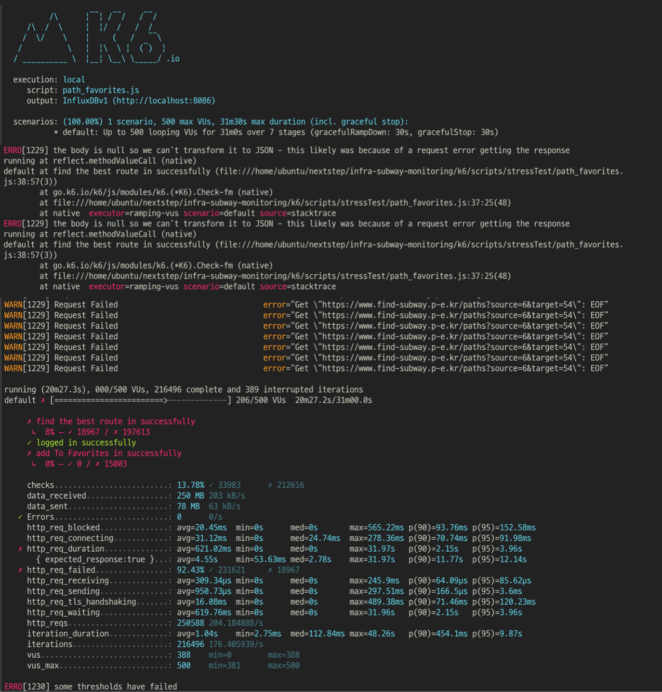
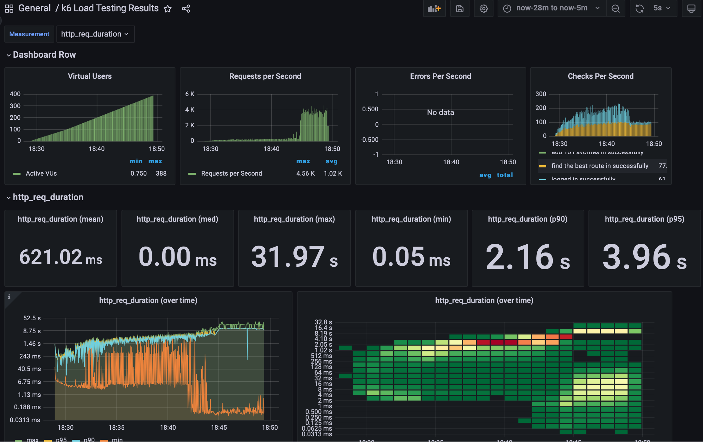

<p align="center">
    
</p>
<p align="center">
  
  
  <a href="https://edu.nextstep.camp/c/R89PYi5H" alt="nextstep atdd">
    
  </a>
  
</p>

<br>

# 인프라공방 샘플 서비스 - 지하철 노선도

<br>

## 🚀 Getting Started

### Install
#### npm 설치
```
cd frontend
npm install
```
> `frontend` 디렉토리에서 수행해야 합니다.

### Usage
#### webpack server 구동
```
npm run dev
```
#### application 구동
```
./gradlew clean build
```
<br>

### 1단계 - 웹 성능 테스트
- [모바일] 경로 검색 페이지 기준 <br>

|     app      |       FCP |    LCP |    TTI |   성능 점수 |    
|:------------:|---------:|-------:|-------:|--------:|
|  RunningMap  |     15.2s |       15.7s |       15.8s |        43점 |
|   서울 교통공사    |      6.4s |       6.6s |       8.4s |        36점 |
|   네이버 지하철    |      2.2s |       8.0s |       6.6s |        64점 |
|   카카오 지하철    |     1.7s |       6.4s |       4.2s |        69점 |

<br>
- [데스크탑] 경로 검색 페이지 기준 <br>

|     app      |       FCP |    LCP |    TTI |   성능 점수 |    
|:------------:|---------:|-------:|-------:|--------:|
|  RunningMap  |     3.0s |       3.0s |       3.1s |        65점 |
|   서울 교통공사    |      1.5s |       3.7s |       2.0s |        50점 |
|   네이버 지하철    |      0.5s |       1.6s |       0.6s |        89점 |
|   카카오 지하철    |     0.5s |       1.3s |       0.7s |        92점 |


<br>
- [데스크탑] 경로 검색 페이지 기준 <br>

|     app      |       FCP |    LCP |    TTI |   성능 점수 |    
|:------------:|---------:|-------:|-------:|--------:|
|  RunningMap  |     3.0s |       3.0s |       3.1s |        65점 |
|   서울 교통공사    |      1.5s |       3.7s |       2.0s |        50점 |
|   네이버 지하철    |      0.5s |       1.6s |       0.6s |        89점 |
|   카카오 지하철    |     0.5s |       1.3s |       0.7s |        92점 |

<br>
   - 목표 성능 예산 : <br>

      - 사용자에게 가장 필요하고 '응답, 요청'이 많은 노선 검색 서비스를 가장 중요한 페이지라고 판단 했습니다.
      - 이용자의 이탈을 막기 위하여 시간을 기반으로 웹 성능 예산을 FCP 3초 미만, LCP 5초 미만, TTI 5초 미만으로 산정 합니다.


<br>
   - 목표 성능 예산 : <br>


      - 사용자에게 가장 필요하고 '응답, 요청'이 많은 노선 검색 서비스를 가장 중요한 페이지라고 판단 했습니다.
      - 이용자의 이탈을 막기 위하여 시간을 기반으로 웹 성능 예산을 FCP 3초 미만, LCP 5초 미만, TTI 5초 미만으로 산정 합니다.


2. 웹 성능예산을 바탕으로 현재 지하철 노선도 서비스는 어떤 부분을 개선하면 좋을까요? <br>
<br>   
    - 지하철 노선 검색은 이동 및 환승 간에 급하게 필요한 경우가 많기에 사용자가 빠르게 원하는 정보를 확인 할 수 있도록 'LCP'를 개선하는 것이 좋을 것으로 생각합니다. 
    - 시간은 많이 들지만 500 에러가 나는 부분 해결

    - 정적 리소스를 캐시 메모리를 사용하여 빠르게 처리
    - CDN을 이용해서 가까운 곳에서 작업 처리
---

### 2단계 - 부하 테스트 
1. 부하테스트 전제조건은 어느정도로 설정하셨나요
   * 대상 시스템 범위
   * 접속 빈도가 높은 페이지 및 여러 데이터를 참조하는 페이지 : 경로 검색 페이지
   * 데이터를 갱신하는 페이지 : 나의 정보 페이지 (나이 update), 즐겨찾기
   * 목표값 설정
   * latency : 250ms(214ms + a(36ms))
   * throughput :
     * 일일 지하철 이용자 수를 기준으로 산정
       * 일일 탑승자 : 5,500,000명 (서울 열린데이터_광장2022.08.27 기준_https://data.seoul.go.kr/dataList/OA-12914/S/1/datasetView.do)
       * 일일 애플리케이션 이용자(탑승자의 1/5로 추산) : 1,100,000명
       * 하루 평균 접속횟수 : 2번
       * 일일 평균 rps : 13
       * 일일 최대 rps : 39(피크타임 3배로 가정)
       * Latency : 250ms (크롬 관리자 도구에서 페이지 응답시간으로 기준+a)
       * my 페이지 :
         * requests : login + me + modify = 3개
         * 최대 VUser : (13 x 2 x 0.5 ) / 3 = 20
       * 경로 검색 페이지 :
         * path + login + favorites = 3개
         * 최대 VUser : (13 x 2 x 0.5 ) / 3 = 20
       
2. Smoke, Load, Stress 테스트 스크립트와 결과를 공유해주세요
   * Smoke Test : 시나리오가 이상 없이 돌아가는지 확인
     * 로그인 및 마이 페이지, 회원정보 수정  

     * 경로 탐색 및 로그인, 즐겨찾기


   * load test : vuser를 구하고 이를 적용하여 목표 기준(99% request < 0.5s, ...)을 지키며 잘 동작 하는지 확인 
   * 잦은 테스트로 인해 EC2 서버의 볼륨을 8GB -> 32GB로 상향 조정
     * 로그인 및 마이 페이지, 회원정보 수정

       * 경로 탐색 및 로그인, 즐겨찾기


   * stress test : 부하를 점진적으로 높여서 에러 발생 시점을 찾고 어떤 문제가 생기는지 확인
     * 로그인 및 마이 페이지, 회원정보 수정(에러 발생 시점 => vuser : 482)


     * 경로 탐색 및 로그인, 즐겨찾기(에러 발생 시점 => vuser : 206)



---

### 3단계 - 로깅, 모니터링
1. 각 서버내 로깅 경로를 알려주세요

2. Cloudwatch 대시보드 URL을 알려주세요
