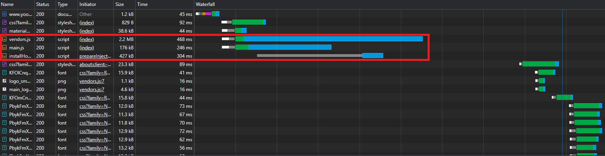

<p align="center">
    
</p>
<p align="center">
  
  
  <a href="https://edu.nextstep.camp/c/R89PYi5H" alt="nextstep atdd">
    
  </a>
  
</p>

<br>

# 인프라공방 샘플 서비스 - 지하철 노선도

<br>

## 🚀 Getting Started

### Install
#### npm 설치
```
cd frontend
npm install
```
> `frontend` 디렉토리에서 수행해야 합니다.

### Usage
#### webpack server 구동
```
npm run dev
```
#### application 구동
```
./gradlew clean build
```
<br>

### 1단계 - 웹 성능 테스트
1. 웹 성능예산은 어느정도가 적당하다고 생각하시나요

- 사용자가 경쟁사 서비스와 비교했을때 성능차이를 느끼지 않을 정도로 잡아야 한다고 생각합니다
- 사용자는 응답시간이 경쟁사 대비 20%이상의 차이를 느낄 경우 성능차이를 느낍니다
- 실제 운영서비스의 자원은 한정적이기 때문에 최소한 경쟁사와 20% 이상의 차이는<br>
  발생하지 않도록 잡아야 한다고 생각합니다

---

2. 웹 성능예산을 바탕으로 현재 지하철 노선도 서비스의 서버 목표 응답시간 가설을 세워보세요.

- `시간기반` 성능기준에 대한 목표설정을 진행하였습니다
- 경쟁사 평균값 대비 `FCP: 10.9 초`, `LCP: 7.9초` 의 차이가 발생했습니다
- 경쟁사 평균값의 +20%의 성능은 `FCP: 4.2 초`, `LCP: 8.5초` 이며
- RUNNINGMAP의 최소한의 목표값은 `FCP: -10.2 초`, `LCP: -6.5 초` 가 됩니다
- RUNNINGMAP 에서 위와 같은 목표를 달성하기 위해서 성능에 영향을 주는 자바스크립트의<br>
  파일 압축과 사용하지 않는 자바스크립트를 제거해야합니다

---

위와 같은 결과를 도출하기 위해 분석 한 내용은 다음과 같습니다

---

A. 예비 분석
- 사용자 트래픽은 메인페이지에 가장 많이 몰립니다
- 지하철 노선도는 데스크톱 보다는 모바일에서 사용량이 훨씬 많습니다
- PageSpeed 에 측정된 모바일 메인페이지 예상 절감치 Top3 지표로는 다음과 같습니다
    - 텍스트 압축 사용 (FCP, LCP)
    - 사용하지 않는 자바스크립트 줄이기(LCP)
    - 랜더링 차단 리소스 제거하기(FCP, LCP)

B. 경쟁사 분석
- 메인페이지
- 경쟁사 평균값 (FCP: 3.5초, LCP: 7.1초)

<table>
<tr>
    <td>(RUNNINGMAP)</td><td>(서울교통공사)</td><td>(네이버지도)</td><td>(카카오맵)</td>
</tr>

<tr>
    <td>
        FCP: 14.4초<br>
        LCP: 15.0초
    </td>
    <td>
        FCP: 6.8초<br>
        LCP: 7.1초
    </td>
    <td>
        FCP: 2.2초<br>
        LCP: 7.5초
    </td>
    <td>
        FCP: 1.7초<br>
        LCP: 6.8초
    </td>
</tr>
</table>

C. 퍼포먼스 확인
- FCP, LCP 성능저하의 주된 요인으로는 `main.js`, `vendors.js` 파일 처리이며
- `.js 파입의 압축`과 `사용하지 않는 자바스크립트를 줄이도록` 해야합니다

(그림1)

(그림2)


---

### 2단계 - 부하 테스트
1. 부하테스트 전제조건은 어느정도로 설정하셨나요

2. Smoke, Load, Stress 테스트 스크립트와 결과를 공유해주세요

---

### 3단계 - 로깅, 모니터링
1. 각 서버내 로깅 경로를 알려주세요

2. Cloudwatch 대시보드 URL을 알려주세요
