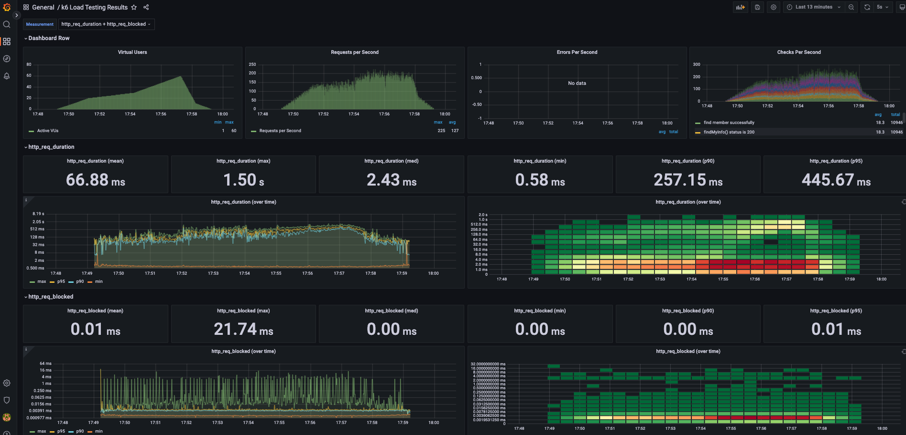

<p align="center">
    
</p>
<p align="center">
  
  
  <a href="https://edu.nextstep.camp/c/R89PYi5H" alt="nextstep atdd">
    
  </a>
  
</p>

<br>

# 인프라공방 샘플 서비스 - 지하철 노선도

<br>

## 🚀 Getting Started

### Install

#### npm 설치

```
cd frontend
npm install
```

> `frontend` 디렉토리에서 수행해야 합니다.

### Usage

#### webpack server 구동

```
npm run dev
```

#### application 구동

```
./gradlew clean build
```

<br>

### 1단계 - 웹 성능 테스트

1. 웹 성능예산은 어느정도가 적당하다고 생각하시나요
    - 경쟁사들의 수치를 비교하여 중간값 정도로 정하면 적당할 것이라 생각합니다.

2. 웹 성능예산을 바탕으로 현재 지하철 노선도 서비스의 서버 목표 응답시간 가설을 세워보세요.
    - 경쟁사들의 성능예산을 보고 해당 값들의 중간값 정도로 목표 응답시간을 정할 생각입니다.
    - 성능예산을 보면 TBT, LCP, CLS 의 수치는 비슷합니다.  
      경쟁사와 수치 차이가 큰 FCP, TTI, SI의 목표 응답시간을 개선하는게 사용자 경험 측면에서 긍정적이라 생각합니다.
    - FCP 개선 방법
        - 렌더링 차단 리소스 제거
        - CSS 축소 및 사용하지 않는 CSS 제거
        - 효율적인 캐시 정책으로 정적 자산 제공
        - 이미지 용량 줄이기
    - TTI 개선 방법
        - 자바스크립트 축소
        - 핵심 요청 사전 로드
        - 요청 수를 낮게 유지하고 전송 크기를 작게 유지
    - SI 개선 방법
        - SQL 쿼리 로직 개선
        - GZIP 활성화해 파일 크기 줄이기

#### 요구사항

- [x] 웹 성능 예산 작성 후 서버 목표 응답시간 도출

#### 용어 정의

- First Contentful Paint : 콘텐츠가 포함된 첫 페인트는 첫 번째 텍스트 또는 이미지가 표시되는 시간을 나타냄
- Time to Interactive : 사용할 수 있을 때까지 걸리는 시간은 완전히 페이지와 상호작용할 수 있게 될 때 까지 걸리는 시간
- Speed Index : 페이지 콘텐츠가 얼마나 빨리 표시되는지 보여주는 시간
- Total Blocking Time : FCP와 상호작용 시간 사이의 모든 시간의 합으로 작업 지속 시간
- Largest Contentful Paint : 최대 텍스트 또는 이미지가 표시되는 시간
- Cumulative Layout Shift : 표시 영역 안에 보이는 요소의 이동을 측정한 시간

#### 경쟁사 비교분석

- 모바일(Mobile)

|         | Running Map | 서울교통공사 | 네이버지도  | 카카오맵   |
|---------|-------------|--------|--------|--------|
| FCP(s)  | 15.0s       | 7.9s   | 2.2s   | 1.7s   |
| TTI(s)  | 15.5s       | 9.8s   | 6.9s   | 4.7s   |
| SI(s)   | 15.0s       | 11.8s  | 7.0s   | 7.8s   |
| TBT(ms) | 470ms       | 400ms  | 520ms  | 120ms  |
| LCP(s)  | 15.5s       | 14.7s  | 9.9s   | 5.6s   |
| CLS(s)  | 0.042s      | 0s     | 0.017s | 0.005s |

- 데스크탑(Desktop)

|         | Running Map | 서울교통공사 | 네이버지도  | 카카오맵   |
|---------|-------------|--------|--------|--------|
| FCP(s)  | 2.7s        | 2.0s   | 0.6s   | 0.5s   |
| TTI(s)  | 2.8s        | 2.5s   | 1.2s   | 1.4s   |
| SI(s)   | 2.7s        | 3.3s   | 2.2s   | 2.4s   |
| TBT(ms) | 80ms        | 50ms   | 70ms   | 60ms   |
| LCP(s)  | 2.8s        | 5.0s   | 2.4s   | 1.2s   |
| CLS(s)  | 0.004s      | 0.232s | 0.004s | 0.004s |

#### 웹 성능예산

- 모바일(Mobile)

|       | FCP(s) | TTI(s) | SI(s) | TBT(ms) | LCP(s) | CLS(s) |
|-------|--------|--------|-------|---------|--------|--------|
| AS-IS | 15.0s  | 15.5s  | 15.0s | 470ms   | 15.5s  | 0.042s | 
| TO-BE | 4s     | 4s     | 6.5s  | 450ms   | 12s    | 0.035s | 

- 데스크탑(Desktop)

|       | FCP(s) | TTI(s) | SI(s) | TBT(ms) | LCP(s) | CLS(s) |
|-------|--------|--------|-------|---------|--------|--------|
| AS-IS | 2.7s   | 2.8s   | 2.7s  | 80ms    | 2.8s   | 0.004s | 
| TO-BE | 1.5s   | 1.5s   | 2s    | 70ms    | 2.0s   | 0.004s |

#### 참조

- [TTI 개선 방법](https://web.dev/i18n/ko/tti/)

---

### 2단계 - 부하 테스트

1. 부하테스트 전제조건은 어느정도로 설정하셨나요
    - 대상 시스템 범위
        - nginx -> application -> db
    - 목표값 설정
        - 경쟁사의 MAU(22년8월) 네이버지도(2130만), 카카오맵(950만) 을
          기준[(참조 링크)](https://mobile.newsis.com/view.html?ar_id=NISX20220927_0002028167)으로  
          두 경쟁사의 합인 약 3000만의 30프로인 **MAU 900만**으로 가정했습니다.
        - Throughput(처리량) 구하기
            - 예상 1일 사용자 수(DAU): **30만** (900만 / 30일)
            - 예상 1일 사용자 1명당 평균 접속 수: **4회** (출근, 퇴근, 출장, 기타)
            - 예상 1일 사용자 총 요청 수: **120만** (30만 * 4회))
            - 예상 1일 평균 rps: **13.8rps** (120만 / 86400(초/일))
            - 예상 1일 최대 rps: **41.6rps** (평균 rps의 3배)
        - latency
            - 100ms
        - VUser 구하기
            - R(시나리오에 포함된 요청의 수): **3번** (메인 페이지, 경로 검색 페이지, 경로 검색 요청)
            - T(VUser 반복을 완료하는데 필요한 시간보다 큰 값): **1.9초** ((3 * 0.3초) + 1초)
            - VUser(평균): **8.74** ((13.8 * 1.9) / 3)
            - VUser(최대): **26.3** ((41.6 * 1.9) / 3)
    - 부하 테스트 시 저장될 데이터 건수 및 크기
        - 지하철 노선: 23개
        - 지하철 역: 616개
        - 지하철 구간: 340개
        - 사용자: 1개

2. Smoke, Load, Stress 테스트 스크립트와 결과를 공유해주세요
    - 일반적으로 해당 시스템은 지하철 노선도를 조회하는 역할이 크기 때문에 접속 빈도가 높은 페이지 시나리오를 선택
    - Smoke 테스트
        - VUser: 1
        - Latency: 100ms 이하
        - 결과: 정상 확인
    - Load 테스트
        - VUser: 30까지 점진적으로 증가 후 일정 시간 유지 후 감소
        - Latency: 100ms 이하
        - 유지시간: 30분
        - 결과: 정상 확인
    - Stress 테스트
        - VUser: 300까지 점진적으로 증가
        - 유지시간: 30분
        - 결과: 몇몇 요청의 실패 및 지연 로그 확인 및 이후 시스템 정상 동작 확인

   <details>
   <summary>테스트 스크립트와 이미지</summary>

    - Smoke 테스트
        - [Smoke Script](./docs/step2/smoke/smoke.js)
        - 
        - 
    - Load 테스트
        - [Load Script](./docs/step2/load/load.js)
        - 
        - 
    - Stress 테스트
        - [Stress Script](./docs/step2/stress/stress.js)
        - 
        - 

    </details> 

#### 요구사항

- [x] 부하 테스트
    - [x] 테스트 전제조건 정리
        - [x] 대상 시스템 범위
        - [x] 목푯값 설정 (latency, throughput, 부하 유지기간)
        - [x] 부하 테스트 시 저장될 데이터 건수 및 크기
    - [x] 아래 시나리오 중 하나를 선택하여 스크립트 작성
        - [x] 접속 빈도가 높은 페이지
        - [ ] 데이터를 갱신하는 페이지
        - [ ] 데이터를 조회하는데 여러 데이터를 참조하는 페이지
    - [x] Smoke, Load, Stress 테스트 후 결과를 기록

#### 용어정의

<details>
<summary>용어 정의 정리</summary>

- Smoke Test
    - 최소한의 부하로 구성된 테스트로, 테스트 시나리오에 오류가 없는지 확인 할 수 있음
    - 최소 부하 상태에서 시스템에 오류가 발생하지 않는지 확인할 수 있음
    - VUser를 1~2로 구성하여 테스트
- Load Test
    - 서비스의 평소 트래픽과 최대 트래픽 상황에서 성능이 어떤지 확인 및 기능 정상 동작 확인
    - 애플리케이션 배포 및 인프라 변경(scale out, DB failover 등)시에 성능 변화를 확인
    - 외부 요인(결제 등)에 따른 예외 상황을 확인
    - 보통 30 ~ 2시간 사이의 테스트 권장
- Stress Test
    - 서비스가 극한의 상황에서 어떻게 동작하는지 확인
    - 장기간 부하 발생에 대한 한계치를 확인하고 기능이 정상 동작하는지 확인
    - 최대 사용자 또는 최대 처리량을 확인
    - 스트레스 테스트 이후 시스템이 수동 개입없이 복구되는지 확인
- VU(Virtual Users): 동시에 접속하는 가상 사용자의 숫자
- EPS(Errors Per Second): 초당 에러 수
- CPS(Checks Per Second): 초당 체크된 요청 수
- TPS(Transaction Per Second): 1초에 처리하는 단위 작업의 수
- RPS(Request Per Second: 1초에 처리하는 HTTP 요청 수
- latency(지연시간): 서버가 클라이언트의 요청을 처리하는데 발생하는 지연시간
- 목표 rps 구하기
    - 1일 사용자 수(DAU) x 1명당 1일 평균 접속 수 = 1일 총 접속 수
    - 1일 총 접속 수 / 86,400(초/일) = 1일 평균 rps
    - 1일 평균 rps x (최대 트래픽 / 평소 트래픽) = 1일 최대 rps
- VUser 구하기(목표 rps * T) / R
    - R: 시나리오에 포함된 요청의 수(반복 횟수)
    - T: 시나리오 완료 시간보다 큰 값(VUser 반복을 완료하는데 필요한 시간보다 큰 값)
        - T = (R * 왕복시간(http_req_duration)) + 지연시간(내부망일 경우 추가(보통1초))
- http_req_sending: 원격 호스트에 데이터를 보내는데 소요된 시간
- http_req_waiting: 원격 호스트로부터의 응답을 대기하는 데 소요된 시간
- http_req_receiving: 원격 호스트로부터 응답 데이터를 수신하는 데 소요된 시간
- http_req_duration: 요청의 총 시간 (http_req_sending + http_req_waiting + http_req_receiving)

</details>

#### 참조

- [K6 공식 문서](https://k6.io/docs/)
- [k6 sample code](https://github.com/grafana/k6/tree/master/samples)
- [성능 테스트 관련](https://hyuntaeknote.tistory.com/10)
- [부하 테스트 계산 관련](https://velog.io/@max9106/nGrinderPinpoint-test1)
- [K6 용어 관련 블로그](https://happy-coding-day.tistory.com/entry/%EC%84%B1%EB%8A%A5%ED%85%8C%EC%8A%A4%ED%8A%B8-k6-%EA%B2%B0%EA%B3%BC-%EB%82%B4%EC%97%AD%EC%9D%84-%EC%9D%B4%ED%95%B4%ED%95%B4%EB%B3%B4%EC%9E%90)

---

### 3단계 - 로깅, 모니터링

1. 각 서버내 로깅 경로를 알려주세요
    - Application File Log 경로 : /home/ubuntu/infra-subway-monitoring/logs/file.log
    - Application Json Log 경로 : /home/ubuntu/infra-subway-monitoring/logs/json.log
    - Nginx Access Log 경로 : /home/ubuntu/infra-subway-monitoring/logs/nginx/access.log
    - Nginx Error Log 경로 : /home/ubuntu/infra-subway-monitoring/logs/nginx/error.log

2. Cloudwatch 대시보드 URL을 알려주세요
    - https://ap-northeast-2.console.aws.amazon.com/cloudwatch/home?region=ap-northeast-2#dashboards:name=haservi

#### 요구사항

- [x] 애플리케이션 진단하기 실습을 진행해보고 문제가 되는 코드를 수정
- [x] 로그 설정하기
    - [x] Application Log 파일로 저장하기
        - [x] 회원가입, 로그인 등의 이벤트에 로깅을 설정
        - [x] 경로찾기 등의 이벤트 로그를 JSON으로 수집
    - [x] Nginx Access Log 설정하기
- [x] Cloudwatch로 모니터링

#### 용어정리

- USE 방법론
    - 모든 resource (자원)에 대하여 utilization (점유율), saturation (포화율), errors (오류)를 확인

