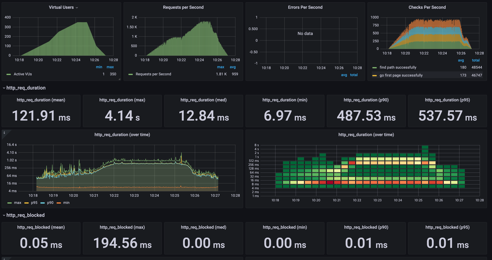

<p align="center">
    
</p>
<p align="center">
  
  
  <a href="https://edu.nextstep.camp/c/R89PYi5H" alt="nextstep atdd">
    
  </a>
  
</p>

<br>

# 인프라공방 샘플 서비스 - 지하철 노선도

<br>

## 🚀 Getting Started

### Install
#### npm 설치
```
cd frontend
npm install
```
> `frontend` 디렉토리에서 수행해야 합니다.

### Usage
#### webpack server 구동
```
npm run dev
```
#### application 구동
```
./gradlew clean build
```
<br>


### 1단계 - 웹 성능 테스트
1. 웹 성능예산은 어느정도가 적당하다고 생각하시나요

#### 성능 테스트 결과 (모바일 기준)

|             |지하철 노선도| 서울교통공사 | 네이버지도 | 카카오맵 |
|-------------|------------|-------------|-----------|---------|
| FCP         | 14.7s      | 7.1s        | 2.2s      | 1.7s    |
| Speed Index | 14.7s      | 8.3s        | 5.2s      | 6.8s    | 
| LCP         | 15.3s      | 11.3s       | 7.8s      | 5.1s    |
| TTI         | 15.4s      | 9.0s        | 6.4s      | 4.5s    | 
| TBT         | 580ms      | 650ms       | 220ms     | 70ms    |
| CLS         | 0.042      | 0           | 0.03      | 0.005   | 

#### 중요 지표 순서

- 첫 응답 속도가 중요하고, 인터액션을 빠르게 할 수 있도록 하는 것이 중요하기 때문에, 아래의 지표를 중요하게 잡음
- FCP : 2.65s (경쟁사 평균 3.3s이므로 이보다 20% 성능을 개선한 수치를 목표로 함)
- TTI : 5.3s (경쟁사 평균 6.3s이므로 이보다 20% 성능을 개선한 수치를 목표로 함)


2. 웹 성능예산을 바탕으로 현재 지하철 노선도 서비스는 어떤 부분을 개선하면 좋을까요


- 위의 스크린샷을 보면, 해당 두 파일 다운로드 시간이 오래걸리는 것을 알 수 있다.
  - 해당 두 파일(vendor.js, main.js) 을 gzip압축하여 리소스를 응답한다.
- 이미지들을 압축하여 응답한다
- 정적 파일 (css, js, 이미지, 폰트) 등을 cdn에 캐싱하여 응답시간을 줄임


---

### 2단계 - 부하 테스트 
1. 부하테스트 전제조건은 어느정도로 설정하셨나요
- 테스트 전제조건 정리
  - 대상 시스템 범위 : web server (nginx), web application server, db
  - 목푯값 설정
    - latency : 100ms 이하
    - throughput : 20.8rps ~ 104rps
      - 1일 사용자 수 dau : 60만 (2016년 기사의 자하철 앱 1위 dau가 130만임을 감안해 이의 50%를 목표로 잡음)
      - 1일 총 접속 수 : 3번 ( 출근 퇴근 2번 + 환승 1번으로 가정함 )
      - 피크 트래픽 / 평소 트래픽 : 5  ( 선릉역 기준 250000 출근시간 / 50000 평상시 ) 참고자료 https://data.seoul.go.kr/dataList/OA-12252/S/1/datasetView.do
      - 1일 평균 rps : 20.8rps (60만 * 3 / 86400)
      - 1일 최대 rps : 104rps (20.8rps * 5)
    - T : 1.3 (3 * 0.1 + 1)
    - min VUser: (20.8 * 1.3) / 3 = 9.0
    - max VUser: (104 * 1.3) / 3 = 45.0

- 각 시나리오에 맞춰 스크립트 작성
  - 접속 빈도가 높은 페이지 : 메인페이지
  - 데이터를 갱신하는 페이지 : 경로 조회 페이지로 이동
  - 데이터를 조회하는데 여러 데이터를 참조하는 페이지 : 경로 조회


2. Smoke, Load, Stress 테스트 스크립트와 결과를 공유해주세요
- smoke : , 
- load : 
- stress : , 
  -  Request Failed error="Get \"https://soob-forest.n-e.kr/path\": dial tcp socket: too many open files 이와 같은 에러 메세지가 발생하는 것을 보면, 열수 있는 파일의 개수를 넘어서, 소켓 생성을 못하는 것으로 판단됨 

---

### 3단계 - 로깅, 모니터링
1. 각 서버내 로깅 경로를 알려주세요

2. Cloudwatch 대시보드 URL을 알려주세요
