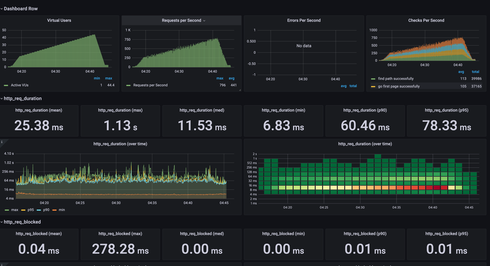

<p align="center">
    
</p>
<p align="center">
  
  
  <a href="https://edu.nextstep.camp/c/R89PYi5H" alt="nextstep atdd">
    
  </a>
  
</p>

<br>

# 인프라공방 샘플 서비스 - 지하철 노선도

<br>

## 🚀 Getting Started

### Install

#### npm 설치

```
cd frontend
npm install
```

> `frontend` 디렉토리에서 수행해야 합니다.

### Usage

#### webpack server 구동

```
npm run dev
```

#### application 구동

```
./gradlew clean build
```

<br>

### 1단계 - 웹 성능 테스트

1. 웹 성능예산은 어느정도가 적당하다고 생각하시나요

#### 성능 테스트 결과 (모바일 기준)

|             |지하철 노선도| 서울교통공사 | 네이버지도 | 카카오맵 |
|-------------|------------|-------------|-----------|---------|
| FCP         | 14.7s      | 7.1s        | 2.2s      | 1.7s    |
| Speed Index | 14.7s      | 8.3s        | 5.2s      | 6.8s    | 
| LCP         | 15.3s      | 11.3s       | 7.8s      | 5.1s    |
| TTI         | 15.4s      | 9.0s        | 6.4s      | 4.5s    | 
| TBT         | 580ms      | 650ms       | 220ms     | 70ms    |
| CLS         | 0.042      | 0           | 0.03      | 0.005   | 

#### 중요 지표 순서

- 첫 응답 속도가 중요하고, 인터액션을 빠르게 할 수 있도록 하는 것이 중요하기 때문에, 아래의 지표를 중요하게 잡음
- FCP : 2.65s (경쟁사 평균 3.3s이므로 이보다 20% 성능을 개선한 수치를 목표로 함)
- TTI : 5.3s (경쟁사 평균 6.3s이므로 이보다 20% 성능을 개선한 수치를 목표로 함)


2. 웹 성능예산을 바탕으로 현재 지하철 노선도 서비스는 어떤 부분을 개선하면 좋을까요


- 위의 스크린샷을 보면, 해당 두 파일 다운로드 시간이 오래걸리는 것을 알 수 있다.
    - 해당 두 파일(vendor.js, main.js) 을 gzip압축하여 리소스를 응답한다.
- 이미지들을 압축하여 응답한다
- 정적 파일 (css, js, 이미지, 폰트) 등을 cdn에 캐싱하여 응답시간을 줄임

---

### 2단계 - 부하 테스트

1. 부하테스트 전제조건은 어느정도로 설정하셨나요

- 테스트 전제조건 정리
    - 대상 시스템 범위 : web server (nginx), web application server, db
    - 목푯값 설정
        - latency : 100ms 이하
        - throughput : 20.8rps ~ 104rps
            - 1일 사용자 수 dau : 60만 (2016년 기사의 자하철 앱 1위 dau가 130만임을 감안해 이의 50%를 목표로 잡음)
            - 1일 총 접속 수 : 3번 ( 출근 퇴근 2번 + 환승 1번으로 가정함 )
            - 피크 트래픽 / 평소 트래픽 : 5  ( 선릉역 기준 250000 출근시간 / 50000 평상시 )
              참고자료 https://data.seoul.go.kr/dataList/OA-12252/S/1/datasetView.do
            - 1일 평균 rps : 20.8rps (60만 * 3 / 86400)
            - 1일 최대 rps : 104rps (20.8rps * 5)
        - T : 1.3 (3 * 0.1 + 1)
        - min VUser: (20.8 * 1.3) / 3 = 9.0
        - max VUser: (104 * 1.3) / 3 = 45.0

- 각 시나리오에 맞춰 스크립트 작성
    - 접속 빈도가 높은 페이지 : 메인페이지
    - 데이터를 갱신하는 페이지 : 경로 조회 페이지로 이동
    - 데이터를 조회하는데 여러 데이터를 참조하는 페이지 : 경로 조회


2. Smoke, Load, Stress 테스트 스크립트와 결과를 공유해주세요

- smoke : , 
- load :  , 
- stress : , 
    - Request Failed error="Get \"https://soob-forest.n-e.kr/path\": dial tcp socket: too many open files 이와 같은 에러 메세지가
      발생하는 것을 보면, 열수 있는 파일의 개수를 넘어서, 소켓 생성을 못하는 것으로 판단됨

---

### 3단계 - 로깅, 모니터링

- [x] 애플리케이션 진단하기 실습을 진행해보고 문제가 되는 코드를 수정

```
2022-06-21 17:19:12.642  WARN 255722 --- [nio-8080-exec-7] o.h.engine.jdbc.spi.SqlExceptionHelper   : SQL Error: 90022, SQLState: 90022
2022-06-21 17:19:12.643 ERROR 255722 --- [nio-8080-exec-7] o.h.engine.jdbc.spi.SqlExceptionHelper   : Function "SLEEP" not found; SQL statement:
SELECT * FROM line WHERE SLEEP(3) [90022-200]
2022-06-21 17:19:12.652 ERROR 255722 --- [nio-8080-exec-7] o.a.c.c.C.[.[.[/].[dispatcherServlet]    : Servlet.service() for servlet [dispatcherServlet] in context with path [] threw exception [Request processing failed; nested exception is org.springframework.dao.InvalidDataAccessResourceUsageException: could not prepare statement; SQL [SELECT * FROM line WHERE SLEEP(3)]; nested exception is org.hibernate.exception.SQLGrammarException: could not prepare statement] with root cause

org.h2.jdbc.JdbcSQLSyntaxErrorException: Function "SLEEP" not found; SQL statement:
SELECT * FROM line WHERE SLEEP(3) [90022-200]
.
.
.
at com.sun.proxy.$Proxy108.findAll(Unknown Source) ~[na:na]
	at nextstep.subway.line.application.LineService.findLineResponses(LineService.java:35) ~[classes!/:na]
```

위와 같은 로그를 확인 하여, LineService.java:35 의 lineRepository.findAll(); 가 문제 라는 것을 확인.
결로적으로, line repository 의
`@Query(value = "SELECT * FROM line WHERE SLEEP(3)", nativeQuery = true) List<Line> findAll();`
문장이 문제의 원인이라는 것을 확인함

- [x] 로그 설정하기
    - [x] Application Log 파일로 저장하기
        - 회원가입, 로그인 등의 이벤트에 로깅을 설정
        - 경로찾기 등의 이벤트 로그를 JSON으로 수집
    - [x] Nginx Access Log설정하기
- [x] Cloudwatch로 로그 수집하기
    - https://ap-northeast-2.console.aws.amazon.com/cloudwatch/home?region=ap-northeast-2#logsV2:log-groups/log-group/soob-forest
- [x] Cloudwatch로 메트릭 수집하기
- [x] Use 방법론을 활용하기 용이하도록 대시보드 구성

1. 각 서버내 로깅 경로를 알려주세요
    - nginx
        - ec2 : soob-forest-proxy-EC2
        - path : /var/log/nginx
    - was
        - ec2 : soob-forest-EC2
        - path: /home/ubuntu/nextstep/infra-subway-monitoring/log

2. Cloudwatch 대시보드 URL을 알려주세요

- https://ap-northeast-2.console.aws.amazon.com/cloudwatch/home?region=ap-northeast-2#dashboards:name=soob-forest-dashboard
