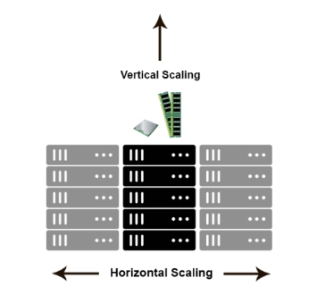
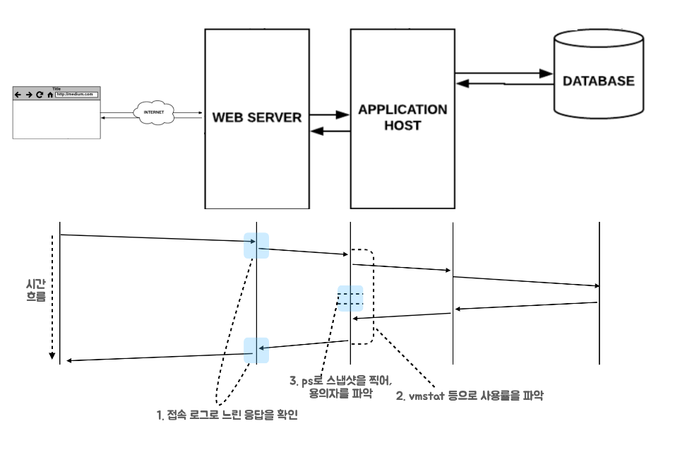
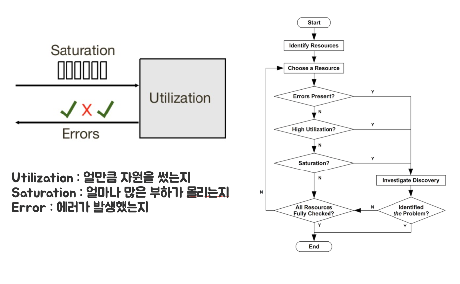
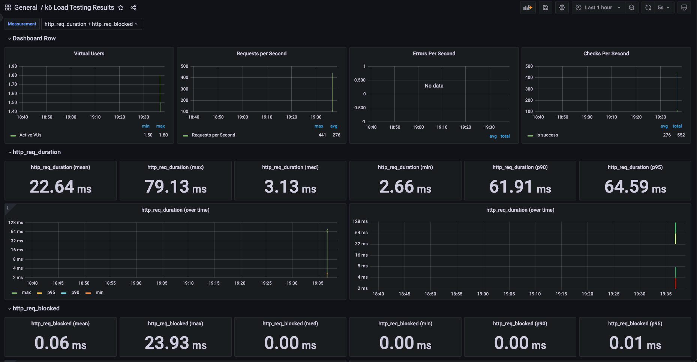
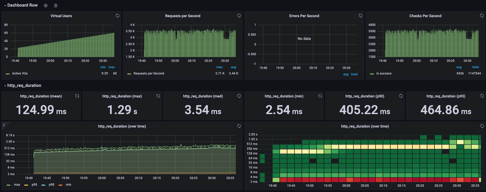
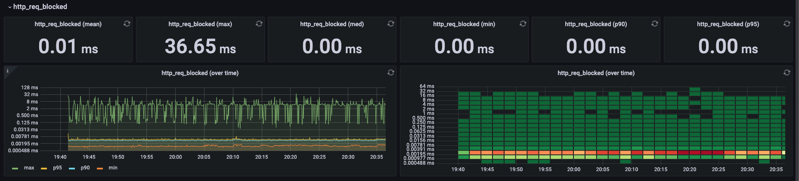
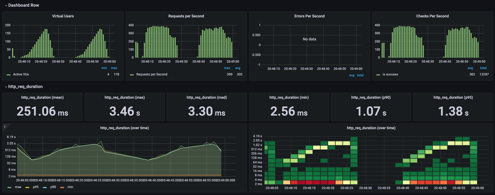
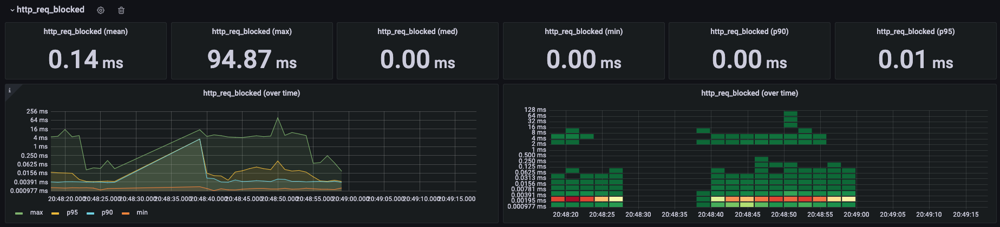
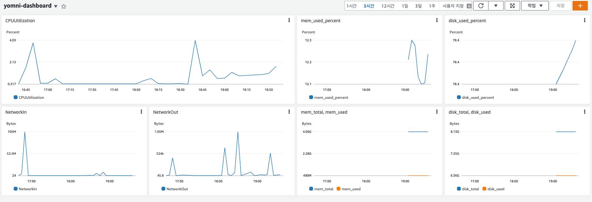

<p align="center">
    
</p>
<p align="center">
  
  
  <a href="https://edu.nextstep.camp/c/R89PYi5H" alt="nextstep atdd">
    
  </a>
  
</p>

<br>

# 인프라공방 샘플 서비스 - 지하철 노선도

<br>

## 🚀 Getting Started

### Install
#### npm 설치
```
cd frontend
npm install
```
> `frontend` 디렉토리에서 수행해야 합니다.

### Usage
#### webpack server 구동
```
npm run dev
```
#### application 구동
```
./gradlew clean build
```
<br>

## 서비스 진단하기 강의 내용 간단 정리
> 이번 미션 목표
> 1. webpagetest, pagespeed를 활용하여 _**웹 성능 예산 고민**_
> 2. 목표치를 정하고 _**부하 테스트**_ 를 직접 수행
> 3. _**USE 방법론**_ 을 활용하여 _**서버 진단 & Thread 덤프**_ 를 확인 가능

### 웹 성능 진단하기

#### 문제 인식) 주로 _인터넷 구간 성능 테스트_ 를 _어떤 기준_ 으로 _어떻게_ _무엇을_ 개선 할 것 인가?

#### 어떻게 확인?
- webpagetest, pagespeed 등의 도구를 활용

#### 무엇을 개선?
A) 정답은 없다 ; 서비스 특성마다 다른 기준을 가지고 개선  
크게 **정량** / **시간** / **규칙** 기반으로 산정하여 개선 가능 하다.

- 정량 기반(`Quantity Based Metric`) 예시
  - 메인 페이지의 모든 오브젝트 파일 크기는 `10mb 미만`으로 제한한다
  - 모든 웹 페이지의 각 페이지 내 포함된 자바스크립트 크기는 `1mb 미만` 이어야 한다.
  - 검색 페이지에는 `2mb 미만`의 이미지가 포함되어야 합니다.
- 시간 기반(`Timing Based Metric`) 예시
  - LTE 환경에서의 모바일 기기의 `TTI:Time To Interactive`는 `5초 미만`이어야 한다
  - `DCL:Dom Content Loaded`는 `10초`, `FMP: First Meaningful Paint`는 `15초 미만`이어야 한다
- 규칙 기반(`Rule Based Metric`) 예시
  - Lighthouse 성능 검사에서 `80점 이상`이어야 한다.

대표적으로 활용되는 가장 중요한 기준
- 사용자 _**트래픽이 많은 페이지**_ , _**가장 중요한 페이지**_ 기준
    - 경쟁사 대비 20% 차이
    - 3초 안에 로딩

> 참고)성능 관련 용어들의 의미 파악
> - FCP(First Contentful Paint) : 가장 첫번째 유의미한 콘텐츠(텍스트 or 이미지)가 표시되는 시간 
> - LCP(Large Contentful Paint) : 유의미한 콘텐츠(텍스트 or 이미지) 중 가장 큰 콘텐츠가 표시되는 시간 
> - TTI(Time To Interactive) : 사용자가 사이트와 완전히 상호작용 할 수 있을 때까지 걸리는 시간
> - TBT(Total Blocking Time) : 상호작용이 불가능 했을 때의 시간
> - CLS(Cumulative Layout Shift) : 표시 영역 안에 보이는 요소의 이동을 측정
> - Speed Index : 페이지의 보이는 부분이 표시되는 평균 시간

#### 성능 예산 이란?
`예산`이란 단어 때문에 헷갈릴 여지가 있는 부분이 있으나, 금전적인것과는 연관 없는  
**_순수하게 페이지에 대한 초과할 수 없는 어떤 기준이나 제한을 의미_**

### 부하 테스트 하기

#### 사전 지식
- 가용성 : 사용을 가능하게 하는 성질  
  어떤 시스템이 **상당히 오랜 기간 동안 지속적으로 정상 운영이 가능한 성질**,  
  고가용성이란 **절대 고장 나지 않음** 이란 말과 진배없다.
  - uptime 등의 지표로 측정됨
  - 부하가 높아지면 가용성은 낮아짐(장애가 발생할 확률이 높기 때문에)
  - 가용성을 높이기 위해 단일장애점(SPOF)를 없애고, 확장성 있는 서비스를 만들어야 함

따라서, 고가용성 시스템을 구축하기 위한 필요조건으로 다중화가 많이 거론되곤 한다.
- 다중화 : 장애가 발생해도 예비 운용장비로 시스템의 기능을 계속 할 수 있도록 하는 것(**장애내성**)
  - 단일장애점(SPOF)를 없애고 무중단 / 고가용성 서비스를 위해 필요조건. 다만, 사용량을 고려하여 다중화 정도를 정해야 함
  - 애플리케이션 서버, Load Balancer, Network Device 등등 모든 것이 다중화 대상
    - Fail - Over : active - passive 관계 (하나만 활성화 되어있다가 죽으면 passive 가 active 로 전환)
    - Replication : master - slave 클러스터링

#### 부하 테스트 관점 정리
- 고가용성, 무중단 서비스를 지향하는데 있어 핵심은 사용자가 납득할만한 수준의 가용성을 유지하되, 배포 사이클을 유지하는 것
- 서비스를 배포하기에 앞서 예상되는 상황을 테스트하여, 현재 시스템이 어느 정도의 부하를 견딜 수 있는지 확인하고,  
  한계치에서 병목이 생기는 지점을 파악하고 장애 조치와 복구를 사전에 계획 해 둘 필요가 있음  
  (ex : 인기 콘서트 예매 오픈 전 부하 테스트)
- 결국 사용자의 요청을 어느정도까지 처리할 수 있는지 한계를 예상하고, 가용성을 지키기 위해 적정 수준의 성능을 제공하는것이 부하테스트의 핵심
  - Concurrent User : 켜놓고 아무것도 안하는 사용자 ; 예비 Active User
  - Active User : 실제 서버에 부하를 일으키고 있는 사용자(특히 부하테스트에서는 `VUser` 라고 함)
  - Concurrent : Active 적정 수준 유지해야 함

> 부하 테스트 관련 용어 정리  
> - TPS(Transaction Per Second ; 처리량)
>   - 서비스 처리 건수 / 측정 시간
>   - 요청 사용자 수 / 평균 응답시간
>   - 동시 사용자 수 / 서비스 요청 간격  
> 
>   - User : TPS 는 일정구간 비례하다가 특정 시점에 증가하지 않는다.
>   - User : Time 은 일정구간 유지되다가 점차적으로 늘어난다.
>   - TPS : Time 은 일정구간 오르다가 변곡점에 이르기도 한다.
>     - 이 때, 리소스가 누수되고 있는 건 아닌지 의심
>   - TPS 는 `Scale Out : 분산처리` 혹은 `Scale up : 리소스 스펙업`을 통해 증가 가능
>   - 단순히 응답시간을 기준으로 종료시키지 말고, TPS 나 DB Connection, CPU 등을 종합적으로 확인하고 중단해야 함
> - Performance vs Scalability  
>   
>   - 성능에 문제가 있는 경우엔, 단일 사용자에 대한 응답 속도가 느려진다
>   - 확장성에 문제가 있는 경우엔, 당장은 단일 사용자에게는 빠르지만 부하가 많아질 경우 속도가 느려질 수 있다
> - 시간
>   - 사용자에게 있어서 Time 은 응답시간만 존재한다
>   - 하지만, 실제 시스템 입장에선 사용자가 응답받은 후 다음 요청 전까지 웹페이지를 보고 활용하는 등의 시간이 존재한다(Think time)  
>   
>   - 성능 테스트 시엔 실제 지연시간이 발생하는 구간을 파악해야 한다.
>     - 상위 5%의 화면이 95% 사용자 요청을 받는다. --> 튜닝의 대상을 면밀히 검토하여 선별해야 한다.
>     - 따라서 성능 테스트 시엔 `Scale Out` 도 중요하지만, 응답시간 또한 중요하다 

#### 부하 테스트 종류
- Smoke Test<sup>[1](#footnote_1)</sup>
  - 최소한의 부하로 구성된 테스트, 테스트 시나리오에 오류가 없는 지 확인 가능
  - VUser : 1 ~ 2 로 구성
- Load Test
  - 서비스의 평소 트래픽과 최대 트래픽 상황에서 성능이 어떤 지 확인
  - 이 때 기능의 정상 동작 여부도 확인
  - 애플리케이션 배포 및 인프라 변경 (scale out, DB failover 등)시에 성능 변화를 확인
  - 외부 요인(결제 등)에 따른 예외 상황을 확인
- Stress Test
  - 극한 상황에서의 동작 테스트
  - 장기간 부하 발생에 대한 한계치 확인 및 기능 정상 동작 여부 확인
  - 최대 사용자 또는 최대 처리량을 확인
  - 스트레스 테스트 이후 시스템이 수동 개입 없이 복구되는 지 확인

### 서버 진단하기
부하테스트까지 진행을 했으면, 이런 의문이 생긴다.  
**_부하 임계점에서 문제가 되는 부분을 어떻게 파악하지?_**  



비단 부하 테스트를 떠나서 운영을 하다 보면 많은 문제에 봉착하게 된다.  
이럴 때, 모든 경우에 대해 **전후 상황을 파악하고 원인을 분석해야 대처가 가능**하다.

#### 어떻게?
- USE 방법론



- USE 방법론으로 진단/모니터링 하기 위한 도구로 stat 등이 있다.

### 애플리케이션 진단하기
Thread는 Process와는 다르게 메모리 공간을 공유하기 때문에, Lock이 걸릴 확률이 높다.  
따라서, 
- BLOCKED 상태인 Thread가 있는지
- 한 Task가 특정 Thread를 점유하고 있지 않은지
- CPU 사용률이 너무 높지 않은지
파악해야 함

#### 어떻게?
- Thread 덤프 분석
  - Thread 덤프는 Thread 가 무슨 일을 하는 지 알 수 있다.
- Arthas 활용하기(자바 Thread 덤프 분석기(?))

```shell
curl -O https://arthas.aliyun.com/arthas-boot.jar
java -jar arthas-boot.jar
```

### 1단계 - 웹 성능 테스트
1. 웹 성능예산은 어느정도가 적당하다고 생각하시나요  
- 경쟁사 서비스 대비 사용자가 **_성능차이_** 를 느끼지 않을 정도로 예산을 잡아야 한다고 생각합니다
   - 사용자는 응답시간이 경쟁사 대비 20% 이상 차이가 나면 성능차이를 체감합니다.  

- 따라서, 최소한 경쟁사 대비 20% 이상 차이가 나지 않도록 개선해야하는 것을 목표로 잡아야 한다고 생각합니다.

- 또한, 경쟁사 중 가장 성능이 좋은 서비스 대비하여 20%를 목표로 잡아야 한다고 생각합니다.  
  - 임의의 경쟁사 A, B가 있고 A가 가장 성능이 좋다 라고 가정해본다면,
  - B가 성능예산을 잡을 때, A의 서비스 성능 대비하여 20%로 잡았다고 가정해봅시다.
  - 그렇다면, 우리의 서비스는 B의 성능을 대비하여 20%로 성능예산을 잡으면
  - 결국, 가장 성능이 좋은 A의 서비스 대비 44%의 성능차이 내에서 예산을 잡은것이 됩니다(이론적으로)  
  **_따라서, 경쟁사 중 가장 성능이 좋은 서비스 대비하여 20%를 목표로 잡아야 합니다_**

2. 웹 성능예산을 바탕으로 현재 지하철 노선도 서비스의 서버 목표 응답시간 가설을 세워보세요.
- 성능 테스트 대상 페이지는 다음 두 페이지 입니다.
  - 메인 페이지(서비스 최초 접근 화면)
  - 경로 찾기 서비스(사용자가 가장 많이 사용할 것 같은 기능)
    - 카카오맵은 내부 sidebar 탭으로 길찾기 기능이 내장되어 있으므로 메인페이지와 결과가 동일합니다.  
      (메인페이지와 길찾기 URI 분리가 안됨)

- 가장 성능이 좋은 서비스 대비 20% 이내로 성능예산 목표로 잡았습니다.
  - 시간 기반으로 기준을 잡았습니다. 
    - 성능 종합, CLS는 시간과 연관있는 수치가 아니기 때문에 성능예산 에서 제외합니다.
    - TBT는 성능의 개선과는 다소 연관성이 낮기 때문에 성능예산엔 포함하지 않습니다.  
    (각각의 수치가 편차가 크지 않다면 TBT는 그 값이 작아짐)
  - 자세한 목표 수치는 아래 기능목록에서 상세하게 기술하겠습니다.

#### 1단계 기능 목록
- [x] AWS에 서버 띄우기(연계되는 미션이 있는 줄 모르고 세미 보이스카웃 규칙 적용(지울수 있는 만큼 지우기))
  - [x] 현재 소스코드 기준으로 운영 환경 구성(환경설정 파일 분리, 배포 스크립트 적용 등등..)
- [x] 경쟁사 / RunningMap 성능 테스트([pagespeed](https://pagespeed.web.dev/) 로 성능 테스트 진행) 
- 메인페이지 (모바일)

|            | FCP          | TTI          | Speed Index  | TBT    | LCP          | CLS   | 성능 종합 |
|------------|--------------|--------------|--------------|--------|--------------|-------|-------|
| 서울교통공사     | 7.2 s        | 11.6 s       | 8.2 s        | 630 ms | 14.7 s       | 0.04  | 33    |
| 네이버지도      | 2.2 s        | 6.6 s        | **_7.2 s_**  | 240 ms | 10.7 s       | 0.17  | 57    |
| 카카오맵       | **_1.7 s_**  | **_4.6 s_**  | 8.3 s        | 90 ms  | **_6.8 s_**  | 0.005 | 66    | 
| RunningMap | 15.0 s       | 15.5 s       | 15.0 s       | 480 ms | 15.5 s       | 0.042 | 33    |
| Target     | ~ **2.04 s** | ~ **5.52 s** | ~ **8.64 s** | -      | ~ **8.16 s** | -     | -     |

- 메인페이지 (데스크탑)

|            | FCP          | TTI          | Speed Index  | TBT    | LCP         | CLS   | 성능 종합 |
|------------|--------------|--------------|--------------|--------|-------------|-------|-------|
| 서울교통공사     | 1.7 s        | **_2.3 s_**  | **_2.2 s_**  | 40 ms  | 4.7 s       | 0.232 | 60    |
| 네이버지도      | **_0.3 s_**  | 3.0 s        | 2.9 s        | 260 ms | 4.1 s       | 0.032 | 60    |
| 카카오맵       | 0.6 s        | 2.6 s        | 2.8 s        | 780 ms | 0.8 s       | 0.017 | 65    |
| RunningMap | 2.7 s        | 2.8 s        | 2.7 s        | 60 ms  | **_2.8 s_** | 0.004 | 68    |
| Target     | ~ **0.36 s** | ~ **2.76 s** | ~ **2.64 s** | -      | **2.8 s**   | -     | -     |

- 경로탐색 페이지 (모바일)

|            | FCP          | TTI          | Speed Index  | TBT      | LCP          | CLS   | 성능 종합 |
|------------|--------------|--------------|--------------|----------|--------------|-------|-------|
| 서울교통공사     | 6.4 s        | 8.6 s        | 8.1 s        | 1,610 ms | 7.3 s        | 0     | 26    |
| 네이버지도      | 2.2 s        | **_2.4 s_**  | **_3.1 s_**  | 20 ms    | **_3.7s_**   | 0     | 86    |
| 카카오맵       | **_1.7 s_**  | 4.6 s        | 8.3 s        | 90 ms    | 6.8 s        | 0.005 | 66    |
| RunningMap | 16.4 s       | 16.9 s       | 16.4 s       | 70ms     | 16.4 s       | 0     | 45    |
| Target     | ~ **2.04 s** | ~ **2.88 s** | ~ **3.72 s** | -        | ~ **4.44 s** | -     | -     |

- 경로탐색 페이지 (데스크탑)

|            | FCP         | TTI         | Speed Index  | TBT    | LCP          | CLS   | 성능 종합 |
|------------|-------------|-------------|--------------|--------|--------------|-------|-------|
| 서울교통공사     | 1.5 s       | **_2.0 s_** | **_2.1 s_**  | 210 ms | 2.6 s        | 0.001 | 70    |
| 네이버지도      | **_0.5 s_** | 3.2 s       | 2.8 s        | 450 ms | 2.6 s        | 0.008 | 57    |
| 카카오맵       | 0.6 s       | 2.6 s       | 2.8 s        | 780 ms | **_0.8 s_**  | 0.017 | 65    |
| RunningMap | 3.0 s       | 3.1 s       | 3.0 s        | 0 ms   | 3.0 s        | 0     | 64    |
| Target     | ~ **0.6 s** | ~ **2.4 s** | ~ **2.52 s** | -      | ~ **0.96 s** | -     | -     |

- [x] 성능 개선의 여지가 있는 부분 파악
  - RunningMap 서비스는 대채로 네트워크 페이로드가 커서 각 시간 수치에서 좋은 성능을 내지 못하고 있었습니다.

  - 따라서, 안내되어 있는 내용 대로 gzip 압축등의 방법을 통해 성능예산 목표를 달성할 수 있도록 개선해 볼 수 있을 것 같습니다.

#### 1단계 피드백
- cdn 서버 적용으로도 성능개선 여지가 있음

> CDN(Content Delivery Network) 서버란?  
> 한마디로 말하면, **캐시 서버의 일종**이라고 할 수 있다.  
> 최근 콘텐츠는 변동될 가능성이 매우 적다(netflex의 영상, 게임의 리소스 등등..)  
> 이런 콘텐츠는 캐싱하여 Content 요청시에 CDN 서비스 등을 통해 응답하는 것이  
> 성능적인 측면에서 훨씬 이점이 많다.

---

### 2단계 - 부하 테스트
---- ----
#### 부하테스트 전제조건은 어느정도로 설정하셨나요
##### 대상 시스템 범위 선정

지하철 노선도 앱의 주요 기능은 바로 `노선 조회` 입니다.
따라서 타겟 시스템 범위는 다음과 같이 설정하였습니다.
- `메인 페이지` : 노선도 시스템 최초 접근 화면
- `노선 조회` : 데이터를 조회하는 데 여러 데이터를 참조하는 페이지

##### 목푯값 설정  
가이드 데이터에 대해 조사해보았습니다.  
- [2021년 1월 도시철도여객수송 - 기관별 승강차실적](http://www.kric.go.kr/jsp/industry/rss/cityorganpassList.jsp?q_fdate=2021)

| 2021    | 1월          |
|---------|-------------|
| 승차인원(명) | 136,963,409 |
| 하차인원(명) | 131,882,716 |

- [2021년 1월 도시철도여객수송 - 시간대별 수송실적](http://www.kric.go.kr/jsp/industry/rss/citytimepassList.jsp?q_fdate=2021&q_month=1)  

| 시간구분/기관     | 승차인원(명)     | 하차인원(명)    | 시간구분/기관     | 승차인원(명)    | 하차인원(명)     |     
|-------------|-------------|------------|-------------|------------|-------------|     
| 00 ~ 01 시간대 | 19,787  	   | 137,784    | 12 ~ 13 시간대 | 6,215,370  | 5,861,232   |     
| 01 ~ 02 시간대 | 1,631   	   | 2,575      | 13 ~ 14 시간대 | 6,670,464  | 6,508,224   |     
| 02 ~ 03 시간대 | 661	        | 1,368      | 14 ~ 15 시간대 | 6,869,426  | 	6,560,438  |     
| 03 ~ 04 시간대 | 258	        | 357        | 15 ~ 16 시간대 | 7,432,874  | 	6,838,711  |     
| 04 ~ 05 시간대 | **36,707**	     | **5,950**      | 16 ~ 17 시간대 | 8,322,306  | 	7,274,110  |     
| 05 ~ 06 시간대 | 1,751,348	  | 505,119    | 17 ~ 18 시간대 | 11,243,652 | 	8,842,101  |     
| 06 ~ 07 시간대 | 3,589,608	  | 2,604,302  | 18 ~ 19 시간대 | **15,021,049** | 	**12,723,067** |     
| 07 ~ 08 시간대 | 9,238,520	  | 5,909,965  | 19 ~ 20 시간대 | 7,547,150  | 	9,167,473  |     
| 08 ~ 09 시간대 | **12,171,172**	 | **14,730,619** | 20 ~ 21 시간대 | 6,379,369  | 	5,513,240  |     
| 09 ~ 10 시간대 | 7,240,449	  | 9,525,133  | 21 ~ 22 시간대 | 6,051,588  | 	6,223,248  |     
| 10 ~ 11 시간대 | 5,515,588	  | 6,048,477  | 22 ~ 23 시간대 | 2,114,058  | 	2,945,234  |     
| 11 ~ 12 시간대 | 5,641,178	  | 5,575,680  | 23 ~ 00 시간대 | 674,884	   | 1,340,31    |     

모든 기관의 2021년 기준 1월의 승/하차 인원은 총 `268,846,125` 대략 `2억 6천 명` 정도 입니다.  
일별로 환산하면 `8,672,455` 명으로 대략 `860만명` 입니다.

또한, 월 기준의 시간대별 승차인원을 비교해보면
- 새벽시간(04시 경) : `3만명`
- 피크시간(출퇴근) : `1200만명` ~ `1500만명` 
- 평균 : `5,406,212` = `540만명`

따라서, 시스템 사용자를 예측해보면
- 하루 지하철 사용자 : 약 400만명(승 / 하차 각각 기준)
- 어플을 사용하는 지하철 사용자는 이 중 약 3/4로 가정 : 약 300만명
- 이 중 1/3이 `RunningMap`을 사용할 것이라고 가정 : 300만 / 3 = `100만명`
- 1명당 1일 평균 접속 수는 [대략 2번(네이버 지도 일일 사용자 기사 참고)](https://news.mt.co.kr/mtview.php?no=2021090916014079809)

위와 같은 기준으로 목푯값을 설정한다면 아래와 같습니다.
##### Throughput : 1일 평균 rps ~ 1일 최대 rps
- 1일 사용자 수(DAU) * 1명당 1일 평균 접속 수 = 1일 총 접속 수
  - 100만 * 2 = 200만
- 1일 총 접속 수 / 86,400 (초/일) = 1일 평균 rps
  - 2,000,000 / 86,400 = `23.14`
- 1일 평균 rps * (최대 트래픽 / 평소 트래픽) = 1일 최대 rps
  - 23.14 * (15,000,000 / 5,400,000) = `64.27`
- 23 ~ 64 rps 로 추정

##### Latency
일반적으로 50 ~ 100 ms 이하로 설정

##### VUser 설정
- T = (R * http_req_duration) (+ 1s(latency)) ; 내부망에서 테스트할 경우 예상 latency를 추가
  - (2회 요청 * 0.5 s) + 1s(latency) = 2 s
- 평균 VUser = 23 * 2 / 2 = 23
- 최대 VUser = 64 * 2 / 2 = 64 

##### 최종 목표 설정

| 부하테스트 종류 | VUser(명) | ramp-up(s) | 부하 유지 시간(s) | ramp-down(s) | threshold(ms) |
|----------|----------|------------|-------------|--------------|---------------|
| smoke    | 2        | 1          | 5           | 1            | 1000          |
| load     | 64       | 10         | 3600        | 10           | 100           |
| stress   | 180      | 5          | 10          | 5            | 100           |

-----
#### Smoke, Load, Stress 테스트 스크립트와 결과를 공유해주세요
> 시나리오는 다음과 같이 설정하였습니다
> - 접속 빈도가 높은 페이지 : 홈페이지
> - 접속 빈도가 높은 페이지 : 노선조회 페이지
> - 데이터를 조회하는데 여러 데이터를 참조하는 페이지 : 노선 조회 요청

##### 부하테스트 스크립트
- Smoke Test
```javascript
import http from 'k6/http';
import {check} from 'k6';

export let options = {
    threshold: {
        http_req_duration: ['p(99)<1000'],
    },
    stages: [
        {duration: '1s', target: 2},
        {duration: '5s', target: 2},
        {duration: '1s', target: 0},
    ],
};

const BASE_URL = 'https://yomni-subway.kro.kr/';
const SOURCE_STATION_ID = 1;
const TARGET_STATION_ID = 6;

export default function () {

    // 메인 페이지
    const mainRes = http.get(`${BASE_URL}`);

    check(mainRes, {
        'is success': (r) => r.status === 200,
    });

    // 노선조회 페이지 접근
    const pathRes = http.get(`${BASE_URL}/path`)

    check(pathRes, {
        'is success': (r) => r.status === 200,
    });

    // 노선조회 기능 실행
    const pathsRes = http.get(
        `${BASE_URL}/paths?source=${SOURCE_STATION_ID}&target=${TARGET_STATION_ID}`);

    check(pathsRes, {
        'is success': (r) => r.status === 200,
    });
}
```
```shell
  execution: local
     script: smoke.js
     output: InfluxDBv1 (http://localhost:8086)

  scenarios: (100.00%) 1 scenario, 2 max VUs, 37s max duration (incl. graceful stop):
           * default: Up to 2 looping VUs for 7s over 3 stages (gracefulRampDown: 30s, gracefulStop: 30s)


running (07.0s), 0/2 VUs, 181 complete and 0 interrupted iterations
default ✓ [======================================] 0/2 VUs  7s

     ✓ is success

     checks.........................: 100.00% ✓ 543       ✗ 0
     data_received..................: 1.1 MB  159 kB/s
     data_sent......................: 68 kB   9.6 kB/s
     http_req_blocked...............: avg=48.6µs  min=1.27µs  med=2.65µs  max=19.94ms  p(90)=3.88µs  p(95)=4.5µs
     http_req_connecting............: avg=2.45µs  min=0s      med=0s      max=667.31µs p(90)=0s      p(95)=0s
     http_req_duration..............: avg=23.01ms min=2.61ms  med=3.01ms  max=76.35ms  p(90)=63.96ms p(95)=66.07ms
       { expected_response:true }...: avg=23.01ms min=2.61ms  med=3.01ms  max=76.35ms  p(90)=63.96ms p(95)=66.07ms
     http_req_failed................: 0.00%   ✓ 0         ✗ 543
     http_req_receiving.............: avg=59.3µs  min=22.06µs med=54.58µs max=319.72µs p(90)=83.92µs p(95)=101.64µs
     http_req_sending...............: avg=14.92µs min=6.04µs  med=11.26µs max=107.86µs p(90)=23.08µs p(95)=37.18µs
     http_req_tls_handshaking.......: avg=31.5µs  min=0s      med=0s      max=13.23ms  p(90)=0s      p(95)=0s
     http_req_waiting...............: avg=22.93ms min=2.57ms  med=2.93ms  max=76.31ms  p(90)=63.86ms p(95)=65.98ms
     http_reqs......................: 543     77.137344/s
     iteration_duration.............: avg=69.57ms min=64.17ms med=68.46ms max=90.7ms   p(90)=76.56ms p(95)=79.2ms
     iterations.....................: 181     25.712448/s
     vus............................: 1       min=1       max=2
     vus_max........................: 2       min=2       max=2
```

- Load Test
```javascript
import http from 'k6/http';
import {check} from 'k6';

export let options = {
  threshold: {
    http_req_duration: ['p(99)<100'],
  },
  stages: [
    {duration: '10s', target: 23},
    {duration: '3600s', target: 64},
    {duration: '10s', target: 0},
  ],
};

const BASE_URL = 'https://yomni-subway.kro.kr/';
const SOURCE_STATION_ID = 1;
const TARGET_STATION_ID = 6;

export default function () {

  // 메인 페이지
  const mainRes = http.get(`${BASE_URL}`);

  check(mainRes, {
    'is success': (r) => r.status === 200,
  });

  // 노선조회 페이지 접근
  const pathRes = http.get(`${BASE_URL}/path`)

  check(pathRes, {
    'is success': (r) => r.status === 200,
  });

  // 노선조회 기능 실행
  const pathsRes = http.get(
          `${BASE_URL}/paths?source=${SOURCE_STATION_ID}&target=${TARGET_STATION_ID}`);

  check(pathsRes, {
    'is success': (r) => r.status === 200,
  });
}
```
```shell
  execution: local
     script: load.js
     output: InfluxDBv1 (http://localhost:8086)

  scenarios: (100.00%) 1 scenario, 64 max VUs, 1h0m50s max duration (incl. graceful stop):
           * default: Up to 64 looping VUs for 1h0m20s over 3 stages (gracefulRampDown: 30s, gracefulStop: 30s)


running (1h00m20.1s), 00/64 VUs, 436745 complete and 0 interrupted iterations
default ✓ [======================================] 00/64 VUs  1h0m20s

     ✓ is success

     checks.........................: 100.00% ✓ 1310235    ✗ 0
     data_received..................: 2.7 GB  741 kB/s
     data_sent......................: 163 MB  45 kB/s
     http_req_blocked...............: avg=8.46µs   min=825ns   med=2.3µs    max=111.91ms p(90)=3.61µs   p(95)=4.43µs
     http_req_connecting............: avg=816ns    min=0s      med=0s       max=37.41ms  p(90)=0s       p(95)=0s
     http_req_duration..............: avg=118.34ms min=2.54ms  med=3.83ms   max=1.56s    p(90)=426.05ms p(95)=487.7ms
       { expected_response:true }...: avg=118.34ms min=2.54ms  med=3.83ms   max=1.56s    p(90)=426.05ms p(95)=487.7ms
     http_req_failed................: 0.00%   ✓ 0          ✗ 1310235
     http_req_receiving.............: avg=67.37µs  min=15.64µs med=50.45µs  max=51ms     p(90)=90.4µs   p(95)=119.67µs
     http_req_sending...............: avg=18.4µs   min=4.72µs  med=11.16µs  max=36.05ms  p(90)=26.44µs  p(95)=36.21µs
     http_req_tls_handshaking.......: avg=3.85µs   min=0s      med=0s       max=111.07ms p(90)=0s       p(95)=0s
     http_req_waiting...............: avg=118.25ms min=2.49ms  med=3.75ms   max=1.55s    p(90)=425.95ms p(95)=487.61ms
     http_reqs......................: 1310235 361.937548/s
     iteration_duration.............: avg=355.45ms min=61.02ms med=363.27ms max=1.56s    p(90)=515.65ms p(95)=549.21ms
     iterations.....................: 436745  120.645849/s
     vus............................: 1       min=1        max=63
     vus_max........................: 64      min=64       max=64
```
- Stress Test
```javascript
import http from 'k6/http';
import {check} from 'k6';

export let options = {
    threshold: {
        http_req_duration: ['p(99)<100'],
    },
    stages: [
        {duration: '5s', target: 23},
        {duration: '10s', target: 180},
        {duration: '5s', target: 0},
    ],
};

const BASE_URL = 'https://yomni-subway.kro.kr/';
const SOURCE_STATION_ID = 1;
const TARGET_STATION_ID = 6;

export default function () {

  // 메인 페이지
  const mainRes = http.get(`${BASE_URL}`);

  check(mainRes, {
    'is success': (r) => r.status === 200,
  });

  // 노선조회 페이지 접근
  const pathRes = http.get(`${BASE_URL}/path`)

  check(pathRes, {
    'is success': (r) => r.status === 200,
  });

  // 노선조회 기능 실행
  const pathsRes = http.get(
          `${BASE_URL}/paths?source=${SOURCE_STATION_ID}&target=${TARGET_STATION_ID}`);

  check(pathsRes, {
    'is success': (r) => r.status === 200,
  });
}
```
```shell
  execution: local
     script: stress.js
     output: InfluxDBv1 (http://localhost:8086)

  scenarios: (100.00%) 1 scenario, 180 max VUs, 50s max duration (incl. graceful stop):
           * default: Up to 180 looping VUs for 20s over 3 stages (gracefulRampDown: 30s, gracefulStop: 30s)


running (20.0s), 000/180 VUs, 1887 complete and 0 interrupted iterations
default ✓ [======================================] 000/180 VUs  20s

     ✓ is success

     checks.........................: 100.00% ✓ 5661       ✗ 0
     data_received..................: 12 MB   615 kB/s
     data_sent......................: 768 kB  38 kB/s
     http_req_blocked...............: avg=158.68µs min=1.06µs  med=2.39µs   max=38.23ms p(90)=4.04µs  p(95)=16.42µs
     http_req_connecting............: avg=24.75µs  min=0s      med=0s       max=5.15ms  p(90)=0s      p(95)=0s
     http_req_duration..............: avg=287.96ms min=2.61ms  med=3.35ms   max=2.3s    p(90)=1.31s   p(95)=1.61s
       { expected_response:true }...: avg=287.96ms min=2.61ms  med=3.35ms   max=2.3s    p(90)=1.31s   p(95)=1.61s
     http_req_failed................: 0.00%   ✓ 0          ✗ 5661
     http_req_receiving.............: avg=70.31µs  min=18.33µs med=50.39µs  max=15.87ms p(90)=89.74µs p(95)=119.77µs
     http_req_sending...............: avg=17.96µs  min=5.27µs  med=11.12µs  max=3.84ms  p(90)=28.28µs p(95)=37.53µs
     http_req_tls_handshaking.......: avg=125.12µs min=0s      med=0s       max=25.98ms p(90)=0s      p(95)=0s
     http_req_waiting...............: avg=287.87ms min=2.55ms  med=3.27ms   max=2.3s    p(90)=1.31s   p(95)=1.61s
     http_reqs......................: 5661    282.753057/s
     iteration_duration.............: avg=864.79ms min=65.84ms med=829.91ms max=2.31s   p(90)=1.73s   p(95)=1.81s
     iterations.....................: 1887    94.251019/s
     vus............................: 7       min=4        max=178
     vus_max........................: 180     min=180      max=180
```
---
### 결론 
모든 부하테스트의 시나리오에서 checks 100%를 달성했다.  
따라서, 현재 시스템 상에서 **예상되는 수요량을 모두 만족할만한 수준인 것으로 확인**된다.

#### 추가 grafana 구축 
- smoke test  


- load test  
      
  

- stress test  
      
  
### 2단계 피드백
- [x] 경로깨진 파일 확인
- [x] 스크립트 한개 내에서 유저 플로우대로 정의
  - [x] 경로 검색 접근 페이지도 확인
- [x] Load Test 의 테스트 시간을 30분 ~ 2시간 사이로
- [x] Load, Stress 테스트의 Latency 를 낮춰도 좋을 듯
- [x] stress 테스트 진행 시 duration 을 조금 더 길게 가져가도 좋을 듯 함..
  - 현재 설정한 duration 기준으로 stress test 지표가 어떤지?
  - 대략 VUser 300 정도부터 오류가 발생했습니다.
  - 현재 목표로 설정한 Target 대비 duration : p(99) 100, target : 180 으로도  
    별다른 이슈가 없었습니다!   

- stress test (VUser : 300 버전)
```javascript
...

export let options = {
  threshold: {
    http_req_duration: ['p(99)<100'],
  },
  stages: [
    {duration: '5s', target: 23},
    {duration: '10s', target: 300},
    {duration: '5s', target: 0},
  ],
};

...
```

```shell
  execution: local
     script: stress_end.js
     output: InfluxDBv1 (http://localhost:8086)

  scenarios: (100.00%) 1 scenario, 300 max VUs, 50s max duration (incl. graceful stop):
           * default: Up to 300 looping VUs for 20s over 3 stages (gracefulRampDown: 30s, gracefulStop: 30s)

WARN[0017] Request Failed                                error="Get \"https://yomni-subway.kro.kr//path\": EOF"
WARN[0017] Request Failed                                error="Get \"https://yomni-subway.kro.kr//paths?source=1&target=6\": EOF"
WARN[0017] Request Failed                                error="Get \"https://yomni-subway.kro.kr//paths?source=1&target=6\": EOF"
WARN[0017] Request Failed                                error="Get \"https://yomni-subway.kro.kr//path\": EOF"
WARN[0017] Request Failed                                error="Get \"https://yomni-subway.kro.kr//path\": EOF"
WARN[0018] Request Failed                                error="Get \"https://yomni-subway.kro.kr//paths?source=1&target=6\": EOF"
...

running (20.5s), 000/300 VUs, 2608 complete and 0 interrupted iterations
default ✓ [======================================] 000/300 VUs  20s

     ✗ is success
      ↳  70% — ✓ 5487 / ✗ 2337

     checks.........................: 70.13% ✓ 5487       ✗ 2337
     data_received..................: 19 MB  923 kB/s
     data_sent......................: 1.8 MB 88 kB/s
     http_req_blocked...............: avg=17.48ms  min=0s     med=2.61µs   max=346.44ms p(90)=81.77ms  p(95)=114.26ms
     http_req_connecting............: avg=9.35ms   min=0s     med=0s       max=121.68ms p(90)=33.34ms  p(95)=46.28ms
     http_req_duration..............: avg=323.87ms min=0s     med=5.5ms    max=4.32s    p(90)=1.84s    p(95)=2.11s
       { expected_response:true }...: avg=459.03ms min=2.59ms med=53.77ms  max=4.32s    p(90)=2.06s    p(95)=2.17s
     http_req_failed................: 29.86% ✓ 2337       ✗ 5487
     http_req_receiving.............: avg=716.76µs min=0s     med=44.11µs  max=78.42ms  p(90)=102.72µs p(95)=670.01µs
     http_req_sending...............: avg=1.51ms   min=0s     med=11.26µs  max=225.61ms p(90)=1.98ms   p(95)=7.98ms
     http_req_tls_handshaking.......: avg=12.57ms  min=0s     med=0s       max=262.03ms p(90)=58.53ms  p(95)=84.28ms
     http_req_waiting...............: avg=321.64ms min=0s     med=3.99ms   max=4.32s    p(90)=1.84s    p(95)=2.11s
     http_reqs......................: 7824   382.474588/s
     iteration_duration.............: avg=1.04s    min=8.91ms med=571.15ms max=4.38s    p(90)=2.42s    p(95)=2.52s
     iterations.....................: 2608   127.491529/s
     vus............................: 69     min=4        max=294
     vus_max........................: 300    min=300      max=300
```
---

### 3단계 - 로깅, 모니터링
1. 각 서버내 로깅 경로를 알려주세요
```shell
sudo docker run -d -p 80:80 -p 443:443 -v /var/log/nginx:/var/log/nginx --name proxy nextstep/reverse-proxy
```
- proxy
  - /var/log/nginx/access.log
  - /var/log/nginx/error.log
- web
  - /home/ubuntu/subway/log/file.log
  - /home/ubuntu/subway/log/json.log
- system load
  - /var/log/syslog
2. Cloudwatch 대시보드 URL을 알려주세요
[yomni-dashboard](https://ap-northeast-2.console.aws.amazon.com/cloudwatch/home?region=ap-northeast-2#dashboards:name=yomni-dashboard)



#### 3단계 기능 목록 작성
- [x] 애플리케이션 진단하기 실습을 진행해보고 문제가 되는 코드를 수정
- [x] 로그 설정하기
- [x] Cloudwatch로 모니터링

#### 3단계 피드백
- [x] prod_exec.log (애플리케이션 로깅 파일 경로 확인)
- [x] 주석 지우기
- [x] application 로깅 처리 확인(web2 에서의 file, json 로그가 안찍히고 있음)
- [ ] 로깅처리를 `제대로` 적용해보자!
  - AOP + 커스텀 어노테이션으로 로깅처리
    - [x] CUD : file log
      - [x] 로깅 대상 : 메서드명, 아규먼트들, 리턴값
      - [x] Service layer 의 메서드에 file 로깅 처리
      - [x] LoggingTarget Custom Annotation 정의
        - `StationService`, `MapService.findPath` 대상
    - [ ] request / response : json log (단, 개인정보는 toString을 활용하여 마스킹 처리)
      - [ ] 로깅 대상 : HttpRequest / HttpResponse
      - [ ] Controller Layer 의 메서드에 json 로깅 처리

---
<a name="footnote_1">1</a> smoke test : 하드웨어 테스트 단계로부터 나온 단어.   
하드웨어는 조립 / 납땜 / 배선 과정이 올바르게 되었는 지 확인하기 위해, 최종적으로 전원에 연결하고 전원을 켜는(smoke ; 불을 붙이다) 테스트를 의미한다. 