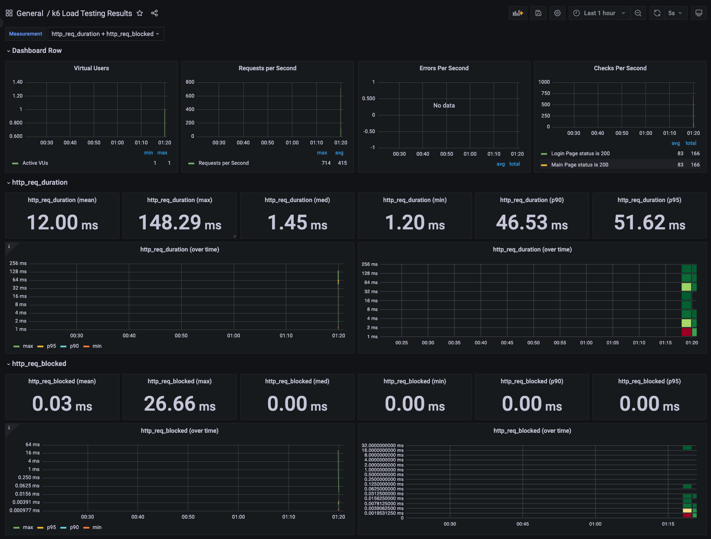
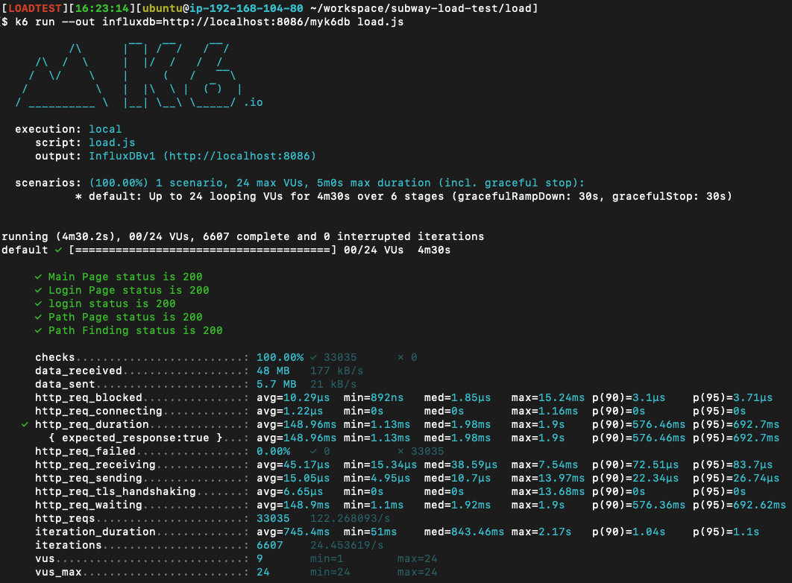
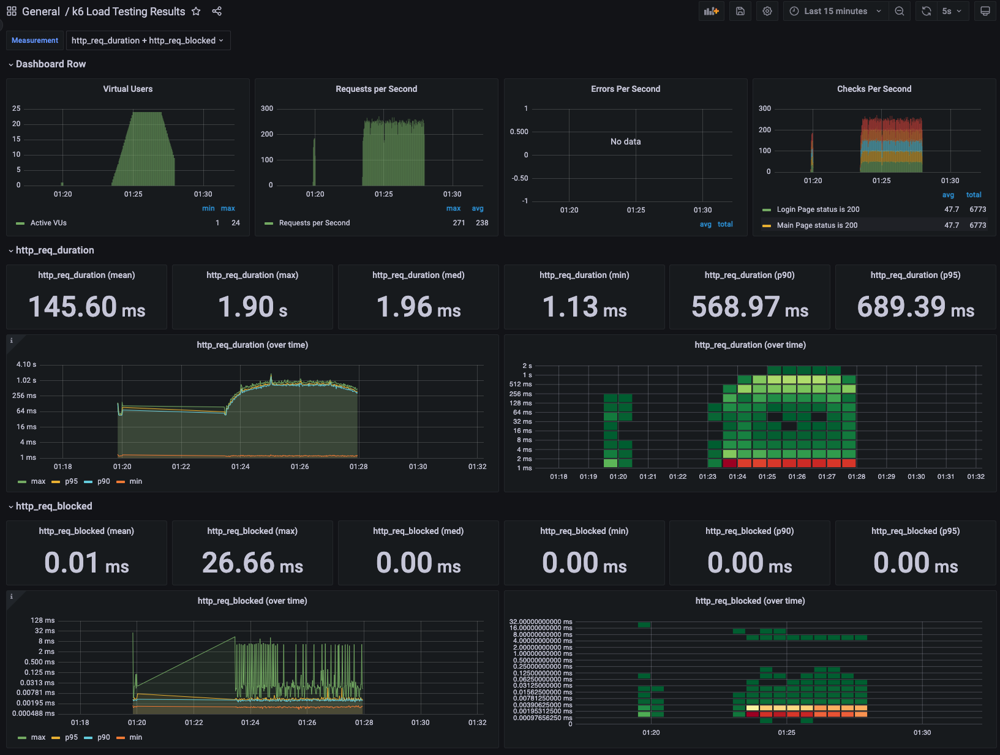
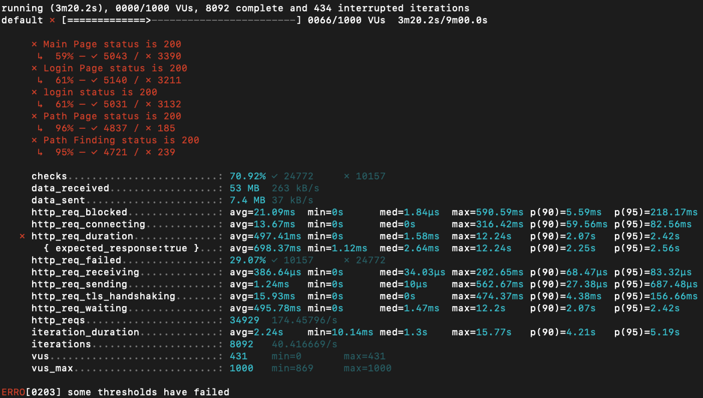
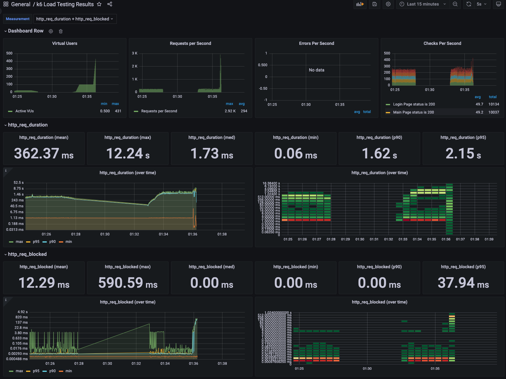

<p align="center">
    
</p>
<p align="center">
  
  
  <a href="https://edu.nextstep.camp/c/R89PYi5H" alt="nextstep atdd">
    
  </a>
  
</p>

<br>

# 인프라공방 샘플 서비스 - 지하철 노선도

<br>

## 🚀 Getting Started

### Install
#### npm 설치
```
cd frontend
npm install
```
> `frontend` 디렉토리에서 수행해야 합니다.

### Usage
#### webpack server 구동
```
npm run dev
```
#### application 구동
```
./gradlew clean build
```
<br>


### 1단계 - 웹 성능 테스트

1. 웹 성능예산은 어느정도가 적당하다고 생각하시나요  
일반적으로 지하철 노선 조회는 데스크탑보다는 모바일에서 더 자주 일어난다고 생각하기 때문에, 모바일을 기준으로 성능 향상
- Quantity-based
  - 200KB 미만
- Timing-based
  - FCP ≤ 2.9 sec: 랜딩페이지에서 메인으로 사용되는 경로검색 페이지로 넘어가는 것이 잘 이루어지고 있는 것을 보여주기 위하여 경로검색 페이지를 우선으로 성능 개선 (서울교통공사 모바일 기준)
  - TTI  ≤ 7.3 sec: 빠르게 기능을 사용할 수 있는 다른 페이지로 넘어갈 수 있도록 랜딩페이지를 우선으로 성능 개선 (네이버지도 모바일 시간 기준)
  - SI ≤ 4.9 sec: 메인으로 사용되는 경로 검색 페이지를 우선으로 성능 개선 (네이버지도 모바일 기준)
  - TBT ≤ 0.450 sec: (네이버 모바일 기준)
  - LCP ≤ 9 sec: TTI와 같은 이유로 랜딩페이지를 우선으로 성능 개선 (네이버지도 모바일 120% 기준)
  - CLS ≤ 0.1 sec: (PageSpeed 측정 사이트 양호 기준)
- Rule-based
  - 60점
2. 웹 성능예산을 바탕으로 현재 지하철 노선도 서비스는 어떤 부분을 개선하면 좋을까요
- Quantity-based
  - 200KB 미만: PageSpeedInsight를 통해 평가해본 결과 텍스트 압축을 통해 200KB 미만으로 축소 가능
  
- Timing-based
  - FCP ≤ 3 sec
  - TTI  ≤ 8.76 sec
  - SI ≤ 6.96 sec
  - LCP ≤ 9 sec
- Rule-based
  - 60점: 현재보다 50% 성능 향상 필요

---

### 2단계 - 부하 테스트 
1. 부하테스트 전제조건은 어느 정도로 설정하셨나요
#### 대상 시스템 범위
- 홈페이지
- 로그인 페이지
- 로그인
- 경로 검색 페이지
- 경로 검색
#### 목푯값 설정 (latency, throughput, 부하 유지기간)
- **Daily Active Users (DAU)**
  - DAU: 353,200 (2019년 4월 평균 지하철 승하차인원 x 90% / 2 x 5%)
- **피크 시간대의 집중률 (최대 트래픽 / 평소 트래픽)**
  - 최대 트래픽: 264,900 (7AM - 10AM, 5PM - 8PM)
  - 평소 트래픽: 88,300
- **1일 평균 rps**
  - 10회 =  
    5회 요청 (메인, 로그인, 로그인요청, 경로 검색, 경로 검색 요청) x  
    2회 (출근 1회, 퇴근 1회)
- **Throughput**
  - 1일 사용자 수(DAU) x 1명당 1일 평균 접속 수 = 1일 총 접속 수
    - 353,200 x 10회 = 3,532,000
  - 1일 총 접속 수 / 86,400 (초/일) = 1일 평균 rps 
    - 3,532,000 / 86,400 = 40
  - 1일 평균 rps x (최대 트래픽 / 평소 트래픽) = 1일 최대 rps
    - 40 x (264,900 / 88,300) = 120
  - Throughput : 1일 평균 rps ~ 1일 최대 rps
    - **40 ~ 120**
- Latency
  - **100ms**
- VUser
  - (요청수 * http_req_duration) + 1 = T
    - (10 * 0.1) + 1 = 2
  - (1일 평균 rps * T) / R = 평균 VUser
    - (40 * 2) / 10 = 8
  - (1일 최대 rps * T) / R = 최대 VUser
    - (120 * 2) / 10 = 24

2. Smoke, Load, Stress 테스트 스크립트와 결과를 공유해주세요
#### Smoke


#### Load


#### Stress
오류가 발생하는 시점: 431


---

### 3단계 - 로깅, 모니터링
1. 각 서버내 로깅 경로를 알려주세요

2. Cloudwatch 대시보드 URL을 알려주세요
