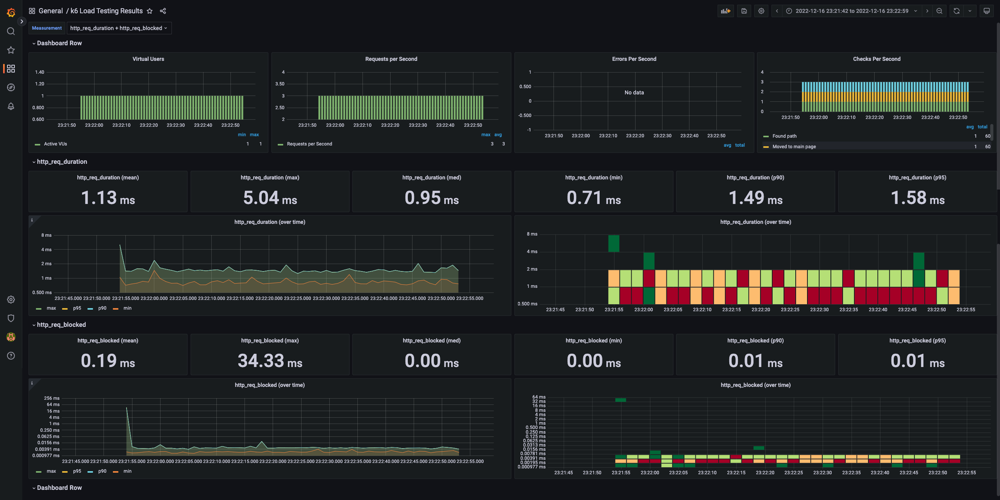
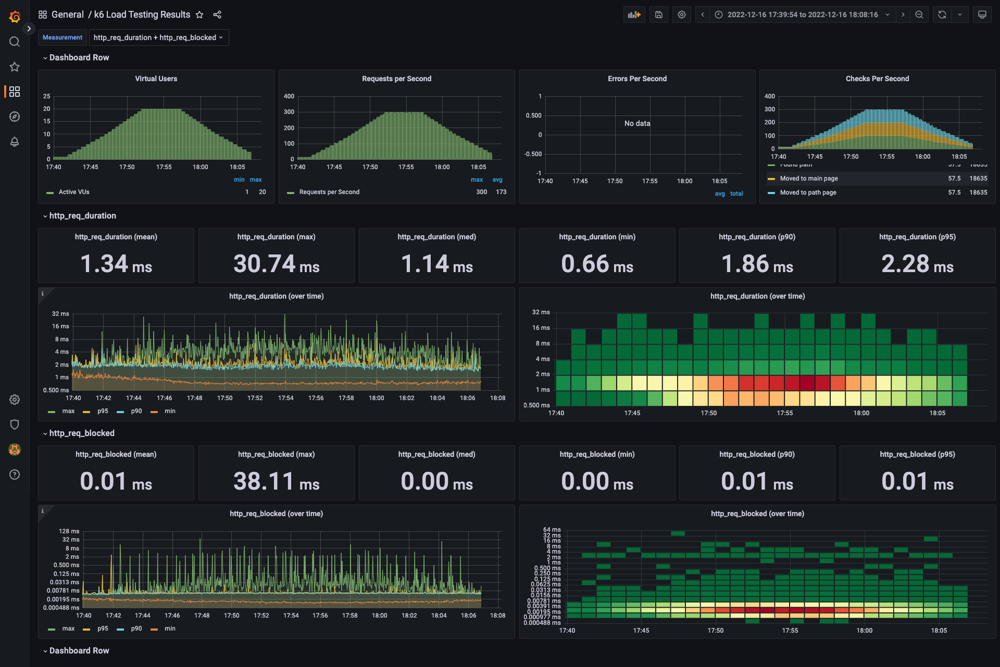
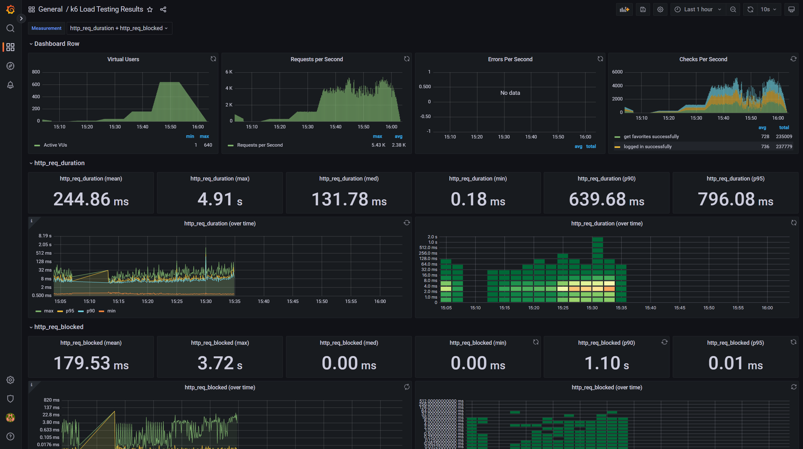

<p align="center">
    
</p>
<p align="center">
  
  
  <a href="https://edu.nextstep.camp/c/R89PYi5H" alt="nextstep atdd">
    
  </a>
  
</p>

<br>

# 인프라공방 샘플 서비스 - 지하철 노선도

<br>

## 🚀 Getting Started

### Install
#### npm 설치
```
cd frontend
npm install
```
> `frontend` 디렉토리에서 수행해야 합니다.

### Usage
#### webpack server 구동
```
npm run dev
```
#### application 구동
```
./gradlew clean build
```
<br>


### 1단계 - 웹 성능 테스트
1. 웹 성능예산은 어느정도가 적당하다고 생각하시나요
- 대상 시스템 범워 : WEB(nginx), WAS(tomcat), DB(mysql)
- 측정 사이트 : https://pagespeed.web.dev
- 측정 대상 페이지 : https://hyeongjukim.o-r.kr/path
- 측정 항목
    - First Contentful Paint
    - Speed Index
    - Largest Contentful Paint
    - Time to Interactive
    - Total Blocking Time
    - Cumulative Layout Shift

#### 휴대전화

| 서비스          | FCP   | SI    | LCP   | TTI   | TBT    | CLS    |
|---------------|-------|-------|-------|-------|--------|--------|
| 서울교통사         | 6.5s  | 8.2s  | 6.8s  | 8.6s  | 1390ms | 0      |
| 네이버지도         | 2.5s  | 8.1s  | 10.8s | 7.1s  | 480m   | 0.0017 |
| 카카오맵          | 1.7s  | 7.1s  | 5.3s  | 7.8s  | 130ms  | 0.0005 |
| RUNNUING MAP  | 16.5s | 16.5s | 16.5s | 17.3s | 350ms  | 0.0004 |

#### 데스크톱
| 서비스          | FCP  | SI   | LCP  | TTI  | TBT   | CLS    |
|--------------|------|------|------|------|-------|--------|
| 서울교통사        | 1.4s | 2.2s | 1.9s | 2.0s | 400ms | 0.0001 |
| 네이버지도        | 0.5s | 3.0s | 2.4s | 3.6s | 530s  | 0.0032 |
| 카카오맵         | 0.6s | 2.5s | 0.7s | 2.8s | 1100s | 0.0018 |
| RUNNUING MAP | 3.0s | 3.0s | 3.0s | 3.2s | 30ms  | 0      |

2. 웹 성능예산을 바탕으로 현재 지하철 노선도 서비스의 서버 목표 응답시간 가설을 세워보세요.
- 1위의 성능보다 20%정도 높은 목표로 잡아 사용자에게 더 좋은 성능을 체감할 수 있도록 합니다.
    - FCP 0.4s 미만
    - TTI 1.6s 미만
- 텍스트 압축 사용
    - js/vendors.js
    - /js/main.js
- 사용하지 않는 자바스크립트 줄이기
    - js/vendors.js
    - /js/main.js

---

### 2단계 - 부하 테스트
1. 부하테스트 전제조건은 어느정도로 설정하셨나요
- 대상 시스템 범워 : WEB(nginx), WAS(tomcat), DB(mysql)
- 목표 rps
  - DAU : 20만
  - 평소 트래픽 : 5만
  - 최대 트래픽 : 10만
  - 피크 시간대 집중률 : 2 
  - 1명당 1일 평균 요청 수 : 3
  - Throughput
    - 1일 총 접속 수 = 60만
    - 1일 평소 rps = 6.94
    - 1일 최대 rps = 13.89
- VUser
  - RPS :6.94 
  - 평균 VU : 2.08
  - 최대 VU : 4.17
  - R : 5
  - T : 1.5
- 시나리오 : 데이터를 조회하는데 여러 데이터를 참조하는 페이지
- 부하 테스트 시 저장될 데이터 건수 및 크기
  - 조회 테스트이므로 저장될 데이터 없음

2. Smoke, Load, Stress 테스트 스크립트와 결과를 공유해주세요

- Smoke : `k6/smoke/smoke_k6.png`



- Load : `k6/load/load_k6.png`



- Stress : `k6/stress/stress_k6.png`



---

### 3단계 - 로깅, 모니터링
- [x] 애플리케이션 진단하기 실습을 진행해보고 문제가 되는 코드 수정
- [x] 로그 설정
  - [x] Application Log 파일로 저장하기
    - [x] 회원가입, 로그인 등의 이벤트에 로깅을 설정
    - [x] 경로찾기 등의 이벤트 로그를 JSON으로 수집
  - [x] Nginx Access Log 설정하기
- [ ] Cloudwatch로 모니터링
  - [x] Cloudwatch로 로그 수집하기
  - [] Cloudwatch로 메트릭 수집하기
  - [x] USE 방법론을 활용하기 용이하도록 대시보드 구성
1. 각 서버내 로깅 경로를 알려주세요

2. Cloudwatch 대시보드 URL을 알려주세요
