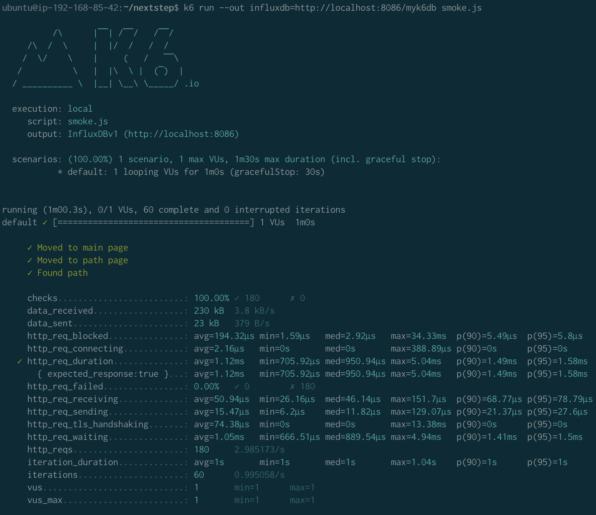
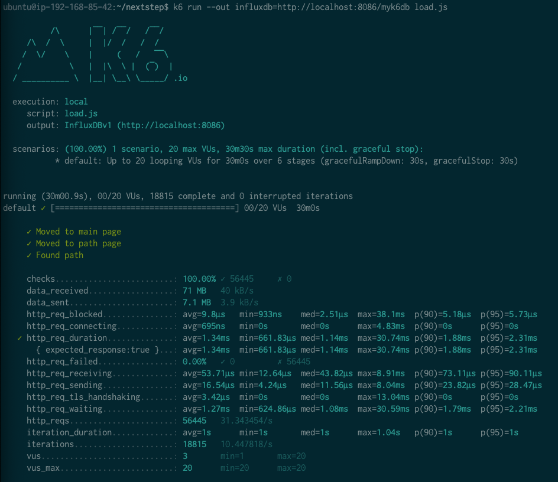

# 서비스 진단하기

## Step1. 웹 성능 테스트

### 요구사항

- [x]  성능 예산 작성 후 서버 목표 응답시간 도출
  - [x] 기준잡기
    - [x] 경쟁사 자료 비교하기
  - [x] 현황 파악하기
    - [x] PageSpeed 결과
  - [x] 웹성능 예산 작성

### 경쟁사 성능 분석
- 항목
  - FCP(First Contentful Paint) : 첫 텍스트, 이미지 표시되는데 걸린 시간
  - TTI(Time to Interactive) : 사용자와 상호 작용할 수 있게 된 시간
  - SI(Speed Index) : 페이지 콘텐츠가 얼마나 빨리 표시되는지
  - TBT(Total Blocking Time) : FCP와 TTI사이 모든 시간의 합
  - LCP(Large Contentful Paint) : 가장 큰 텍스트, 이미지 표시 시간
  - CLS(Cumulative Layout Shift) : 요소들이 얼마나 이동하는지에 대한 정보
- 대상 페이지
  - 카카오 맵(모바일) : https://m.map.kakao.com/actions/routeView
  - 카카오 맵(데스크탑) : https://map.kakao.com/
  - 네이버 맵(모바일) : https://m.map.naver.com/subway/subwayLine.naver?region=1000
  - 네이버 맵(데스크탑) : https://map.naver.com/subway/subwayLine.naver?region=1000
  - 러닝 맵(모바일, 데스크탑 동일) : https://next-bada.n-e.kr
  - 서울 교통공사 : http://www.seoulmetro.co.kr/kr/cyberStation.do
- 참고 (라이트하우스 6 성능지표) 
  - FCP : 0-2 / 2-4 / over 4
  - SI : 0-4.3 / 4.4-5.8 / over 5.8
  - LCP : 0-2.5 / 2.5-4.0 / over 4.0
  - TTI : 0-3.8 / 3.9-7.3 / over 7.3
  - TBT : 0-300 / 300-600 / over 600
  - CLS : 0-0.1 / 0.1-0.25 / over 0.25

#### 모바일

| 구분  | 러닝맵   | 네이버지도 | 카카오지도 |
|-----|-------|-------|-------|
| FCP | 14.6  | 2.2   | 1.7   |
| TTI | 15.2  | 6.6   | 4.5   |
| S I | 14.6  | 5.5   | 4     |
| TBT | 500   | 390   | 70    |
| LCP | 15.1  | 7.3   | 5.8   |
| CLS | 0.042 | 0.03  | 0.005 |
| 점수  | 33    | 56    | 70    |

#### 데스크탑

| 구분  | 러닝맵   | 네이버지도 | 카카오지도 |
|-----|-------|-------|-------|
| FCP | 2.7   | 0.5   | 0.6   |
| TTI | 2.8   | 4     | 2.9   |
| SI  | 2.7   | 3.7   | 2.3   |
| TBT | 50    | 1020  | 1090  |
| LCP | 2.8   | 4.6   | 0.6   |
| CLS | 0.004 | 0.019 | 0.017 |
| 점수  | 67    | 57    | 64    |

#### 목표 예산
- 주요항목
  - 러닝맵의 경우, 이미지가 많거나 경로 조회라는 단순한 기능을 제공하는 사이트이므로, 무엇보다 빠르게 화면이 뜨고 / 바로 동작이 가능해야 한다고 생각합니다. 
  - 따라서 주요 지표로 FCP / TTI 성능을 높여야 합니다. (FCP와 TTI 의 기능개선이 이뤄지면 다른 지표도 좋아질 것) 
    - FCP : FCP는 3초의 룰의 영향을 받는 가장 중요한 항목이므로 라이트 하우스 성능지표의 Fast 기준인 2초를 목표로, 데스크탑의 경우 경쟁사가 1초 이내에 들어오는 것을 확인했을때 1초 를 목표로 한다. (모바일 2초 / 데스크탑 1초)
    - TTI : TTI는 라이트 하우스 성능지표의 Fast 기준인 3.8초를 모바일 MAX로 잡는다. 데스크탑은 현재 성능 유지해도 괜찮다고 판단. (모바일 3.8초 / 데스크탑 2.8초)

#### 개선 사항
- 절감 목표치 : 모바일 12.6 / 데스크톱 1.7
- 텍스트 압축 사용
  - 모바일 : 9.1초 절감 가능
  - 데스크탑 : 1.48초 절감 가능
- 사용하지 않는 자바스크립트 줄이기( /js/vendors.js, /js/main.js)
  - 모바일 : 3.45초 절감 가능
  - 데스크탑 : 0.56초

- 위의 두가지 개선사항만 지켜도 웹 성능예산 달성 가능.

## Step2. 부하테스트

### 요구사항

-[x] 부하 테스트
  -[x] 테스트 전제조건 정리
    -[x] 대상 시스템 범위
    -[x] 목푯값 설정 (latency, throughput, 부하 유지기간)
    -[x] 부하 테스트 시 저장될 데이터 건수 및 크기
  -[x] 아래 시나리오 중 하나를 선택하여 스크립트 작성
    -[x] 접속 빈도가 높은 페이지 - 경로조회
    -[ ] 데이터를 갱신하는 페이지
    -[ ] 데이터를 조회하는데 여러 데이터를 참조하는 페이지
  -[x] Smoke, Load, Stress 테스트 후 결과를 기록

1. 부하테스트 전제조건은 어느정도로 설정하셨나요

- 대상 시스템 범위
  - 메인페이지 이동
  - 로그인
  - 내 정보 확인
  - 경로페이지 이동
  - 경로 조회

- Throughput
  - DAU : [50만]
    - 경쟁사 DAU
      - 네이버지도 : 2129만(MAU) => 70만
      - 카카오맵 : 950만(MAU) => 30만
      - 참고 ) https://www.koit.co.kr/news/articleView.html?idxno=103551
    - 목표 DAU : 경쟁사 평균인 50만
  - 1일 평균 접속수 : [20회] 
    - 경쟁사 일간 접속수
      - 네이버지도 : 46(월간)
      - 카카오맵 : 76(월간)
      - 참고 ) http://www.businesspost.co.kr/BP?command=mobile_view&num=132836
    - 일 평균 접속수 평균인 4회 * 요청갯수 5회 -> 20
  - 집중률 : 약 [2배]
    - 평균 : 122,827
    - 최대 : 248,008
    - 참고 ) https://insfiler.com/detail/rt_subway_time-0003
  - 평균 rps : [115]
    - 500,000 * 20 / 86400
  - 최대 rps : [230]

- 목표 latancy : [200ms] 
  - 참고) smoke test 평균 112ms p(95) / max 178
- VUSER 구하기
  - T = 5 * 0.2 + 0.3(a) => 1.3
  - 평균 VUSER = 115 * 1.3 / 5 -> [29.9]
  - 최대 VUSER = [60]

2. Smoke, Load, Stress 테스트 스크립트와 결과를 공유해주세요
- 총 역 수 : 727

- Smoke 테스트 결과

  - 
  - 

- Load 테스트 결과

  - 
  - 

- Stress 테스트 결과(1차)

  - 
  - 

  - VUSER 280정도부터 문제 생기기 시작. 260으로 줄어들면서 바로 정상화 되었음

## Step3. 로깅 모니터링

### 요구사항

-[x] 애플리케이션 진단하기 실습을 진행해보고 문제가 되는 코드를 수정
  - [x] gzip 적용
  - 
-[x] 로그 설정하기
  - [x] 로그백 설정
  - [x] 주요 서비스에 로그 적용
    - [x] 회원가입
    - [x] 로그인
    - [x] 최단경로조회
  - [x] AOP 적용
  - [x] Nginx Access Log 설정하기
  - [x] cadvisor 적용
    - ip :http://52.79.159.211:9090/
    - 
-[x] Cloudwatch로 모니터링
  - [x] Cloudwatch로 로그 수집하기
  - [x] Cloudwatch로 메트릭 수집하기
  - [x] USE 방법론을 활용하기 용이하도록 대시보드 구성