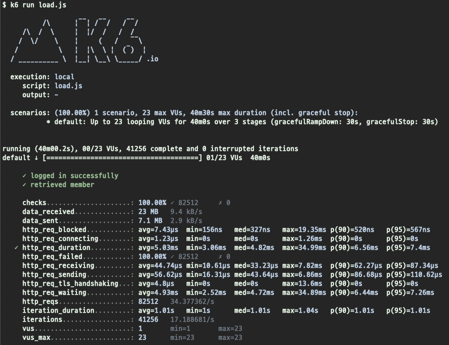

<p align="center">
    
</p>
<p align="center">
  
  
  <a href="https://edu.nextstep.camp/c/R89PYi5H" alt="nextstep atdd">
    
  </a>
  
</p>

<br>

# 인프라공방 샘플 서비스 - 지하철 노선도

<br>

## 🚀 Getting Started

### Install
#### npm 설치
```
cd frontend
npm install
```
> `frontend` 디렉토리에서 수행해야 합니다.

### Usage
#### webpack server 구동
```
npm run dev
```
#### application 구동
```
./gradlew clean build
```
<br>


### 1단계 - 성능 테스트
1. 웹 성능예산은 어느정도가 적당하다고 생각하시나요 

* [내 subway](https://pagespeed.web.dev/report?url=https%3A%2F%2Fparkeeseul.kro.kr%2F) 서비스


* [naver subway](https://pagespeed.web.dev/report?url=https%3A%2F%2Fmap.naver.com%2Fv5%2Fsubway%2F1000%2F-%2F-%2F-%3Fc%3D14146635.9803238%2C4519514.4759440%2C15%2C0%2C0%2C0%2Cdh) 서비스

- 성능 점수를 70 점 까지 높여보자!
- 페이지 로드 3초 미만
- TTI 5초 미만
- 압축된 리소스 최대 크기 200KB 미만

2. 웹 성능예산을 바탕으로 현재 지하철 노선도 서비스는 어떤 부분을 개선하면 좋을까요
  - gzip 압축 : vendors.js, main.js
  - 사용하지 않는 자바스크립트 제거
  - 사용하지 않는 CSS 제거
  - 캐싱 설정
  - keep-alive 설정

3. 부하테스트 전제조건은 어느정도로 설정하셨나요([기사](https://platum.kr/archives/61943) 를 참고해 보았습니다)
- 목표 rps 구하기
  * 1일 사용자 수(DAU) : 1000000
  * 피크 시간대의 집중률 : 10 배
  * 1일 평균 접속 수 = 2

- 1일 총 접속 수 = DAU x 1명당 1일 평균 접속 수
  * 1000000 x 2 = 2000000
- 1일 평균 rps = 1일 총 접속 수 / 86,400 (초/일)  
  * (1000000 x 2) /  86,400 = 23.148
- 1일 최대 rps
  * 23 x 10 = 230
  
4. Smoke, Load, Stress 테스트 스크립트와 결과를 공유해주세요
 - smoke test
   

 - load test
   - VUser 구하기
     * T = (2 * 0.1) + 0 = 0.2 
     * (230 * 0.2) / 2 = 23 (VUser)  
 - 
   
 - stress test
 - 

---

### 2단계 - 화면 응답 개선하기
1. 성능 개선 결과를 공유해주세요 (Smoke, Load, Stress 테스트 결과)
  - smoke

    
  - load

    
  - stress

    

 
2. 어떤 부분을 개선해보셨나요? 과정을 설명해주세요
- Reverse Proxy 개선
  -  
    - gzip 압축
      - 

    
    - cache 설정
      - 

    
    - http2 설정
      -
    
    - 사용하지 않는 css 제거 (materialdesignicons.min.css)
    - 사용하지 않는 자바스크립트 제거 (/js/vendors.js)
- 부하 테스트
  - 
  - 테스트 시나리오
    -
    - 접속 빈도가 높은 페이지
      - 홈 페이지
    - 데이터를 갱신하는 페이지
      - 구간 등록
    - 데이터를 조회하는데 여러 데이터를 참조하는 페이지
      - 경로 조회
      
  - vus 350 으로 설정했을 경우 CPU 자원을 초과하여 vus 를 230으로 낮춤
    
    - CPU 사용량
     
    - K6 발생 문제 발생
     
- stress test 진행
  - 
  - 개선 전
      
  - redis cache 설정
      
  - 부하 분산(EC2 추가 생성) -> 캐시 설정했을 때와 크게 차이는 없지만 부하를 늘렸을 때 많은 차이가 발생할 것이라 예상.
      
  

---

### [추가] 로깅, 모니터링
1. 각 서버내 로깅 경로를 알려주세요

2. Cloudwatch 대시보드 URL을 알려주세요
