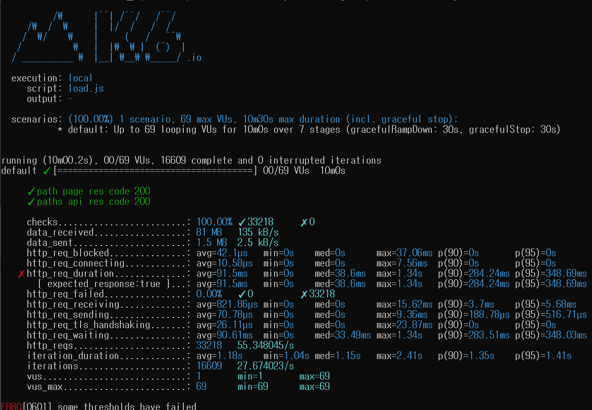
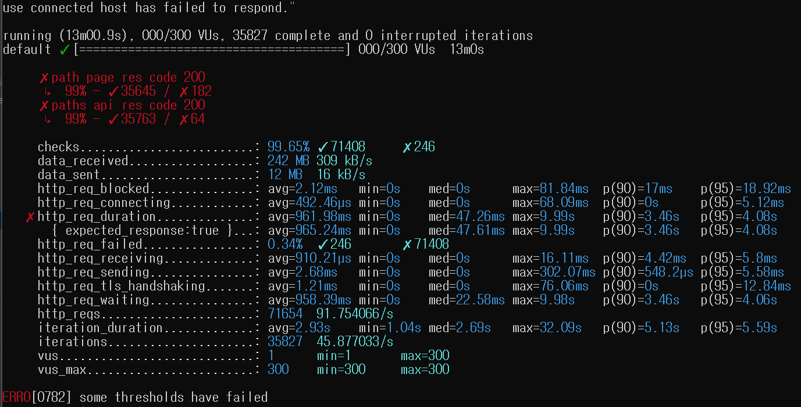

<p align="center">
    
</p>
<p align="center">
  
  
  <a href="https://edu.nextstep.camp/c/R89PYi5H" alt="nextstep atdd">
    
  </a>
  
</p>

<br>

# 인프라공방 샘플 서비스 - 지하철 노선도

<br>

## 🚀 Getting Started

### Install
#### npm 설치
```
cd frontend
npm install
```
> `frontend` 디렉토리에서 수행해야 합니다.

### Usage
#### webpack server 구동
```
npm run dev
```
#### application 구동
```
./gradlew clean build
```
<br>


## 1단계 - 화면 응답 개선하기

### 1. 웹 성능예산은 어느정도가 적당하다고 생각하시나요. 이 때, 서버 목표 응답시간은 어떻게 되나요?

#### 웹 성능 예산 / 서버 목표 응답시간

[https://infrastudy.kro.kr/](https://infrastudy.kro.kr/) 서비스의 웹 성능 예산은 다음과 같이 설정한다.
1. [pagespeed](https://pagespeed.web.dev) 테스트 내 Lighthouse 종합 성능 점수는 50점 이상이어야 한다. (as is 34점)
2. LTE 환경에서의 모바일 기기의 First Contentful Paint(FCP)는 3초 이하이어야 한다. (as is 14.7초)
3. LTE 환경에서의 모바일 기기의 Time to Interactive(TTI)는 7.3초 이하이어야 한다. (as is 15.2초)
4. 메인 페이지의 리소스 크기는 2.8MB 이하으로 제한한다. (as is 3.1MB)

<br>

#### WebPageTest, PageSpeed 테스트 진행 결과
- https://www.webpagetest.org/result/221012_BiDcN5_9N9/
- https://pagespeed.web.dev/report?url=https%3A%2F%2Finfrastudy.kro.kr%2F

<br>

#### 경쟁사와 비교


<br>

### 2. 성능 개선 결과를 공유해주세요 (Smoke, Load, Stress 테스트 결과)


<br>

### 3. 어떤 부분을 개선해보셨나요? 과정을 설명해주세요

아래와 같은 순서로 차례대로 개선점을 찾아 적용해보았다. 
1. gzip 압축을 이용하여 이미지 및 텍스트 압축
2. 정적 파일들에 대해 cache 적용
3. TLS, HTTP 2.0 설정하여 웹 프로토콜 최적화
4. 정적 파일을 경량화하여 패킷의 크기 자체를 줄임

<br>

#### 1) gzip 압축을 이용하여 이미지 및 텍스트 압축하기
- gzip을 이용하여 응답으로 전달되는 이미지 및 텍스트를 압축했고, 그 결과 아래와 같은 개선점을 확인할 수 있었다. 
  - 전달되는 리소스의 크기는 1.2kb에서 893b로 줄었고,
  - 그에 따라 응답속도 역시 기존의 37ms 에서 10ms 으로 훨씬 빨라지게 되었다. 


<br>

#### 정적 파일들에 대해 cache 적용하기
- 기존에는 png, js, css 파일과 같은 정적 파일들이 cache가 적용되지 않았기 때문에 변경되지 않은 내용임에도 매번 WAS 서버까지 요청이 전달되어 응답이 느리고 무거웠었다. 
- nginx 내 설정을 통해 정적파일에 대한 캐싱을 적용하니, FCP, TTI 등 성능에 관한 주요 지표들이 눈에띄게 향상된 것을 알 수 있었다. 


#### TLS, HTTP 2.0 설정하여 웹 프로토콜 최적화하기
- 역시 nginx 설정 상에서 응답을 http2 로 내려주도록 설정을 적용했고,
- 그 결과, 전송되는 패킷의 크기 및 전송 시간이 이전에 비해 확연히 좋아진 것을 확인할 수 있었다. 




#### 정적 파일을 경량화하여 패킷의 크기 자체를 줄이기
- 정적파일의 경량화 작업은 과제 시간상 제약으로 인해 사실 많은 범위를 적용하지는 못했다.
- 힌트 중 하나인 js 스크립트에 async 키워드를 추가하는 작업을 진행했다. 
- 그 결과는 놀랍게도 절대 맞추지 못할 것 같았던 FCP를 목표 시간 이내인 3초보다도 더 빠른 2.5초 내로 맞출 수 있었고, TTI 역시 이전 수치들보다 좋아졌다. 
- 이 단계까지 왔을 때는 리소스의 크기도 적으면서 전체적인 응답 속도가 훨씬 향상된 결과를 발견할 수 있었다. 



---

## 2단계 - 부하 테스트 
### 1. 부하테스트 전제조건은 어느정도로 설정하셨나요

### 2. Smoke, Load, Stress 테스트 스크립트와 결과를 공유해주세요

---

## 3단계 - 스케일 아웃

### 1. Launch Template 링크를 공유해주세요.

### 2. cpu 부하 실행 후 EC2 추가생성 결과를 공유해주세요. (Cloudwatch 캡쳐)

```sh
$ stress -c 2
```

---

## [추가] 로깅, 모니터링

### 1. 각 서버내 로깅 경로를 알려주세요 

### 2. Cloudwatch 대시보드 URL을 알려주세요
---

## [추가] WAS 개선하기
### 1. 성능 개선 결과를 공유해주세요 (Smoke, Load, Stress 테스트 결과)

### 2. 어떤 부분을 개선해보셨나요? 과정을 설명해주세요
