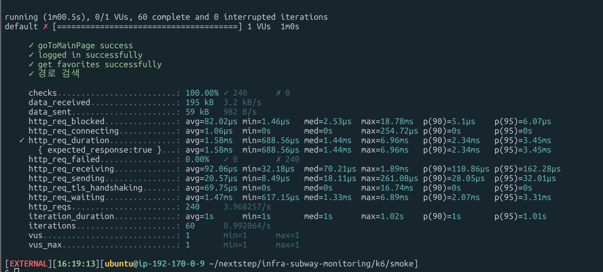
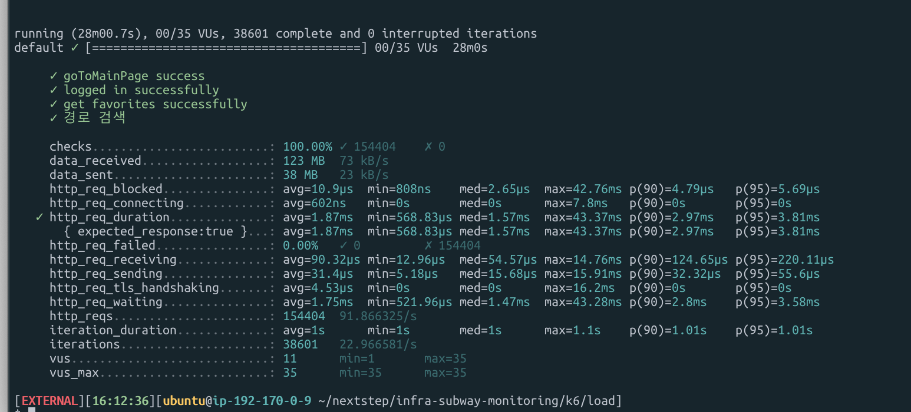
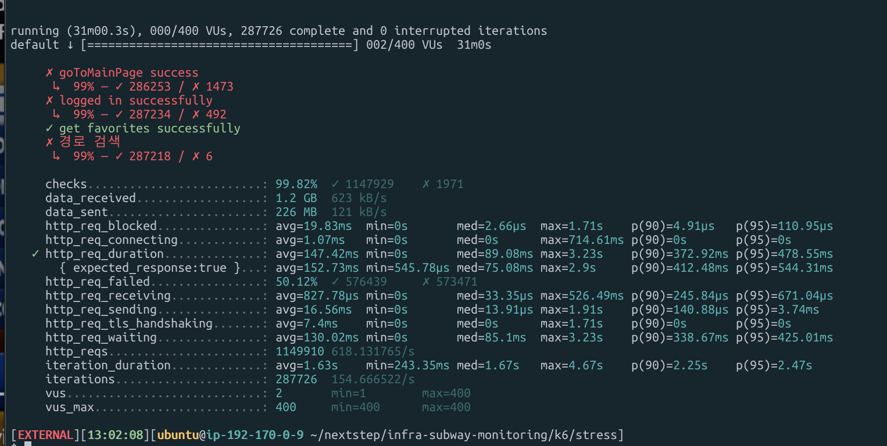

<p align="center">
    
</p>
<p align="center">
  
  
  <a href="https://edu.nextstep.camp/c/R89PYi5H" alt="nextstep atdd">
    
  </a>
  
</p>

<br>

# 인프라공방 샘플 서비스 - 지하철 노선도

<br>

## 🚀 Getting Started

### Install
#### npm 설치
```
cd frontend
npm install
```
> `frontend` 디렉토리에서 수행해야 합니다.

### Usage
#### webpack server 구동
```
npm run dev
```
#### application 구동
```
./gradlew clean build
```
<br>

### 지하철 노선도 사이트

- [https://sonypark.shop](https://sonypark.shop)

### 성능 측정 용어 정리

- FCP (First Contentful Paint) : 페이지가 로드되기 시작한 시점부터 페이지 콘텐츠의 일부가 화면에 렌더링 될 때까지의 시간을 측정
- SI  (Speed Index) : 웹 페이지를 불러올 때 콘텐츠가 시각적으로 표시되는 속도를 측정
- LCP (Largest Contentful Paint) : 페이지가 처음으로 로드를 시작한 시점을 기준으로 뷰포트 내에 있는 가장 큰 이미지 또는 텍스트 블록의 렌더링 시간을 측정
- TTI (Time To Interactive) : 페이지가 로드되기 시작한 시점부터 주요 하위 리소스가 로드되고 사용자 입력에 신속하고 안정적으로 응답할 수 있는 시점까지의 시간을 측정
- TBT (Total Blocking Time) : 키보드나 클릭 같은 이벤트가 동작하지 않았던 시간의 합
- CLS (Cumulative Layout Shift) : 방문자에게 콘텐츠가 얼마나 불안정한지 측정

### 1단계 - 웹 성능 테스트
1. 웹 성능예산은 어느정도가 적당하다고 생각하시나요

#### PageSpeed 성능 테스트 결과 (Mobile)


|             |지하철 노선도| 서울교통공사 | 네이버지도 | 카카오맵 |
|-------------|------------|-------------|-----------|---------|
| Performance |  33        |   43        | 59        | 69
| FCP         | 14.6s      | 6.4s        | 2.2s      | 1.7s    |
| Speed Index | 14.6s      | 7.7s        | 5.6s      | 6.4s    | 
| LCP         | 15.1s      | 6.6s        | 8.3s      | 6.4s    |
| TTI         | 15.1s      | 8.4s        | 5.9s      | 4.1s    | 
| TBT         | 490ms      | 420ms       | 290ms     | 30ms    |
| CLS         | 0.042      | 0           | 0.03      | 0.005   | 

3. 웹 성능예산을 바탕으로 현재 지하철 노선도 서비스는 어떤 부분을 개선하면 좋을까요

- 개선 지표 우선순위는 다음과 같습니다
- 성능 개선 기준 사이트: 성능 점수가 가장 높은 카카오맵
- 예산 지표 선정 이유: 카카오맵 대비 현저히 낮은 지표, 사용자 입장에서 첫 화면이 보이는 시간이 체감 성능에 매우 중요
- FCP : 1.53s (카카오맵 보다 10% 성능을 개선한 수치를 목표로 함)
- SI  : 5.76s  (카카오맵 보다 10% 성능을 개선한 수치를 목표로 함)
- TTI : 3.69s (카카오맵 보다 10% 성능을 개선한 수치를 목표로 함)

#### 파일 압축

- gzip으로 압축하여 네트워크 부하 감소


#### 사용하지 않는 파일 삭제

- js, css 파일 중 사용하지 않는 파일을 삭제


#### 렌더링 차단 리소스 삭제


#### 정적 리소스에 대해 효율적인 캐싱 정책 사용


#### 이미지 width, height 크기 지정


---

### 2단계 - 부하 테스트 

#### 1. 부하테스트 전제조건은 어느정도로 설정하셨나요

참고) 경쟁사 카카오맵 MAU 729만 (https://www.sedaily.com/NewsView/22RH3PUBN6)

1. 예상 1일 사용자 수 (DAU)
- MAU: 440만으로 기준 설정 (경쟁사 카카오맵 MAU의 60% 정도)
- DAU: 146,000으로 설정 (440만 / 30일) 

2. 예상 피크 시간대
- 출퇴근 시간에 피크 예상
  - 출근: 07:00 AM ~ 10:00 AM
  - 퇴근: 06:00 PM ~ 09:00 PM

3. 1명당 1일 평균 접속 혹은 요청 수
- 출/퇴근 시간에 1번씩 접속(총 2회)
- 메인 페이지, 로그인, 즐겨찾기 페이지, 경로 조회 페이지, 경로 조회로 평균 5번 요청한다고 가정

4. Throughput (1일 평균 RPS ~ 최대 RPS)
- 1일 사용자 수(DAU) * 1명당 1일 평균 접속 수 = 146,000 * 10 = 1,460,000 (1일 총 접속수)
- 1일 총 접속 수 / 86,400 (초/일) = 1,460,000 / 86,400 = 평균 16.89 (1일 평균 rps)
- 1일 평균 rps x (피크 시간대 집중률) = 16.89 * 5(출퇴근 시간에 약 3~5배 인원이 몰림) = 84.45 (1일 최대 rps)
- 참고) [서울시 지하철 호선별 역별 시간대별 승하차 인원 정보](https://data.seoul.go.kr/dataList/OA-12252/S/1/datasetView.do) 

5. VUser
- T(VU iteration) = 5(요청 수) * 0.1(http_req_duration) (+1s 지연시간) = 1.5
- min VUser = (16.89 * 1.5) / 5 = 5.06
- max VUser = (84.45 * 1.5) / 5 = 25.3

#### 2. Smoke, Load, Stress 테스트 스크립트와 결과를 공유해주세요

- smoke


- load


- stress


---

### 3단계 - 로깅, 모니터링
1. 각 서버내 로깅 경로를 알려주세요

2. Cloudwatch 대시보드 URL을 알려주세요
