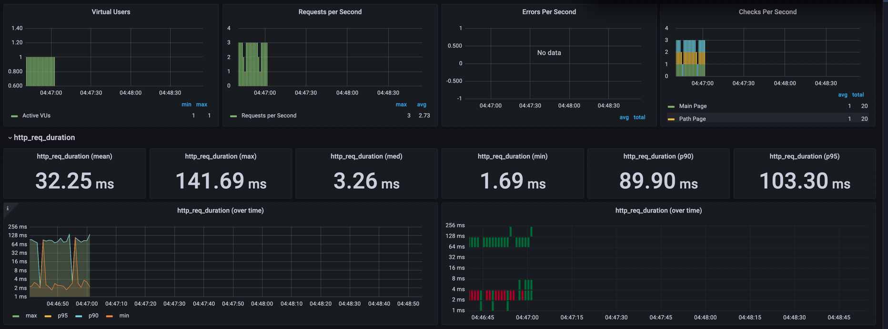

---
<p align="center">
    
</p>
<p align="center">
  
  
  <a href="https://edu.nextstep.camp/c/R89PYi5H" alt="nextstep atdd">
    
  </a>
  
</p>

<br>

# 인프라공방 샘플 서비스 - 지하철 노선도

<br>

## 🚀 Getting Started

### Install
#### npm 설치
```
cd frontend
npm install
```
> `frontend` 디렉토리에서 수행해야 합니다.

### Usage
#### webpack server 구동
```
npm run dev
```
#### application 구동
```
./gradlew clean build
```
<br>

## 미션

* 미션 진행 후에 아래 질문의 답을 작성하여 PR을 보내주세요.

### 1단계 - 인프라 운영하기
1. 각 서버내 로깅 경로를 알려주세요
   200-200-0-5(reverse-proxy): /var/log/nginx/
   200-200-0-25(webservice): /home/log/
2. Cloudwatch 대시보드 URL을 알려주세요
   https://ap-northeast-2.console.aws.amazon.com/cloudwatch/home?region=ap-northeast-2#dashboards:name=gim224-cloudwatch-dashboard
---

### 2단계 - 성능 테스트
1. 웹 성능예산은 어느정도가 적당하다고 생각하시나요
   * 초기속도가 유저를 잡는다. 
     * FCP(First Contentful Paint) 1초 미만 (최대 3초 이내 반드시 랜더링)

* PageSpeed를 활용한 경쟁사와의 비교
  > ### 카카오맵
  > 

  > ### My Application
  >   
  
2. 웹 성능예산을 바탕으로 현재 지하철 노선도 서비스는 어떤 부분을 개선하면 좋을까요
   > ### 개선사항 도출
   >  - First Contentful Paint 개선 필요.
   >  - Largest Contentful Paint 개선 필요.
   >  - **(모바일 웹 성능에선 경쟁사에 비해 심각하게 느림! 절대 개선 필요.)**
   
   > 
   >    - vendor.js, main.js에서 4초 이상이 소요되고 있음. 눈여겨보자.
   
   > ### 시도해볼만한
   > - 텍스트 압축 사용
   > - 사용하지 않는 자바스크립트 제거
   > - 랜더링 차단 리소스 제거
   > - 사용하지 않는 CSS 제거   
   
3. 부하테스트 전제조건은 어느정도로 설정하셨나요
   
4. Smoke, Load, Stress 테스트 스크립트와 결과를 공유해주세요
   
---

# 🚀 2단계 - 성능 테스트
## 요구사항
-[ ] 웹 성능 테스트
   -[ ] 웹 성능 예산을 작성
   -[ ] WebPageTest, PageSpeed 등 테스트해보고 개선이 필요한 부분을 파악


-[ ] 부하 테스트
   -[ ] 테스트 전제조건 정리
      -[ ] 대상 시스템 범위
      -[ ] 목푯값 설정 (latency, throughput, 부하 유지기간)
      -[ ] 부하 테스트 시 저장될 데이터 건수 및 크기
   -[ ] 각 시나리오에 맞춰 스크립트 작성
      -[ ] 접속 빈도가 높은 페이지
      -[ ] 데이터를 갱신하는 페이지
      -[ ] 데이터를 조회하는데 여러 데이터를 참조하는 페이지
   -[ ] Smoke, Load, Stress 테스트 후 결과를 기록
---

# 🚀 1단계 - 로깅과 모니터링
## 요구사항

* 애플리케이션 진단하기 실습을 진행해보고 문제가 되는 코드를 수정
* 로그 설정하기
* Cloudwatch로 모니터링

## 요구사항 설명
* 저장소를 활용하여 아래 요구사항을 해결합니다.
* README 에 있는 질문에 답을 추가한 후 PR을 보내고 리뷰요청을 합니다.

### 로그 설정하기
* Application Log 파일로 저장하기
   - 회원가입, 로그인, 최단거리 조회 등의 이벤트에 로깅을 설정
* Nginx Access Log 설정하기

### Cloudwatch로 모니터링
* Cloudwatch로 로그 수집하기
* Cloudwatch로 메트릭 수집하기

## 힌트
### A. 로깅
* 주의점
  * Avoid side effects
      - logging으로 인해 애플리케이션 기능의 동작에 영향을 미치지 않아야 합니다.
      - 예를 들어 logging하는 시점에 NullPointerException이 발생해 프로그램이 정상적으로 동작하지 않는 상황이 발생하면 안됩니다.
   * Be concise and descriptive 
      - 각 Logging에는 데이터와 설명이 모두 포함되어야 합니다.
   * Log method arguments and return values
      - 메소드의 input과 output을 로그로 남기면 debugger를 사용해 디버깅하지 않아도 됩니다. 특히 debugger를 사용할 수 없는 상황에서는 상당히 유용하게 사용할 수 있습니다.
      - 이를 구현하려면 메소드 앞 부분과 뒷 부분에 지저분한 중복 코드가 계속해서 발생하는 상황이 발생하는데 이는 AOP를 통해 해결할 수 있습니다.
   * Delete personal information
      - 로그에 사용자의 전화번호, 계좌번호, 패스워드, 주소, 전화번호와 같은 개인정보를 남기지 않습니다.

* logging level
  * Logging Level을 적절하게 나눠 구현하는 것이 신경쓰면서 개발해야 합니다.
      - ERROR : 예상하지 못한 심각한 문제가 발생하여 즉시 조사해야 함
      - WARN : 로직상 유효성 확인, 예상 가능한 문제로 인한 예외처리 등을 남김, 서비스는 운영될 수 있지만, 주의해야 함
      - INFO : 운영에 참고할만한 사항으로, 중요한 비즈니스 프로세스가 완료됨
      - DEBUG / TRACE : 개발 단계에서만 사용하고 운영 단계에서는 사용하지 않음
   
   * 즉, DEBUG 레벨로 설정하면 DEBUG 레벨보다 높은 로그 레벨의 메시지가 모두(DEBUG, INFO, WARN, ERROR) 출력됩니다. ERROR 레벨로 설정하면 ERROR 레벨의 로그만 출력되는 방식으로 동작합니다.


### B. Application Log
애플리케이션의 상태를 확인하기 위해서는 로그를 남기는 것이 중요합니다. 무엇을 로그로 남겨야 할지, 로그를 어떻게 관리해야 할지 고민해보며 학습해보세요.

* 예제 코드를 참고하여 미션을 진행합니다.
  #### a. logback.xml을 작성합니다.
  * logback의 기본 설정 파일은 logback.xml 입니다. logback 라이브러리는 classpath 아래에 위치하는 logback.xml을 기본으로 찾아봅니다.
```
  <configuration debug="false">

    <!--spring boot의 기본 logback base.xml은 그대로 가져간다.-->
    <include resource="org/springframework/boot/logging/logback/base.xml" />
    <include resource="file-appender.xml" />

    <!--    logger name이 file일때 적용할 appender를 등록한다.-->
    <logger name="file" level="INFO" >
        <appender-ref ref="file" />
    </logger>
</configuration>
```

```
    <property name="home" value="log/" />

    <!--  appender이름이 file인 consoleAppender를 선언  -->
    <appender name="file" class="ch.qos.logback.core.rolling.RollingFileAppender">
        <!--로깅이 기록될 위치-->
        <file>${home}file.log</file>
        <!--로깅 파일이 특정 조건을 넘어가면 다른 파일로 만들어 준다.-->
        <rollingPolicy class="ch.qos.logback.core.rolling.TimeBasedRollingPolicy">
            <fileNamePattern>${home}file-%d{yyyyMMdd}-%i.log</fileNamePattern>
            <timeBasedFileNamingAndTriggeringPolicy class="ch.qos.logback.core.rolling.SizeAndTimeBasedFNATP">
                <maxFileSize>15MB</maxFileSize>
            </timeBasedFileNamingAndTriggeringPolicy>
        </rollingPolicy>
        <!--   해당 로깅의 패턴을 설정   -->
        <encoder>
            <charset>utf8</charset>
            <Pattern>
                %d{yyyy-MM-dd HH:mm:ss.SSS} %thread %-5level %logger - %m%n
            </Pattern>
        </encoder>
    </appender>
```

* logger: 실제 로그 기능을 수행하는 객체로 각 Logger마다 Name을 부여하여 사용합니다.

#### b. logback을 이용하여 logging을 찍어봅니다.
```
private static final Logger log = LoggerFactory.getLogger(Controller.class);
private static final Logger fileLogger = LoggerFactory.getLogger("file");

    ...
    log.error("An ERROR Message");
    fileLogger.info("파일 로깅 입니다.");
```

### C. Nginx Log
* volume 옵션을 활용하여 호스트의 경로와 도커의 경로를 마운트합니다.
```
$ docker run -d -p 80:80 -v /var/log/nginx:/var/log/nginx nextstep/reverse-proxy
```


### D. 도커 상태 확인하기(cAdvisor 설치하기)
```
docker run \
--volume=/:/rootfs:ro \
--volume=/var/run:/var/run:ro \
--volume=/sys:/sys:ro \
--volume=/var/lib/docker/:/var/lib/docker:ro \
--volume=/dev/disk/:/dev/disk:ro \
--publish=8080:8080 \
--detach=true \
--name=cadvisor \
google/cadvisor:latest
```
Docker로 운영하는 경우 cAdvisor를 활용하여 간단한 모니터링이 가능합니다.

* 호스트 리소스 모니터링에 필요한 디렉토리를 볼륨으로 지정
   - 보안을 위해 읽기 전용으로 볼륨 지정
* 포트는 8080으로 오픈

### E. Cloudwatch로 수집하기

#### a. EC2에 IAM role 설정
#### b. cloudwatch logs agent를 설치합니다.
```
$ curl https://s3.amazonaws.com/aws-cloudwatch/downloads/latest/awslogs-agent-setup.py -O

$ sudo python ./awslogs-agent-setup.py --region  ap-northeast-2
```
#### c. 로그 수집
```
$ vi /var/awslogs/etc/awslogs.conf

[/var/log/syslog]
datetime_format = %b %d %H:%M:%S
file = /var/log/syslog
buffer_duration = 5000
log_stream_name = {instance_id}
initial_position = start_of_file
log_group_name = [로그그룹 이름]

[/var/log/nginx/access.log]
datetime_format = %d/%b/%Y:%H:%M:%S %z
file = /var/log/nginx/access.log
buffer_duration = 5000
log_stream_name = access.log
initial_position = end_of_file
log_group_name = [로그그룹 이름]

[/var/log/nginx/error.log]
datetime_format = %Y/%m/%d %H:%M:%S
file = /var/log/nginx/error.log
buffer_duration = 5000
log_stream_name = error.log
initial_position = end_of_file
log_group_name = [로그그룹 이름]
```
```
$ sudo service awslogs restart
```

#### d. Metric 수집
* EC2 Metric 수집
```
$ wget https://s3.amazonaws.com/amazoncloudwatch-agent/ubuntu/amd64/latest/amazon-cloudwatch-agent.deb
$ sudo dpkg -i -E ./amazon-cloudwatch-agent.deb
```
```
# /opt/aws/amazon-cloudwatch-agent/bin/config.json
{
"agent": {
"metrics_collection_interval": 60,
"run_as_user": "root"
},
"metrics": {
"metrics_collected": {
"disk": {
"measurement": [
"used_percent",
"used",
"total"
],
"metrics_collection_interval": 60,
"resources": [
"*"
]
},
"mem": {
"measurement": [
"mem_used_percent",
"mem_total",
"mem_used"
],
"metrics_collection_interval": 60
}
}
}
}
```
```
$ sudo /opt/aws/amazon-cloudwatch-agent/bin/amazon-cloudwatch-agent-ctl -a fetch-config -m ec2 -s -c file:/opt/aws/amazon-cloudwatch-agent/bin/config.json
$ sudo /opt/aws/amazon-cloudwatch-agent/bin/amazon-cloudwatch-agent-ctl -m ec2 -a status
{
"status": "running",
"starttime": "2021-03-20T15:12:07+00:00",
"configstatus": "configured",
"cwoc_status": "stopped",
"cwoc_starttime": "",
"cwoc_configstatus": "not configured",
"version": "1.247347.5b250583"
}
```
* 위젯 추가 > 유형으로 행 선택 > 원본데이터로 지표 선택 > CPU Utilization, Network In / Out, mem_used_percent, disk_used_percent 등을 추가


* Spring Actuator Metric 수집
```
  dependencies {
  implementation("org.springframework.boot:spring-boot-starter-actuator")
  implementation("org.springframework.cloud:spring-cloud-starter-aws:2.2.1.RELEASE")
  implementation("io.micrometer:micrometer-registry-cloudwatch")
  }    
```

```
  cloud.aws.stack.auto=false  # 로컬에서 실행시 AWS stack autoconfiguration 수행과정에서 발생하는 에러 방지
  cloud.aws.region.static=ap-northeast-2
  management.metrics.export.cloudwatch.namespace=  # 해당 namespace로 Cloudwatch 메트릭을 조회 가능
  management.metrics.export.cloudwatch.batch-size=20
  management.endpoints.web.exposure.include=*
```
