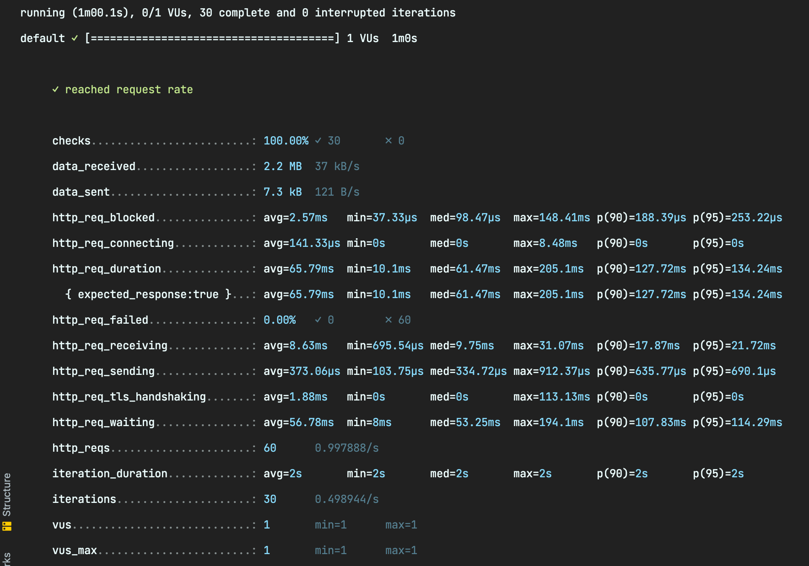
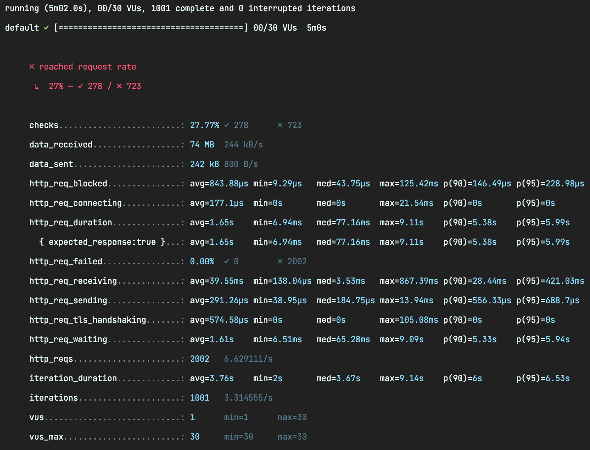
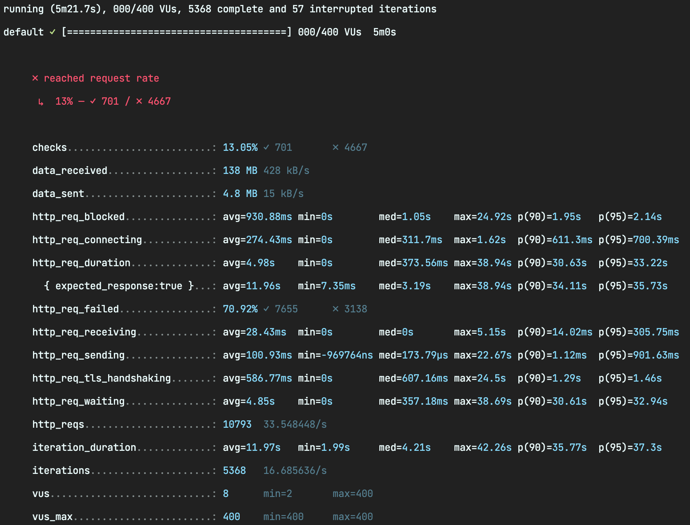

<p align="center">
    
</p>
<p align="center">
  
  
  <a href="https://edu.nextstep.camp/c/R89PYi5H" alt="nextstep atdd">
    
  </a>
  
</p>

<br>

# 인프라공방 샘플 서비스 - 지하철 노선도

<br>

## 🚀 Getting Started

### Install
#### npm 설치
```
cd frontend
npm install
```
> `frontend` 디렉토리에서 수행해야 합니다.

### Usage
#### webpack server 구동
```
npm run dev
```
#### application 구동
```
./gradlew clean build
```
<br>


### 1단계 - 웹 성능 테스트
1. 웹 성능예산은 어느정도가 적당하다고 생각하시나요

성능 측정
- `First Contentful Paint(FCP)`는 화면의 최초 진입시간과 페이지의 콘텐츠의 일부가 화면에 표현된 시간의 간격을 의미합니다.
- `Speed Index(SI)`는 얼마나 빨리 화면에 컨텐츠가 그려지는지를 나타냅니다.
- `Largest Contentful Paint(LCP)` 가장 사이즈가 큰 컨텐츠가 화면에 그려지는데 걸리는 시간입니다. 가장 큰 사이즈의 콘텐츠를 측정하는 이유는 화면에서 메인이 되는 정보라고 판단하기 때문입니다.
- `Total Blocking Time(TBT)`는 메인 쓰레드가 중단된 전체 시간을 의미합니다. (50ms 이상이면 중단으로 판단합니다.)
- `Total Bytes(TB)` 화면에서 사용되는 전체 컨텐츠의 사이즈를 뜻합니다.

|        | 서울교통공사 | 네이버지도 | 카카오맵   | Running Map|
|--------|----------|----------|----------|-------------------------------------------|
| FCP    | 2.26s    | 0.95s    | 1.02s    | 4.69s  |
| SI     | 3.003s   | 2.3s     | 1.65s    | 4.70s  |
| LCP    | 4.137s   | 2.7s     | 2.44s    | 4.73s  |
| TBT    | 1.055s   | 0.005s   | 0.005s   | 0s     |
| TB     | 1377KB   | 772kb    | 1169kb   | 2493kb |

측정 결과 해석
- Running Map의 FCP와 SI의 값이 거의 같은것으로 보아 최초 진입시 요청하는 리소스를 응답받는데 까지 걸리는 시간이 긴것으로 보입니다.
- Filmstrip View를 확인한 결과 화면 진입시 venders.js를 불러오는데 4초가 소모 되었으며, 그 외 리소스를 불러올땐 500ms를 넘지 않았습니다.

API 성능 테스트 결과
- Running Map의 API를 테스트한 결과 전체 라인을 조회하더라도 1.6초 이내로 처리가 가능했습니다. 그외 API는 1초 내로 처리 했습니다. 
- 서울 교통공사의 지하철 시간표를 조회하는 API에선 3.5초가 소요되었습니다.
- 네이버와 카카오는 지하철 역 상세조회시 0.8초 가량 소요되었습니다. 

성능 예산(Timing Based 적용)
- 사용자 이탈을 막기 위해 3초 룰을 지키는게 좋기 떄문에 SI를 3초내로 처리하도록 성능 예산을 잡았습니다.

1. 웹 성능예산을 바탕으로 현재 지하철 노선도 서비스의 서버 목표 응답시간 가설을 세워보세요.
- 현재 API는 성능 예산을 만족하기에 충분한듯 하나 프론트의 리소스 로딩 시간이 많이 소요되었습니다.
- 코드 확인후 js의 로딩 타이밍을 수정할 수 있거나, js에 CDN을 적용할 수 있다면 화면의 최초 로딩시간을 경쟁사와 유사한 수준까지 줄일 수 있을 것으로 보입니다.
- 화면에 노출되는 정보가 경쟁사에 비해 많지 않음에도 TB가 가장 크기 때문에 리소스를 압축해서 처리할 필요가 있습니다.
- 성능 예산을 만족하기 위해 목표 응답시간을 기존 결과에서 2초를 단축해야합니다.

|        | Running Map|
|--------|----------|
| FCP    | 2.69s    |
| SI     | 2.70s   |
| LCP    | 2.73s   |
| TBT    | 0s   |
| TB     | 2493KB  |


---

### 2단계 - 부하 테스트 

#### 1. 부하테스트 전제조건은 어느정도로 설정하셨나요

#### DAU
- 하루 지하철 사용자 수는 최대 600만명입니다. [자료](https://blog.hyundai-rotem.co.kr/691?category=663745)
- 서비스 초기 단계이므로 이중 10%만 running map을 사용하는 것으로 가정하면, 60만명입니다.
- 따라서 DAU는 600,000으로 설정합니다.
#### 1일 총 접속수
- 출/퇴근, 등/하교를 고려해서 1명당 1일 평균 접속 수는 2로 설정합니다.
- 따라서 1일 총 접속수는 600,000 * 2로 1,200,000입니다.
#### 1일 평균 rps
- 1,200,000 / 86,400(초/일) = 13
#### 집중률
- 최대 트래픽 : 사용자중 80%가 사용하는 것으로 가정하면 480,000입니다.
- 평소 트래픽 : 사용자중 40%만 사용하는 것으로 가정하면 240,000입니다.
- 따라서, 집중률은 2입니다.
#### 1일 최대 rps
- 13 * 2 수식을 통해서 26을 도출할 수 있습니다.

#### VUser
- R : 3(경로 검색 Page - 노선 목록 조회 API - 경로 검색 API)
- T : (3 * 0.5) + 1 = 2.5s
- 평균 VUser : 13 * 2.5 / 3 = 10
- 최대 VUser : 26 * 2.5 / 3 = 21


#### 2. Smoke, Load, Stress 테스트 스크립트와 결과를 공유해주세요
- 접속률이 가장 높을 것으로 예상되는 노선조회, 경로 탐색을 포함하여 테스트를 진행했습니다.

#### Smoke 테스트

```javascript
import http from 'k6/http';
import { check, sleep } from 'k6';

export let options = {
  vus: 2, // 1 user looping for 1 minute
  duration: '1m',

  thresholds: {
    http_req_duration: ['p(99)<1500'], // 99% of requests must complete below 1.5s
  },
};

const BASE_URL = 'https://92soojong.o-r.kr/';

export default function ()  {
  
    let main = http.get(`${BASE_URL}`);
    check(main, {'200 : main page': (res) => res.status === 200});

    let stations = http.get(`${BASE_URL}/stations`);
    check(stations, {'200 : stations': (res) => res.status === 200});

    let lines = http.get(`${BASE_URL}/lines`);
    check(lines, {'200 : lines': (res) => res.status === 200});

    let sections = http.get(`${BASE_URL}/sections`);
    check(sections, {'200 : sections': (res) => res.status === 200});

    sleep(1);
  
};
```

#### Load 테스트

```javascript
import http from 'k6/http';
import { check, sleep } from 'k6';

export let options = {
    stages: [
        { duration: '5m', target: 5 },
        { duration: '5m', target: 10 },
        { duration: '15m', target: 21 },
        { duration: '5m', target: 10 },
        { duration: '5m', target: 5 }
        { duration: '10s', target: 0 }
    ],
    thresholds: {
        http_req_duration: ['p(99)<2500'], // 99% of requests must complete below 2.5s
    }
};

const BASE_URL = 'https://92soojong.o-r.kr/';

export default function ()  {

    let path = http.get(`${BASE_URL}/path`);
    check(path, {'200 : path': (res) => res.status === 200});

    let stations = http.get(`${BASE_URL}/stations`);
    check(stations, {'200 : lines': (res) => res.status === 200});

    let sections = http.get(`${BASE_URL}/source=3&target=5`);
    check(sections, {'200 : sections': (res) => res.status === 200});

    sleep(1);
  
};
```


#### Stress 테스트

```javascript
import http from 'k6/http';
import { check, sleep } from 'k6';

export let options = {
    stages: [
        { duration: '5m', target: 5 },
        { duration: '5m', target: 21 },
        { duration: '5m', target: 50 },
        { duration: '5m', target: 70 },
        { duration: '5m', target: 100 },
        { duration: '5m', target: 200 },
        { duration: '10s', target: 0 },
    ],
    thresholds: {
        http_req_duration: ['p(99)<2500'], // 99% of requests must complete below 2.5s
    }
};

const BASE_URL = 'https://92soojong.o-r.kr/';

export default function ()  {

    let path = http.get(`${BASE_URL}/path`);
    check(path, {'200 : path': (res) => res.status === 200});

    let stations = http.get(`${BASE_URL}/stations`);
    check(stations, {'200 : lines': (res) => res.status === 200});

    let sections = http.get(`${BASE_URL}/source=3&target=5`);
    check(sections, {'200 : sections': (res) => res.status === 200});

    sleep(1);
  
};
```

---

### 3단계 - 로깅, 모니터링
1. 각 서버내 로깅 경로를 알려주세요

2. Cloudwatch 대시보드 URL을 알려주세요
