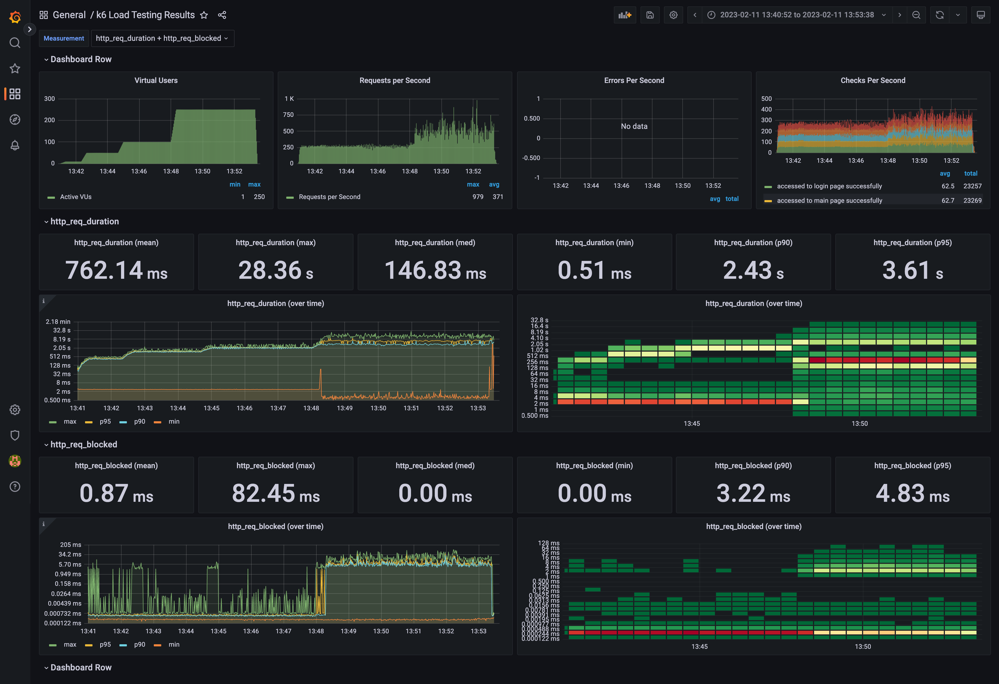

<p align="center">
    
</p>
<p align="center">
  
  
  <a href="https://edu.nextstep.camp/c/R89PYi5H" alt="nextstep atdd">
    
  </a>
  
</p>

<br>

# 인프라공방 샘플 서비스 - 지하철 노선도

<br>

## 🚀 Getting Started

### Install

#### npm 설치

```
cd frontend
npm install
```

> `frontend` 디렉토리에서 수행해야 합니다.

### Usage

#### webpack server 구동

```
npm run dev
```

#### application 구동

```
./gradlew clean build
```

<br>

### 1단계 - 웹 성능 테스트

1. 웹 성능예산은 어느정도가 적당하다고 생각하시나요

경쟁사 웹 성능 비교([https://pagespeed.web.dev/](https://pagespeed.web.dev/))

진단대상 URL : https://waterfog-subway.store/

| 측정 지표       | RUNNINGMAP | 서울 교통 공사 | 네이버 지도 | 카카오 맵 |
|-------------|------------|----------|--------|-------|
| FCP         | 14.7       | 6.3      | 2.1    | 1.7   |
| Speed Index | 14.7       | 10.2     | 2.1    | 7.2   |
| LCP         | 15.3       | 6.5      | 2.1    | 5.6   |
| TTI         | 15.3       | 8.2      | 2.4    | 4.8   |
| TBT         | 0.55       | 0.28     | 0.02   | 0.16  |
| CLS         | 0.04       | 0        | 0.064  | 0.005 |

| 측정 지표       | 목표    |
|-------------|-------|
| FCP         | 1.8   |
| Speed Index | 2.3   |
| LCP         | 2.3   |
| TTI         | 2.6   |
| TBT         | 0.017 |
| CLS         | 0     |

```
3초의법칙 : 구글 리서치 조사결과에 따르면 웹페이지가 3초이내로 로딩되지 않으면 사용자의 53%가 떠난다.
```

이러한 3초의 법칙을 근거로 TTI를 3초이내로 단축시키는것을 최우선으로 하고,
각 성능지표에서 가장 성능이 좋은 경쟁사와 성능차이를 20%이내로 줄이는것을 목표로 한다.

2. 웹 성능예산을 바탕으로 현재 지하철 노선도 서비스의 서버 목표 응답시간 가설을 세워보세요.

- 텍스트 기반 리소스를 압축(gzip, deflate, brotli)하여 제공(예상 절감치 9.51s)
- 효율적인 캐시 정책을 사용하여 정적인 애셋 제공
    - /js/vendors.js
    - /js/main.js
    - /images/main_logo.png
    - /images/logo_small.png

- 크롬 성능탭을 통한 각 페이지별 응답시간 측정
    - 역관리 : 207.55
    - 노선 관리 : 225.60
    - 구간 관리 : 229.98
    - 경로 검색 : 198.44
- 캐시 적용을 통한 DB접근 횟수 줄이기 : 동일한 조회 API를 반복요청하였을때 동일한 DB조회를 반복하여 응답시간이 개선되지 않는다. 캐시적용을 통해 반복요청에 대한 개선이
  가능할 것으로 보임.

---

### 2단계 - 부하 테스트

1. 부하테스트 전제조건은 어느정도로 설정하셨나요

**대상 시스템 범위**

- 시스템
    - Webserver(Nginx)
    - WAS(Tomcat)
    - DB(MySQL)

**시나리오 대상**

- 메인페이지, 로그인, 경로검색
    - 경로검색은 RUNNINGMAP의 주요서비스이다.
    - 메인페이지 -> 로그인페이지 -> 로그인 버튼 클릭 -> 경로페이지 -> 경로 검색 버튼 클릭
    - 경로검색은 노선뿐만아니라 노선이 참조하고 있는 역까지 조회하게 되므로 DB를 많이 사용하는 기능이다.

**목표값 설정**

- DAU : 200만
    - 경쟁사 네이버지도의 경우 516만명, 카카오맵의 경우 약 219만명.
    - 경쟁사만큼의 높은 성능을 확보하기 위해 200만으로 설정
- 피크 시간대 집중률
    - 1명당 1일 평균 접속수 : 2회(출퇴근 2회)
    - 1일 총 접속수 : 400만 (200만 * 2회)
    - 1일 평균 rps : 46 (=1일 총 접속 수 / 86,400)
    - 1일 최대 rps : 92 (=1일 평균 rps * 피크시간대 집중률(2배))

**VUser**

- R : 5
- http_req_duration : 0.2
- T : 2 (=5 * 0.2 + 1)
- 평균 VUser : 18.4 (46 * 2 / 5)
- 최대 VUser : 36.8 (92 * 2 / 5)

2. Smoke, Load, Stress 테스트 스크립트와 결과를 공유해주세요

**Smoke Test Script**

```javascript
import http from 'k6/http';
import {check, group, sleep, fail} from 'k6';

export let options = {
    vus: 1,
    duration: '1m',

    thresholds: {
        http_req_duration: ['p(99)<200'],
    },
};

const BASE_URL = 'https://waterfog-subway.store';
const USERNAME = 'loadTest@test.com';
const PASSWORD = '1234';

export default function () {
    accessMainPage()
    accessLoginPage()
    const authHeaders = login()
    accessPathPage(authHeaders)
    findPath(authHeaders)
};

function accessMainPage() {
    check(http.get(`${BASE_URL}`), {
        'accessed to main page successfully': (res) => res.status === 200,
    });
}

function accessLoginPage() {
    check(http.get(`${BASE_URL}/login`), {
        'accessed to login page successfully': (res) => res.status === 200,
    });
}

function login() {
    const params = {
        headers: {
            'Content-Type': 'application/json',
        },
    };

    const payload = JSON.stringify({
        email: USERNAME,
        password: PASSWORD,
    });

    let loginRes = http.post(`${BASE_URL}/login/token`, payload, params);

    check(loginRes, {'logged in successfully': (resp) => resp.json('accessToken') !== '',});

    return {headers: {Authorization: `Bearer ${loginRes.json('accessToken')}`,},}
}

function accessPathPage(authHeaders) {
    check(http.get(`${BASE_URL}/path`, authHeaders), {
        'accessed to path page successfully': (res) => res.status === 200,
    });
}


function findPath(authHeaders) {
    check(http.get(`${BASE_URL}/paths/?source=1&target=10`, authHeaders), {
        'find path successfully': (res) => res.status === 200,
    });
}

```

**Smoke Test Result**


**Load Test Script**

```javascript
import http from 'k6/http';
import {check, group, sleep, fail} from 'k6';

export let options = {
    stages: [
        {duration: '20s', target: 18},
        {duration: '3m', target: 18},
        {duration: '20s', target: 36},
        {duration: '5m', target: 36},
        {duration: '20s', target: 18},
        {duration: '3m', target: 18},
    ], thresholds: {
        http_req_duration: ['p(99)<200'],
    },
};

const BASE_URL = 'https://waterfog-subway.store';
const USERNAME = 'loadTest@test.com';
const PASSWORD = '1234';

export default function () {
    accessMainPage()
    accessLoginPage()
    const authHeaders = login()
    accessPathPage(authHeaders)
    findPath(authHeaders)
};

function accessMainPage() {
    check(http.get(`${BASE_URL}`), {
        'accessed to main page successfully': (res) => res.status === 200,
    });
}

function accessLoginPage() {
    check(http.get(`${BASE_URL}/login`), {
        'accessed to login page successfully': (res) => res.status === 200,
    });
}

function login() {
    const params = {
        headers: {
            'Content-Type': 'application/json',
        },
    };

    const payload = JSON.stringify({
        email: USERNAME,
        password: PASSWORD,
    });

    let loginRes = http.post(`${BASE_URL}/login/token`, payload, params);

    check(loginRes, {'logged in successfully': (resp) => resp.json('accessToken') !== '',});

    return {headers: {Authorization: `Bearer ${loginRes.json('accessToken')}`,},}
}

function accessPathPage(authHeaders) {
    check(http.get(`${BASE_URL}/path`, authHeaders), {
        'accessed to path page successfully': (res) => res.status === 200,
    });
}


function findPath(authHeaders) {
    check(http.get(`${BASE_URL}/paths/?source=1&target=10`, authHeaders), {
        'find path successfully': (res) => res.status === 200,
    });
}

```

**Load Test Result**


**Stress Test Script**

```javascript
import http from 'k6/http';
import {check, group, sleep, fail} from 'k6';

export let options = {
    stages: [
        {duration: '20s', target: 10},
        {duration: '1m', target: 10},
        {duration: '20s', target: 50},
        {duration: '2m', target: 50},
        {duration: '20s', target: 100},
        {duration: '3m', target: 100},
        {duration: '20s', target: 250},
        {duration: '5m', target: 250},
    ], thresholds: {
        http_req_duration: ['p(99)<200'],
    },
};

const BASE_URL = 'https://waterfog-subway.store';
const USERNAME = 'loadTest@test.com';
const PASSWORD = '1234';

export default function () {
    accessMainPage()
    accessLoginPage()
    const authHeaders = login()
    accessPathPage(authHeaders)
    findPath(authHeaders)
};

function accessMainPage() {
    check(http.get(`${BASE_URL}`), {
        'accessed to main page successfully': (res) => res.status === 200,
    });
}

function accessLoginPage() {
    check(http.get(`${BASE_URL}/login`), {
        'accessed to login page successfully': (res) => res.status === 200,
    });
}

function login() {
    const params = {
        headers: {
            'Content-Type': 'application/json',
        },
    };

    const payload = JSON.stringify({
        email: USERNAME,
        password: PASSWORD,
    });

    let loginRes = http.post(`${BASE_URL}/login/token`, payload, params);

    check(loginRes, {'logged in successfully': (resp) => resp.json('accessToken') !== '',});

    return {headers: {Authorization: `Bearer ${loginRes.json('accessToken')}`,},}
}

function accessPathPage(authHeaders) {
    check(http.get(`${BASE_URL}/path`, authHeaders), {
        'accessed to path page successfully': (res) => res.status === 200,
    });
}


function findPath(authHeaders) {
    check(http.get(`${BASE_URL}/paths/?source=1&target=10`, authHeaders), {
        'find path successfully': (res) => res.status === 200,
    });
}

```

**Stress Test Result**



---

### 3단계 - 로깅, 모니터링

1. 각 서버내 로깅 경로를 알려주세요

- NGINX
  - /var/log/nginx
- WAS
  - ~/nextstep/infra-subway-monitoring/log

2. Cloudwatch 대시보드 URL을 알려주세요

https://ap-northeast-2.console.aws.amazon.com/cloudwatch/home?region=ap-northeast-2#dashboards:name=waterfogSW
