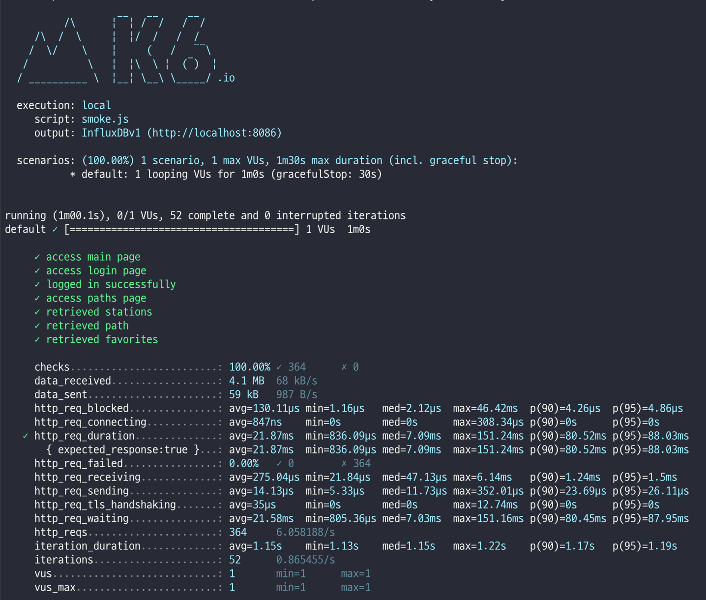
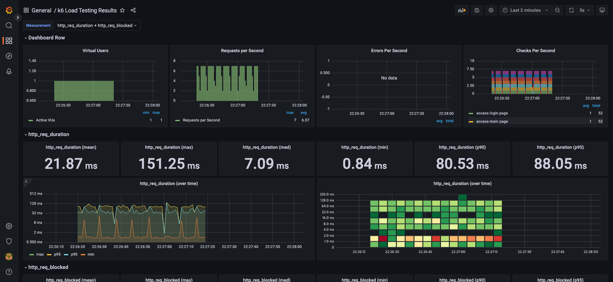
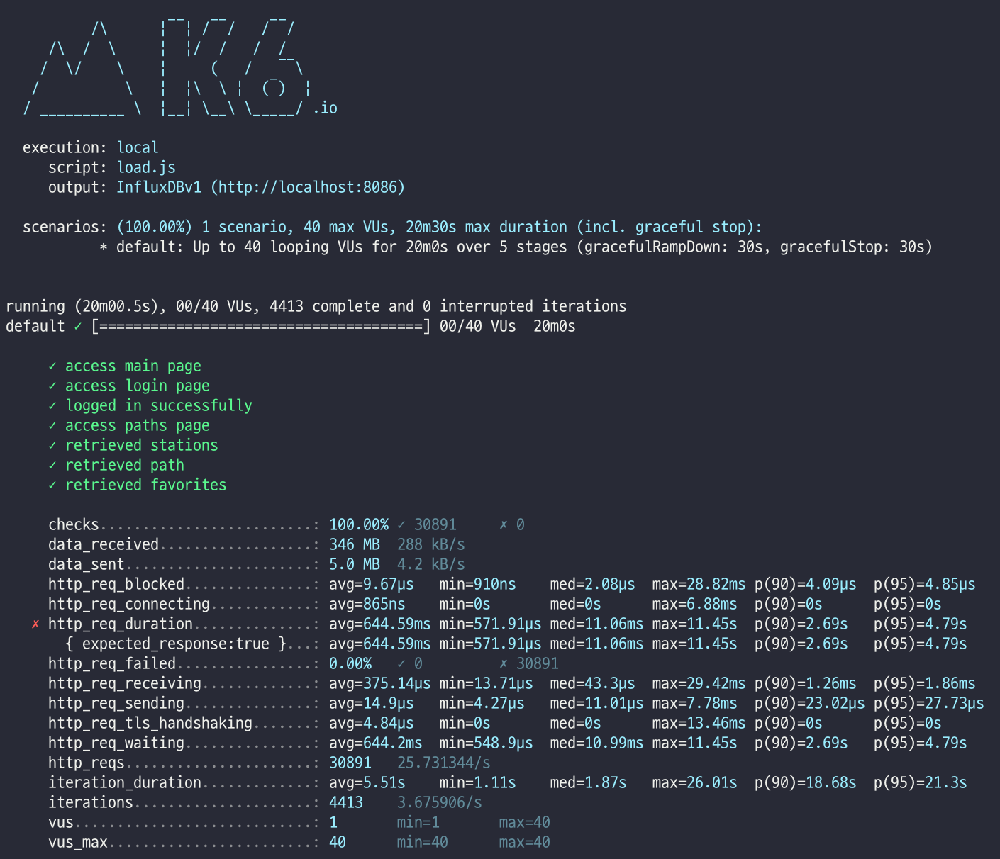
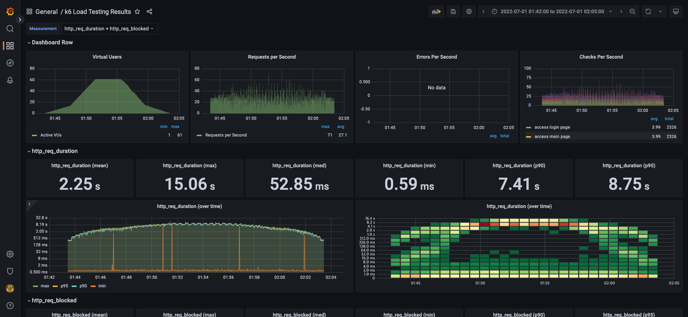
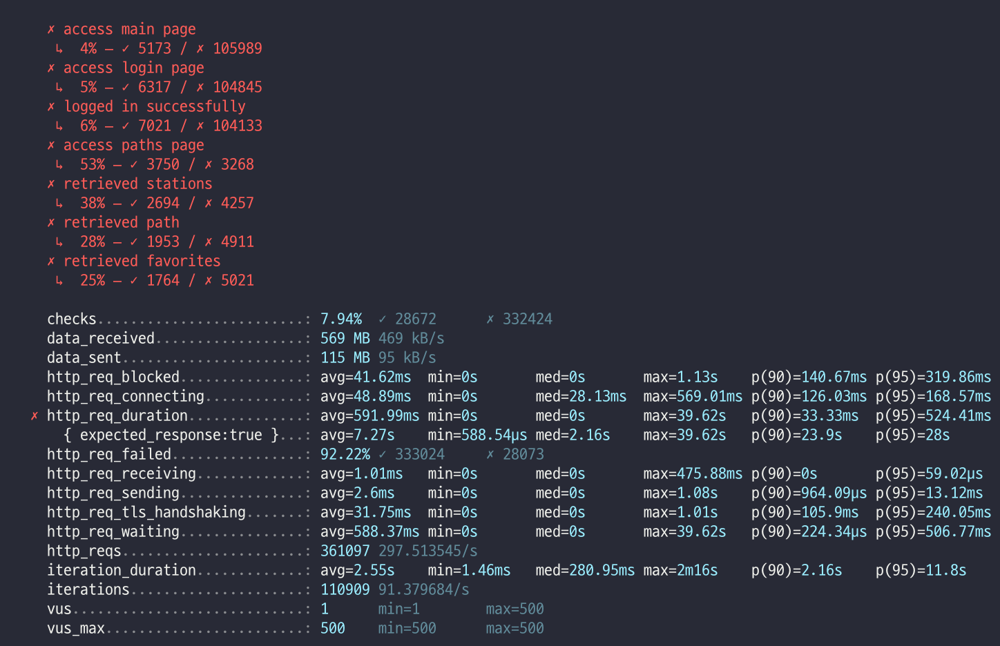

## 요구사항
- [x] 부하 테스트
  - [x] 테스트 전제조건 정리
    - [x] 대상 시스템 범위
    - [x] 목푯값 설정 (latency, throughput, 부하 유지기간)
    - [x] 부하 테스트 시 저장될 데이터 건수 및 크기
  - [x] 각 시나리오에 맞춰 스크립트 작성
    - [x] 접속 빈도가 높은 페이지
    - [x] 데이터를 갱신하는 페이지
    - [x] 데이터를 조회하는데 여러 데이터를 참조하는 페이지
  - [x] Smoke, Load, Stress 테스트 후 결과를 기록

### 1. 부하테스트 전제조건은 어느정도로 설정하셨나요
#### 대상 시스템 범위
Proxy(nginx) -> WAS(tomcat) -> DB(mysql)

- 시나리오
  - 메인 페이지
  - 로그인 페이지
  - 로그인 요청
  - 경로 조회 페이지
  - 지하철역 목록 조회
  - 경로 검색 조회
  - 즐겨찾기 목록 조회

- 데이터
  - 노선 : 23개
  - 구간 : 340개
  - 역 : 616개
  - 사용자 : 1개

#### 목푯값 설정
- Throughput : 23 rps ~ 92 rps
  - 예상 1일 사용자 수(DAU) : 100만명
  - 피크 시간대의 집중률 예상 : 출퇴근 시간대
  - 1명당 1일 평균 접속 혹은 요청수 예상 : 접속 2회

- Latency 
  - P99 : 100ms 이하
```text
Throughput : 1일 평균 rps ~ 1일 최대 rps
  1일 사용자 수(DAU) x 1명당 1일 평균 접속 수 = 1일 총 접속 수
  1일 총 접속 수 / 86,400 (초/일) = 1일 평균 rps
  1일 평균 rps x (최대 트래픽 / 평소 트래픽) = 1일 최대 rps
Latency : 일반적으로 50~100ms이하로 잡는 것이 좋습니다.
```
- 부하 유지기간
  - smoke : 1m
  - load : 20m
  - stress : 20m

```text
Request Rate: measured by the number of requests per second (RPS)
VU: the number of virtual users
R: the number of requests per VU iteration
T: a value larger than the time needed to complete a VU iteration

T = (R * http_req_duration) (+ 1s) ; 내부망에서 테스트할 경우 예상 latency를 추가한다
VUser = (목표 rps * T) / R
```
- VUser
  - T = (6 x 0.5s) (+ 1s) = 4s
  - Min VUser : 23 x 4 / 6 = 14
  - Max VUser : 92 x 4 / 6 = 61

### 2. Smoke, Load, Stress 테스트 스크립트와 결과를 공유해주세요
#### smoke



#### load



#### stress

