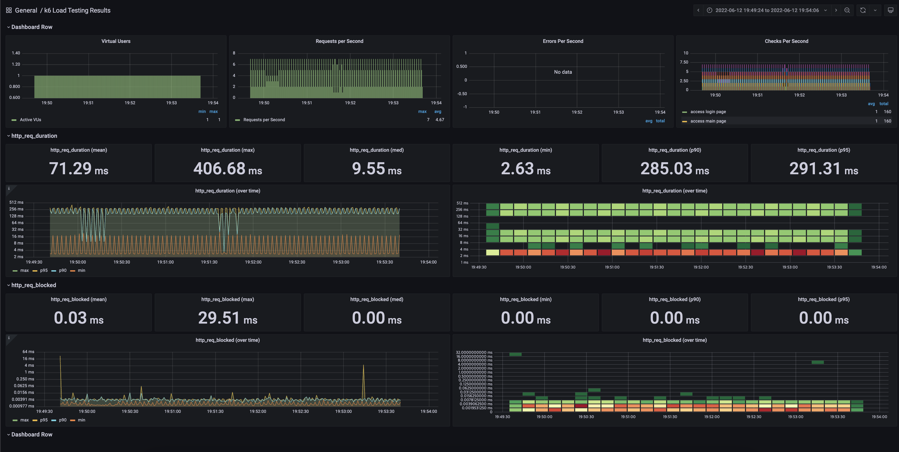
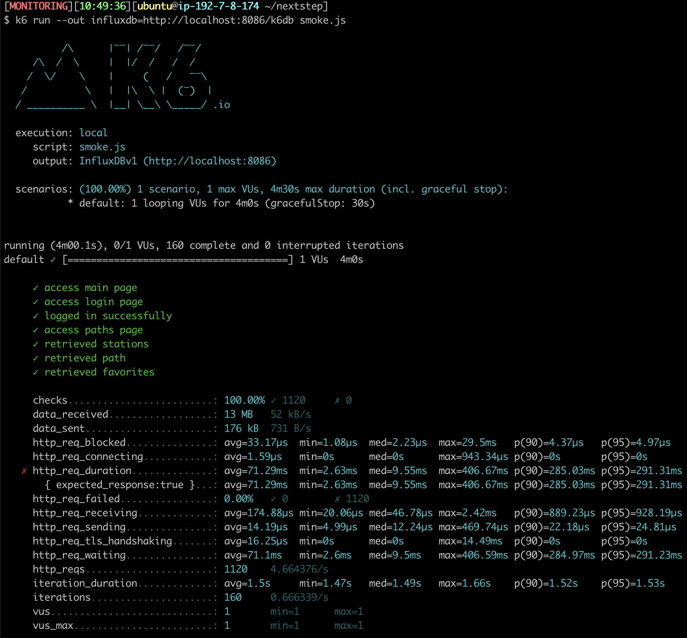
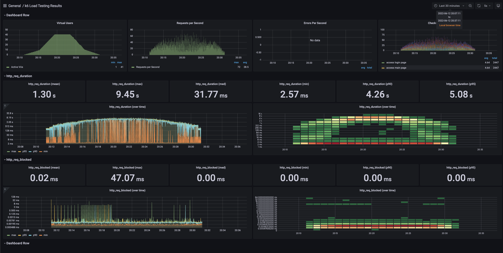
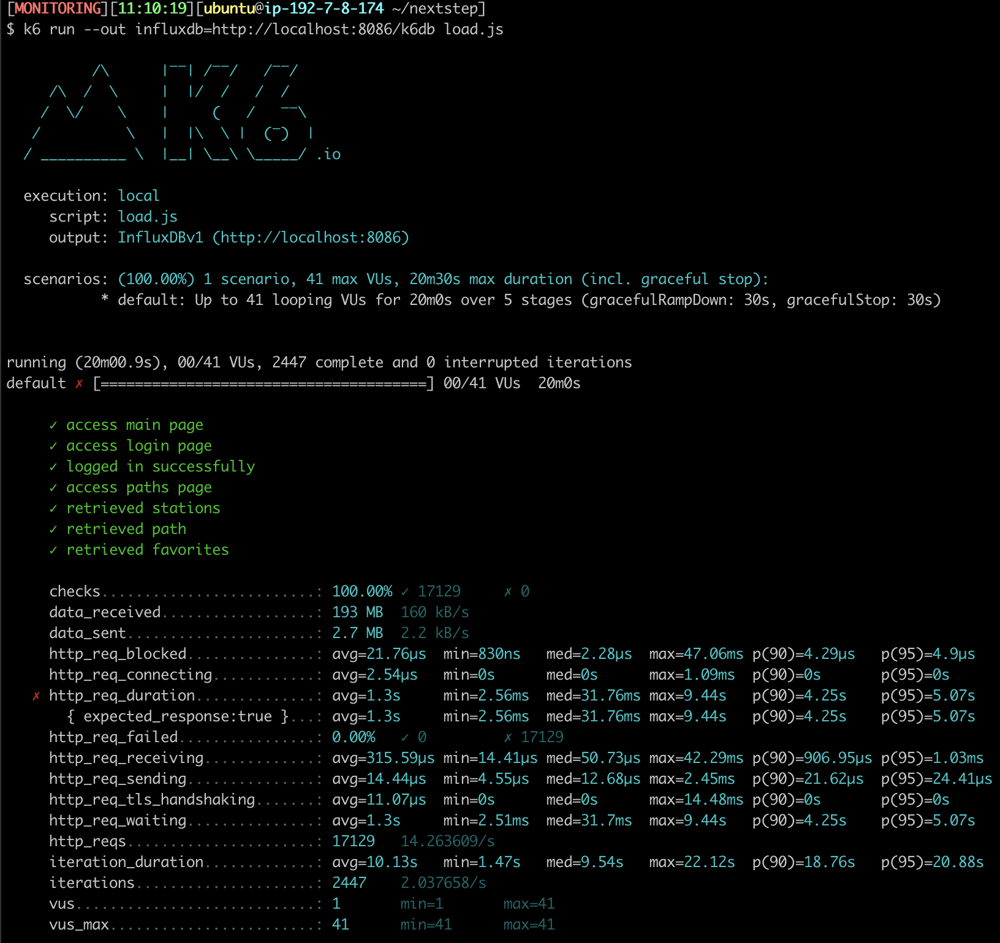
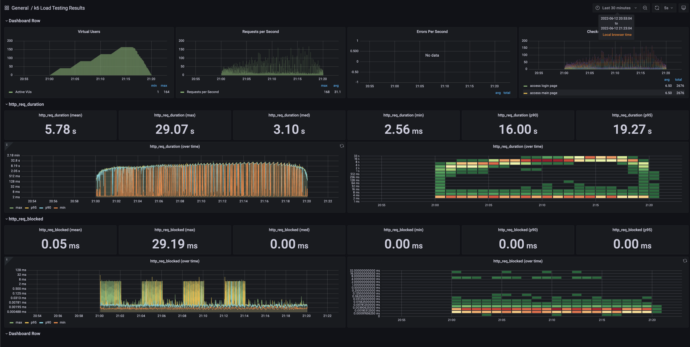
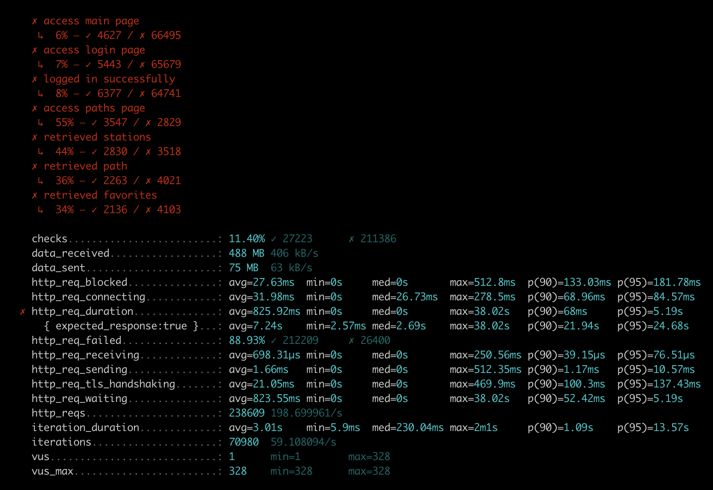

## 1. 부하테스트 전제조건은 어느정도로 설정하셨나요

1. Target 시스템의 범위

    - Reverse Proxy -> Tomcat -> MySQL

2. 우선 예상 1일 사용자 수(DAU)를 정해봅니다.
    
   - 450,000 DAU 

3. 피크 시간대의 집중률을 예상해봅니다. (최대 트래픽 / 평소 트래픽)

   - 출퇴근 시간에 80% 이상 집중된다고 가정 (최대 트래픽 - 360,000)
   - 나머지가 여러 시간대에 균등하게 분포 (평소 트래픽 - 90,000)

4. 1명당 1일 평균 접속 혹은 요청수를 예상해봅니다.

   - 7회
     - 메인 페이지 접속
     - 로그인 페이지 접속
     - 로그인 요청
     - 경로 검색 페이지 접속
     - 지하철역 목록 조회
     - 경로 검색 조회
     - 즐겨찾기 페이지 접속
     - 즐겨찾기 목록 조회

5. 이를 바탕으로 Throughput을 계산합니다.

   - Throughput : 1일 평균 rps ~ 1일 최대 rps
     > 37 rps ~ 148 rps
      - 1일 사용자 수(DAU) x 1명당 1일 평균 접속 수 = 1일 총 접속 수
        > 450,000 x 7 = 3,150,000
      - 1일 총 접속 수 / 86,400 (초/일) = 1일 평균 rps 
        > 3,150,000 / 86,400 = 36 rps
      - 1일 평균 rps x (최대 트래픽 / 평소 트래픽) = 1일 최대 rps
        > 36 x (360,000 / 90,000) = 144 rps
   - Latency : 일반적으로 50~100ms이하로
     > 100ms
   - VUser
      - T = (R * http_req_duration) (+ 1s)
        > (7 * 0.1) + 1 = 2
      - VUser = (목표 rps * T) / R
        > Min VUser: (37 * 2) / 7 = 10
        > Max VUser: (144 * 2) / 7 = 41

## 2. Smoke, Load, Stress 테스트 스크립트와 결과를 공유해주세요

### Smoke

- 
- 

### Load

- 
- 

### Stress

- 
- 
