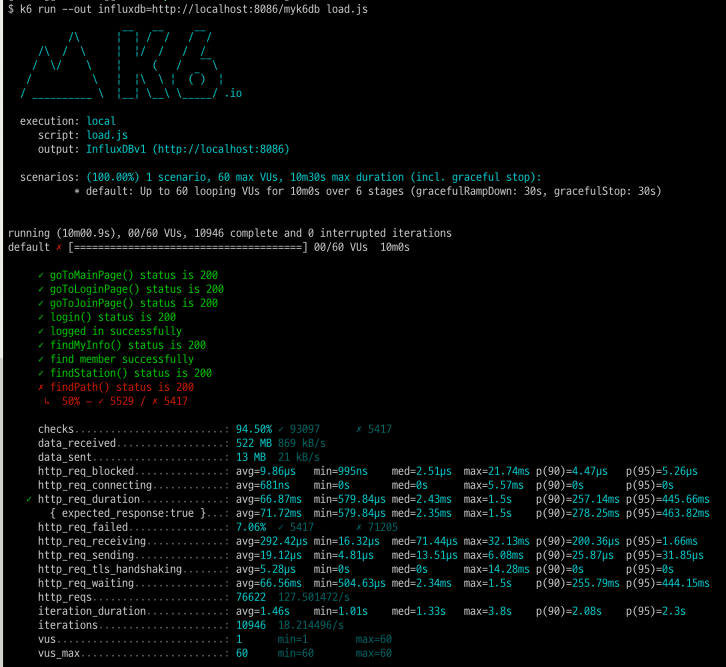

## 1. 테스트 범위

- Load Balancer, Web Server, Database

## 2. DAU 측정

- 450,000 DAU
- 하루 평균 사용자수(4,473,454)의 10%로 설정
- 출처 :  [https://www.bigdata-map.kr/datastory/traffic/seoul](https://www.bigdata-map.kr/datastory/traffic/seoul)

## 3. 피크 시간 설정

- 출퇴근 시간은 피크시간으로 설정하며 약 2배의 트래픽이 발생한다. (300,000)
- 평소에는 균등하게 트래픽이 발생한다 (평소 트래픽 - 150,000)

## 4. 1명당 1일 평균 요청수

- 8회
    - 메인 페이지 접속
    - 회원가입 페이지 접속
    - 회원가입 요청
    - 로그인 페이지 접속
    - 로그인 요청
    - 경로 검색 페이지 접속
    - 지하철역 목록 조회
    - 경로 검색 조회

## 5. Throughput 계산

- 1일 사용자 수(DAU) x 1명당 1일 평균 접속 수 = 1일 총 접속 수
    - 450,000 * 8 = 3,600,000
- 1일 총 접속 수 / 86,400(second/day) = 1일 평균 rps
    - 3,600,000 / 86,400 = 40rps
- 1일 평균 rps x (최대 트래픽 / 평소 트래픽) = 1일 최대 rps
    - 40 x (300,000 / 150,000) = 80rps
- **Throughput : 1일 평균 rps ~ 1일 최대 rps**
    - 40rps ~ 80rps
- Latency : 100ms
- T = (R * http_req_duration) + 1 = (8 * 0.1) + 1 = 1.8
- 평균 VUser = (1일 평균 rps * T) / R = (40 * 1.8) / 8 = 9
- 최대 VUser = (1일 최대 rps * T) / R = (80 * 1.8) / 8 = 18

## smoke
[smoke test 보러가기](smoke/smoke.js)
  

## load 
[load test 보러가기](load/load.js)
  

## stress 
[stress test 보러가기](stress/stress.js)
  

stress 테스트의 경우 VUser가 1000명까지 수용하는 것을 확인했습니다.

