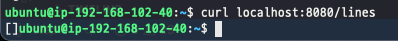
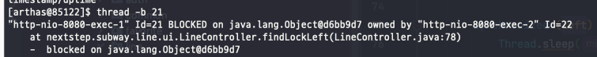
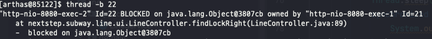
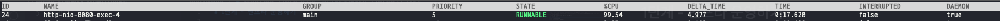
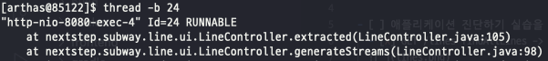
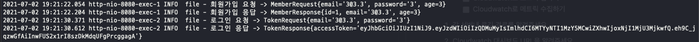
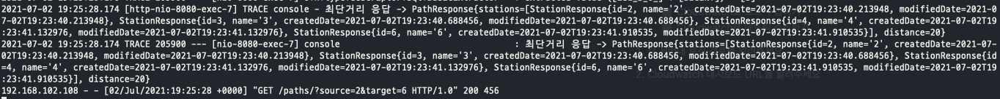
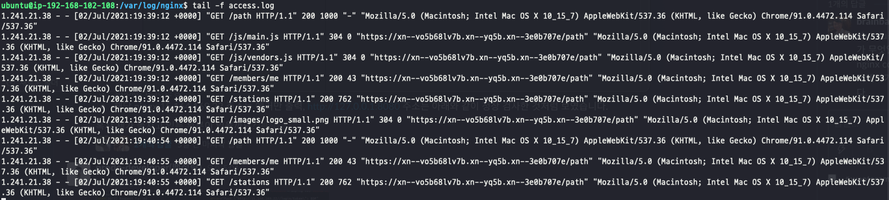

# 1단계 - 인프라 운영하기

## 요구사항

- [X] 애플리케이션 진단하기 실습을 진행해보고 문제가 되는 코드를 수정
  - [X] GET /lines findAllLines -> SLEEP(3)의 리턴은 0이기에 리스폰스가 없어 해당 코드 삭제
  
  - [X] GET /left /right 데드락 코드 삭제
  
  
  - [X] GET /tan 무한루프 코드 삭제
  
  
- [ ] 로그 설정하기
  - [X] Application Log 파일로 저장하기
    - [X] 회원가입, 로그인, 최단거리 조회 등의 이벤트에 로깅을 설정
    
    
  - [X] Nginx Access Log 설정하기
  
- [X] Cloudwatch로 모니터링
  - [X] Cloudwatch로 로그 수집하기
  - [X] Cloudwatch로 메트릭 수집하기

1. 각 서버내 로깅 경로를 알려주세요.
   - mskangg-EC2-web(nginx)
     - 52.78.110.106
     - /var/log/nginx
   - mskangg-EC2-was(web-service)
     - 3.35.54.141
     - /home/ubuntu/infra-subway-monitoring/log

2. Cloudwatch 대시보드 URL을 알려주세요.
   - <https://ap-northeast-2.console.aws.amazon.com/cloudwatch/home?region=ap-northeast-2#dashboards:name=DASHBOARD-mskangg>
