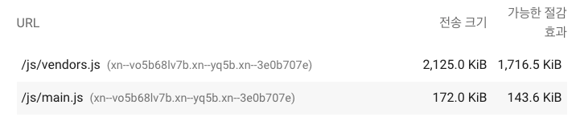
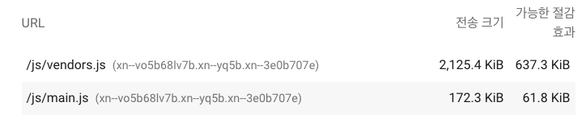
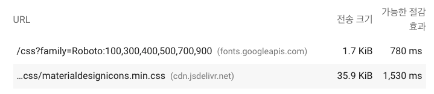
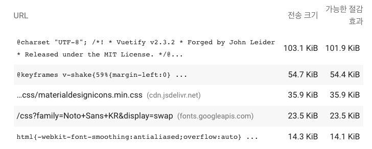
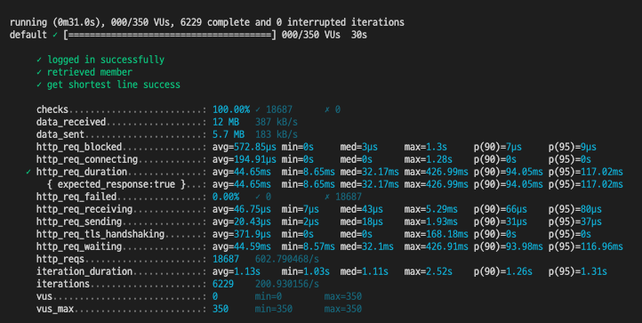
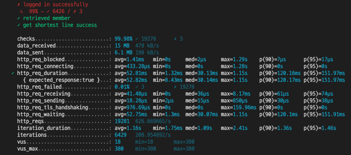
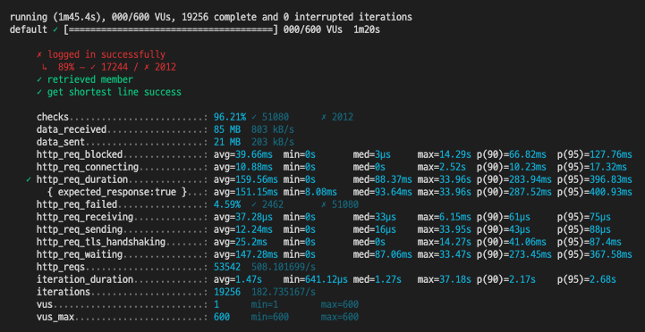

# 🚀 2단계 - 성능 테스트

## 요구사항

- [X] 웹 성능 테스트
  - [X] 웹 성능 예산을 작성
  - [X] WebPageTest, PageSpeed 등 테스트해보고 개선이 필요한 부분을 파악
- [X] 부하 테스트
  - [X] 테스트 전제조건 정리
    - [X] 대상 시스템 범위
    - [X] 목푯값 설정 (latency, throughput, 부하 유지기간)
    - [X] 부하 테스트 시 저장될 데이터 건수 및 크기
  - [X] 각 시나리오에 맞춰 스크립트 작성
    - [X] 접속 빈도가 높은 페이지
    - [X] 데이터를 갱신하는 페이지
    - [X] 데이터를 조회하는데 여러 데이터를 참조하는 페이지
  - [X] Smoke, Load, Stress 테스트 후 결과를 기록

## Report

1. 웹 성능예산은 어느정도가 적당하다고 생각하시나요

| -           | First Contentful Paint | Speed Index | Largest Contentful Paint | Time to Interactive | Total Blocking Time | Cumulative Layout Shift |
| ----------- | ---------------------- | ----------- | ------------------------ | ------------------- | ------------------- | ----------------------- |
| RunningMap  | 14.4 s                 | 14.4 s      | 15.0 s                   | 15.1 s              | 0.51 s              | 0.041 s                 |
| Baemin      | 2.6 s                  | 6.0 s       | 4.3 s                    | 4.7 s               | 0.4 s               | 0.066 s                 |
| NaverMap    | 2.3 s                  | 6.2 s       | 5.9 s                    | 5.8 s               | 0.32 s              | 0.017 s                 |
| KakaoMap    | 2.5 s                  | 7.1 s       | 7.0 s                    | 5.1 s               | 0.9 s               | 0.005 s                 |
| 목표 평균치 | 2.466 s                | 6.43 s      | 5.73 s                   | 5.2 s               | 1.62 s              | 0.029 s                 |

`개선 우선순위: First Contentful Paint > Largest Contentful Paint > Speed Index > Time to Interactive`

1. 웹 성능예산을 바탕으로 현재 지하철 노선도 서비스는 어떤 부분을 개선하면 좋을까요
   - 텍스트 압축 사용
   - 
   - 사용하지 않는 자바스크립트 줄이기
   - 
   - 렌더링 차단 리소스 제거하기
   - 
   - 사용하지 않는 CSS 줄이기
   - 
   - main.js 와 vender.js가 가장 큰 문제로 보여 압축과 캐싱을 통해 개선 가능해보임
   - script 비동기 호출로 개선 가능해보임

2. 부하테스트 전제조건은 어느정도로 설정하셨나요
   - 우선 예상 1일 사용자 수(DAU)를 정해봅니다.
     - 우리 서비스의 경쟁사인 카카오맵(500만)의 1/4 수준인 125만으로 가정하자
     - 125만 / 30일 = 42000 명
   - 피크 시간대의 집중률을 예상해봅니다. (최대 트래픽 / 평소 트래픽)
     - 아침 출근시간: 7 ~ 8시
     - 저녁 퇴근시간: 6 ~ 7시
   - 1명당 1일 평균 접속 혹은 요청수를 예상해봅니다.
     - 1명당 1일 평균 요청수 5회
   - 이를 바탕으로 Throughput을 계산합니다. (Throughput : 1일 평균 rps ~ 1일 최대 rps)
     - 1일 사용자 수(DAU) x 1명당 1일 평균 접속 수 = 1일 총 접속 수
       - 42000 * 5 = 210000
     - 1일 총 접속 수 / 86,400 (초/일) = 1일 평균 rps
       - 210000 / 86400(1일) = 약 2.43 rps
     - 1일 평균 rps x (최대 트래픽 / 평소 트래픽) = 1일 최대 rps
       - 2.43 * (250000/50000) = 약 12.15rps (1일 최대)

3. Smoke, Load, Stress 테스트 스크립트와 결과를 공유해주세요
   - Smoke 테스트 결과
     - 1일 예상 평균 rps 2.43 에 근접한 2.77 rps 나옴
     - 레이턴시 100ms이하 조건 통과
     - 
   - Load 테스트 결과
     - 최대 트래픽 부하테스트시 5초에 350명까진 100% 성공하나 380명부턴 0.01% 실패가 발생
     - 최대 rps 12.15 로 예상되나 부하테스트 결과 602 rps 나옴
     - 
     - 
   - Stress 테스트 결과
     - 
     - 장기간 부하 발생시 기능 정상 작동 되지 않음.
     - read: connection reset by peer 에러 발생하여 요청 처리하지 못하고 서버소켓 리셋이 되는 것을 확인.
