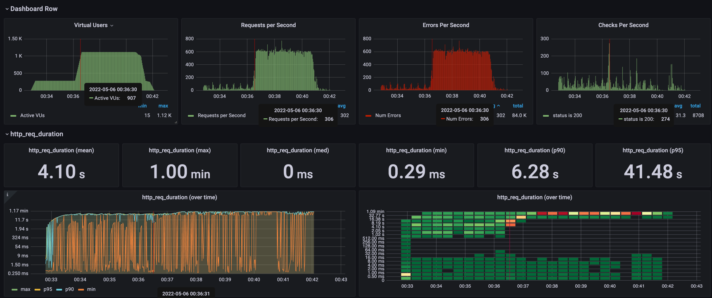
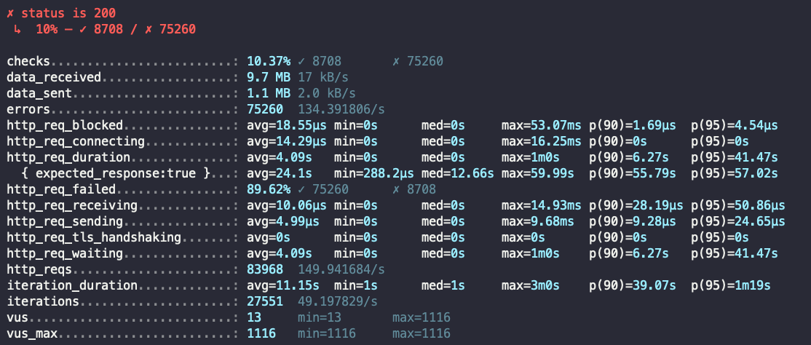

```
data_received: 수신된 데이터의 양입니다.
data_sent: 전송된 데이터의 양입니다.
http_req_blocked: 요청을 시작하기 전에 차단된 시간(사용 가능한 TCP 연결 슬롯 대기)입니다.
http_req_connecting: 원격 호스트에 대한 TCP 연결을 설정하는 데 소요된 시간입니다.
http_req_duration: 요청에 대한 총 시간입니다. (즉, 초기 DNS 조회/연결 시간 없이 원격 서버가 요청을 처리하고 응답하는 데 걸린 시간)
http_req_failed: setResponseCallback 에 따른 실패한 요청 비율입니다.
http_req_receiving: 원격 호스트에서 응답 데이터를 수신하는 데 소요된 시간입니다.
http_req_sending: 원격 호스트에 데이터를 보내는 데 소요된 시간입니다.
http_req_tls_handshaking: 원격 호스트와 TLS 세션을 핸드셰이킹하는 데 소요된 시간입니다.
http_req_waiting: 원격 호스트의 응답을 기다리는 데 소요된 시간입니다.
http_reqs: k6이 생성된 총 HTTP 요청 수입니다.
iteration_duration: 기본/메인 함수의 전체 반복을 완료하는 데 걸린 시간입니다.
iterations: 테스트의 VU가 JS 스크립트를 실행한 총 횟수입니다.
vus: 현재 활성 가상 사용자 수입니다.
vus_max: 최대 가상 사용자 수입니다.
```

```
     checks.........................: 10.37% ✓ 8708       ✗ 75260
     data_received..................: 9.7 MB 17 kB/s
     data_sent......................: 1.1 MB 2.0 kB/s
     errors.........................: 75260  134.391806/s
     http_req_blocked...............: avg=18.55µs min=0s      med=0s     max=53.07ms p(90)=1.69µs  p(95)=4.54µs
     http_req_connecting............: avg=14.29µs min=0s      med=0s     max=16.25ms p(90)=0s      p(95)=0s
   ✗ http_req_duration..............: avg=4.09s   min=0s      med=0s     max=1m0s    p(90)=6.27s   p(95)=41.47s
       { expected_response:true }...: avg=24.1s   min=288.2µs med=12.66s max=59.99s  p(90)=55.79s  p(95)=57.02s
     http_req_failed................: 89.62% ✓ 75260      ✗ 8708
     http_req_receiving.............: avg=10.06µs min=0s      med=0s     max=14.93ms p(90)=28.19µs p(95)=50.86µs
     http_req_sending...............: avg=4.99µs  min=0s      med=0s     max=9.68ms  p(90)=9.28µs  p(95)=24.65µs
     http_req_tls_handshaking.......: avg=0s      min=0s      med=0s     max=0s      p(90)=0s      p(95)=0s
     http_req_waiting...............: avg=4.09s   min=0s      med=0s     max=1m0s    p(90)=6.27s   p(95)=41.47s
     http_reqs......................: 83968  149.941684/s
     iteration_duration.............: avg=11.15s  min=1s      med=1s     max=3m0s    p(90)=39.07s  p(95)=1m19s
     iterations.....................: 27551  49.197829/s
     vus............................: 13     min=13       max=1116
     vus_max........................: 1116   min=1116     max=1116
```