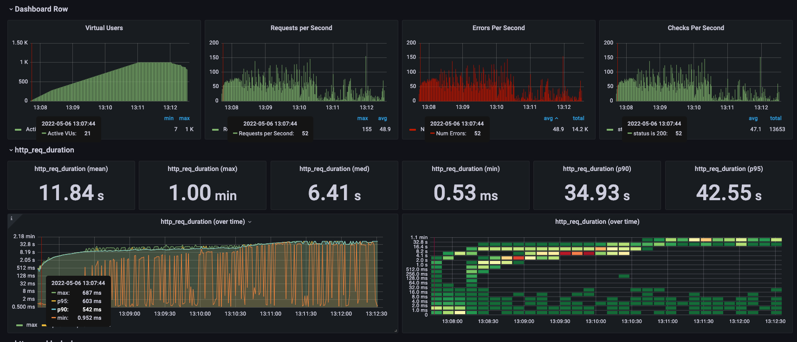
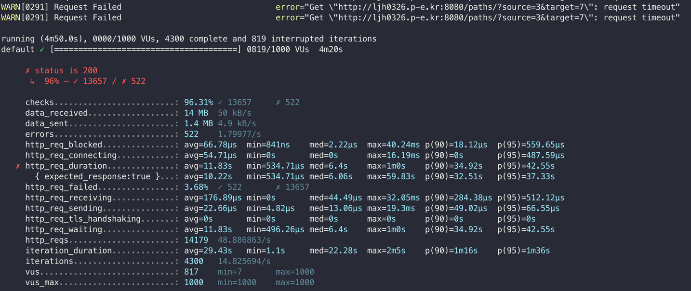

VUs가 21 까지는 어느정도 응답을 해주더니, 250까지 갔을때는 점차 처리속도가 떨어졌고 981부터는 실제로 request timeout이 떨어지기 시작했다.



```
     ✗ status is 200
      ↳  96% — ✓ 13657 / ✗ 522

     checks.........................: 96.31% ✓ 13657     ✗ 522
     data_received..................: 14 MB  50 kB/s
     data_sent......................: 1.4 MB 4.9 kB/s
     errors.........................: 522    1.79977/s
     http_req_blocked...............: avg=66.78µs  min=841ns    med=2.22µs  max=40.24ms p(90)=18.12µs  p(95)=559.65µs
     http_req_connecting............: avg=54.71µs  min=0s       med=0s      max=16.19ms p(90)=0s       p(95)=487.59µs
   ✗ http_req_duration..............: avg=11.83s   min=534.71µs med=6.4s    max=1m0s    p(90)=34.92s   p(95)=42.55s
       { expected_response:true }...: avg=10.22s   min=534.71µs med=6.06s   max=59.83s  p(90)=32.51s   p(95)=37.33s
     http_req_failed................: 3.68%  ✓ 522       ✗ 13657
     http_req_receiving.............: avg=176.89µs min=0s       med=44.49µs max=32.05ms p(90)=284.38µs p(95)=512.12µs
     http_req_sending...............: avg=22.66µs  min=4.82µs   med=13.06µs max=19.3ms  p(90)=49.02µs  p(95)=66.55µs
     http_req_tls_handshaking.......: avg=0s       min=0s       med=0s      max=0s      p(90)=0s       p(95)=0s
     http_req_waiting...............: avg=11.83s   min=496.26µs med=6.4s    max=1m0s    p(90)=34.92s   p(95)=42.55s
     http_reqs......................: 14179  48.886863/s
     iteration_duration.............: avg=29.43s   min=1.1s     med=22.28s  max=2m5s    p(90)=1m16s    p(95)=1m36s
     iterations.....................: 4300   14.825694/s
     vus............................: 817    min=7       max=1000
     vus_max........................: 1000   min=1000    max=1000
```