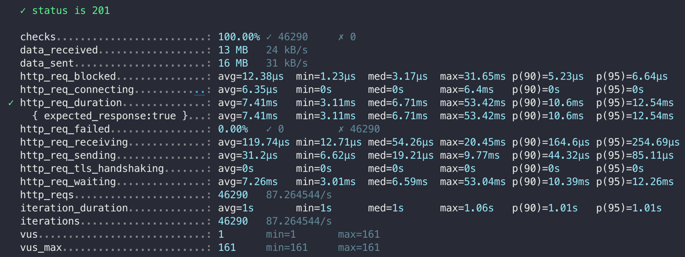

```
     ✓ status is 201

     checks.........................: 100.00% ✓ 46290     ✗ 0
     data_received..................: 13 MB   24 kB/s
     data_sent......................: 16 MB   31 kB/s
     http_req_blocked...............: avg=12.38µs  min=1.23µs  med=3.17µs  max=31.65ms p(90)=5.23µs  p(95)=6.64µs
     http_req_connecting............: avg=6.35µs   min=0s      med=0s      max=6.4ms   p(90)=0s      p(95)=0s
   ✓ http_req_duration..............: avg=7.41ms   min=3.11ms  med=6.71ms  max=53.42ms p(90)=10.6ms  p(95)=12.54ms
       { expected_response:true }...: avg=7.41ms   min=3.11ms  med=6.71ms  max=53.42ms p(90)=10.6ms  p(95)=12.54ms
     http_req_failed................: 0.00%   ✓ 0         ✗ 46290
     http_req_receiving.............: avg=119.74µs min=12.71µs med=54.26µs max=20.45ms p(90)=164.6µs p(95)=254.69µs
     http_req_sending...............: avg=31.2µs   min=6.62µs  med=19.21µs max=9.77ms  p(90)=44.32µs p(95)=85.11µs
     http_req_tls_handshaking.......: avg=0s       min=0s      med=0s      max=0s      p(90)=0s      p(95)=0s
     http_req_waiting...............: avg=7.26ms   min=3.01ms  med=6.59ms  max=53.04ms p(90)=10.39ms p(95)=12.26ms
     http_reqs......................: 46290   87.264544/s
     iteration_duration.............: avg=1s       min=1s      med=1s      max=1.06s   p(90)=1.01s   p(95)=1.01s
     iterations.....................: 46290   87.264544/s
     vus............................: 1       min=1       max=161
     vus_max........................: 161     min=161     max=161
```