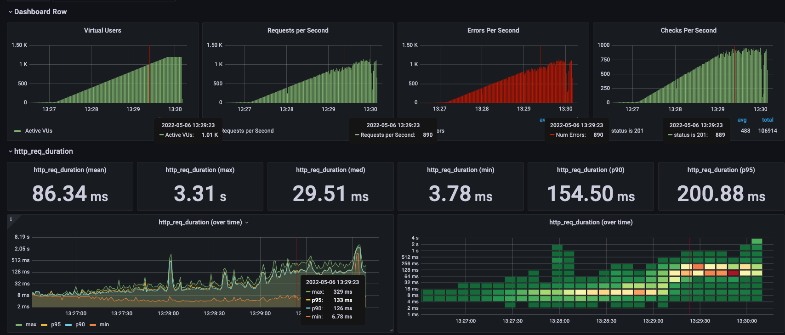
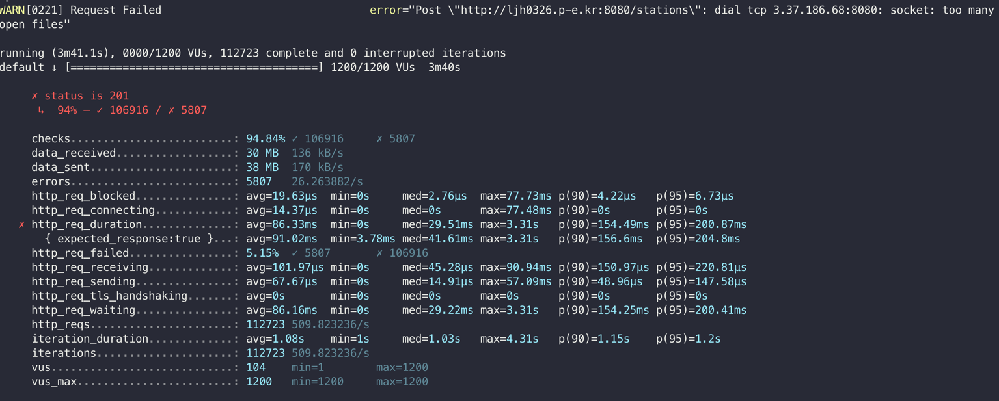

Vuser가 1000을 넘어가는 순간부터 에러가 나기 시작했고 생각보다 성능이 잘나와서 놀랬다.



```
checks.........................: 94.84% ✓ 106916     ✗ 5807
     data_received..................: 30 MB  136 kB/s
     data_sent......................: 38 MB  170 kB/s
     errors.........................: 5807   26.263882/s
     http_req_blocked...............: avg=19.63µs  min=0s     med=2.76µs  max=77.73ms p(90)=4.22µs   p(95)=6.73µs
     http_req_connecting............: avg=14.37µs  min=0s     med=0s      max=77.48ms p(90)=0s       p(95)=0s
   ✗ http_req_duration..............: avg=86.33ms  min=0s     med=29.51ms max=3.31s   p(90)=154.49ms p(95)=200.87ms
       { expected_response:true }...: avg=91.02ms  min=3.78ms med=41.61ms max=3.31s   p(90)=156.6ms  p(95)=204.8ms
     http_req_failed................: 5.15%  ✓ 5807       ✗ 106916
     http_req_receiving.............: avg=101.97µs min=0s     med=45.28µs max=90.94ms p(90)=150.97µs p(95)=220.81µs
     http_req_sending...............: avg=67.67µs  min=0s     med=14.91µs max=57.09ms p(90)=48.96µs  p(95)=147.58µs
     http_req_tls_handshaking.......: avg=0s       min=0s     med=0s      max=0s      p(90)=0s       p(95)=0s
     http_req_waiting...............: avg=86.16ms  min=0s     med=29.22ms max=3.31s   p(90)=154.25ms p(95)=200.41ms
     http_reqs......................: 112723 509.823236/s
     iteration_duration.............: avg=1.08s    min=1s     med=1.03s   max=4.31s   p(90)=1.15s    p(95)=1.2s
     iterations.....................: 112723 509.823236/s
     vus............................: 104    min=1        max=1200
     vus_max........................: 1200   min=1200     max=1200
```